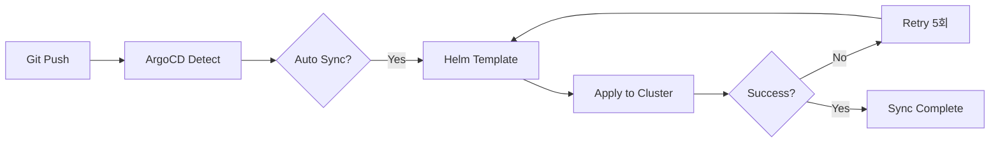

# Pull Request: ArgoCD Domain Services Application

## 📋 개요
- **브랜치**: `cicd/argocd-domain-services` → `develop`
- **타입**: CI/CD
- **목적**: 13-Node 아키텍처를 위한 ArgoCD GitOps 배포 자동화

## 🎯 변경 사항

### 1. ArgoCD Application (통합 배포)

#### argocd/applications/growbin-backend.yaml
```yaml
apiVersion: argoproj.io/v1alpha1
kind: Application
metadata:
  name: growbin-backend
spec:
  source:
    repoURL: https://github.com/SeSACTHON/backend.git
    path: charts/growbin-backend
    helm:
      valueFiles:
        - values-13nodes.yaml
  
  syncPolicy:
    automated:
      prune: true      # 삭제된 리소스 자동 제거
      selfHeal: true   # Drift 자동 복구
```

**특징**:
- 전체 서비스 일괄 배포
- 자동 동기화 활성화
- 5회 재시도 (Exponential Backoff)

### 2. API Services ApplicationSet

#### argocd/applications/api-services-appset.yaml
```yaml
apiVersion: argoproj.io/v1alpha1
kind: ApplicationSet
metadata:
  name: growbin-api-services
spec:
  generators:
    - list:
        elements:
          - domain: waste
          - domain: auth
          - domain: userinfo
          - domain: location
          - domain: recycle-info
          - domain: chat-llm
```

**생성되는 Application**: 6개
- `growbin-api-waste`
- `growbin-api-auth`
- `growbin-api-userinfo`
- `growbin-api-location`
- `growbin-api-recycle-info`
- `growbin-api-chat-llm`

### 3. Worker Services ApplicationSet

#### argocd/applications/worker-services-appset.yaml
```yaml
apiVersion: argoproj.io/v1alpha1
kind: ApplicationSet
metadata:
  name: growbin-worker-services
spec:
  generators:
    - list:
        elements:
          - worker: storage
            poolType: eventlet
          - worker: ai
            poolType: prefork
```

**생성되는 Application**: 2개
- `growbin-worker-storage`
- `growbin-worker-ai`

### 4. README 문서

#### argocd/README.md
- 배포 전략 설명 (통합 vs ApplicationSet)
- 배포 방법 가이드
- 동기화 정책 상세
- Mermaid 배포 흐름도

## 🔄 GitOps 배포 흐름



## 📊 배포 전략 비교

### 방법 1: 통합 배포 (growbin-backend.yaml)
```bash
kubectl apply -f argocd/applications/growbin-backend.yaml
```

**장점**:
- ✅ 전체 서비스 동시 배포
- ✅ 간단한 관리
- ✅ 일관된 버전 관리

### 방법 2: ApplicationSet (도메인별)
```bash
kubectl apply -f argocd/applications/api-services-appset.yaml
kubectl apply -f argocd/applications/worker-services-appset.yaml
```

**장점**:
- ✅ 도메인별 독립 배포
- ✅ 부분 롤아웃 가능
- ✅ 세밀한 리소스 제어

## ✅ 테스트 체크리스트

- [ ] ArgoCD 설치 확인
- [ ] Application 적용: `kubectl apply -f argocd/applications/growbin-backend.yaml`
- [ ] ArgoCD UI 접속: `kubectl port-forward svc/argocd-server -n argocd 8080:443`
- [ ] Sync 상태 확인: `kubectl get application -n argocd`
- [ ] Pod 생성 확인: `kubectl get pods -A`

## 🔗 관련 PR

- ⬅️ Terraform 13-Node 업데이트 (의존)
- ⬅️ Ansible 13-Node 업데이트 (의존)
- ➡️ Helm Charts 13-Node 템플릿 (필수)

## 📝 비고

- ArgoCD Application은 Helm Charts 생성 후 적용 가능
- ApplicationSet은 선택적 사용 (통합 배포 권장)
- Sync 정책: `prune=true`, `selfHeal=true`로 자동화

---

**리뷰어**: @team
**우선순위**: Medium
**의존성**: Helm Charts PR과 함께 병합 권장

