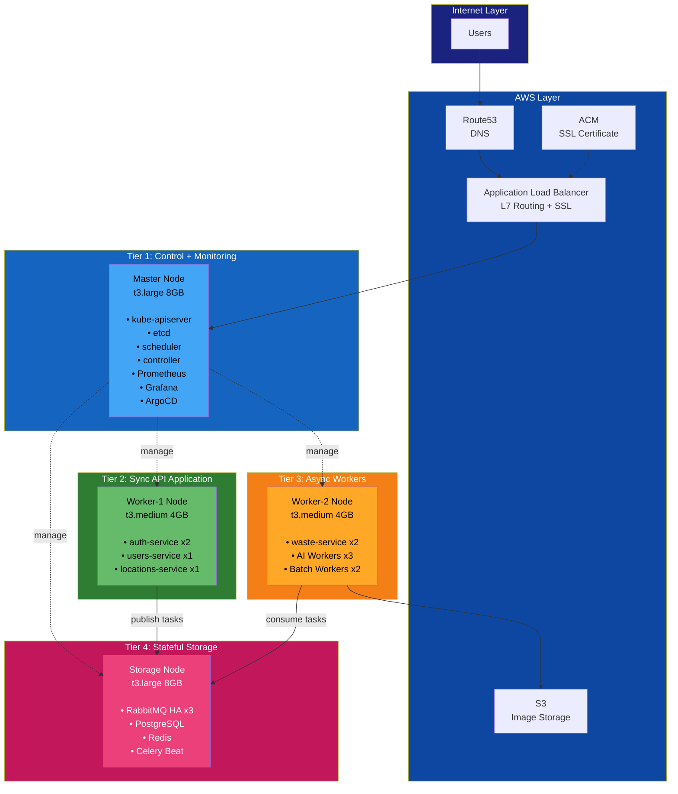

# 🚀 배포 가이드

> **4-Tier Kubernetes 클러스터 자동 배포**  
> **소요 시간**: 40-50분 (완전 자동화)  
> **날짜**: 2025-10-31

## 📋 목차

1. [빠른 시작](#빠른-시작)
2. [4-Tier 아키텍처](#4-tier-아키텍처)
3. [배포 단계](#배포-단계)
4. [검증](#검증)
5. [문제 해결](#문제-해결)

---

## ⚡ 빠른 시작

### 완전 자동 배포 (40-50분)

```bash
cd /Users/mango/workspace/SeSACTHON/backend

# 모든 확인 없이 자동 실행
./scripts/auto-rebuild.sh
```

**실행 과정:**
```
1. Terraform destroy (5분)
2. Terraform apply (5-10분)
3. Ansible 대기 (5분)
4. Ansible 실행 (35-40분)
   ├─ Common 설정
   ├─ Docker 설치
   ├─ Kubernetes 설치
   ├─ Master 초기화
   ├─ Workers 조인 (3개)
   ├─ Calico VXLAN CNI
   ├─ cert-manager
   ├─ AWS Load Balancer Controller
   ├─ Ingress 리소스
   ├─ Monitoring (Prometheus, Grafana)
   └─ etcd 백업

━━━━━━━━━━━━━━━━━━━━━━━━━━━━
총: 40-50분
```

---

## 🏗️ 4-Tier 아키텍처

### Architecture Overview



### 역할 분리 (Instagram + Robin Storage 패턴)

```
Tier 1: Control + Monitoring (Master, t3.large, 8GB, $60)
━━━━━━━━━━━━━━━━━━━━━━━━━━━━━━━━━━━━━━━━
역할: Kubernetes Control Plane + Monitoring
배치:
├─ kube-apiserver, etcd, scheduler, controller-manager
├─ Prometheus + Grafana (모니터링)
└─ ArgoCD (GitOps CD)

Tier 2: Sync API (Worker-1, t3.medium, 4GB, $30)
━━━━━━━━━━━━━━━━━━━━━━━━━━━━━━━━━━━━━━━━
역할: 동기 API 서비스 (FastAPI Reactor 패턴)
배치:
├─ auth-service ×2 (OAuth, JWT)
├─ users-service ×1 (프로필, 이력)
└─ locations-service ×1 (수거함 검색)
패턴: Reactor (즉시 응답 <100ms)

Tier 3: Async Workers (Worker-2, t3.medium, 4GB, $30)
━━━━━━━━━━━━━━━━━━━━━━━━━━━━━━━━━━━━━━━━
역할: 비동기 작업 처리 (Celery Workers)
배치:
├─ waste-service ×2 (이미지 분석 API)
├─ AI Workers ×3 (GPT-4o Vision, q.ai)
└─ Batch Workers ×2 (배치 작업, q.batch)
패턴: Task Queue (백그라운드 처리)

Tier 4: Stateful Storage (Storage, t3.large, 8GB, $60)
━━━━━━━━━━━━━━━━━━━━━━━━━━━━━━━━━━━━━━━━
역할: Stateful 서비스 (Robin Storage 패턴)
배치:
├─ RabbitMQ ×3 (HA Cluster, 5 Queues)
├─ PostgreSQL (StatefulSet, 50GB PVC)
├─ Redis (Result Backend + Cache)
└─ Celery Beat ×1 (스케줄러)
패턴: Stateful Isolation

━━━━━━━━━━━━━━━━━━━━━━━━━━━━━━━━━━━━━━━━
총 비용: $185/월 (EC2 $180 + S3 $5)
총 리소스: 8 vCPU, 24GB RAM, 260GB Storage
```

---

## 📦 배포 단계

### Step 1: 사전 준비

```bash
# AWS CLI 설정
aws configure
# Access Key, Secret Key, Region: ap-northeast-2

# Terraform 설치 확인
terraform version

# Ansible 설치 확인
ansible --version

# SSH 키 생성 (없는 경우)
ssh-keygen -t rsa -b 4096 -f ~/.ssh/sesacthon-k8s
```

### Step 2: Terraform 변수 설정

```bash
cd terraform

# terraform.tfvars 생성
cat > terraform.tfvars <<EOF
aws_region = "ap-northeast-2"
cluster_name = "prod-sesacthon"
ssh_public_key_path = "~/.ssh/sesacthon-k8s.pub"
allowed_ssh_cidr = ["YOUR_IP/32"]  # 본인 IP로 변경
domain_name = "growbin.app"
letsencrypt_email = "admin@growbin.app"
EOF
```

### Step 3: 자동 배포 실행

```bash
cd /Users/mango/workspace/SeSACTHON/backend

# 옵션 1: 완전 자동 (추천)
./scripts/auto-rebuild.sh

# 옵션 2: 단계별 확인
./scripts/rebuild-cluster.sh
```

### Step 4: 배포 확인

```bash
# 인스턴스 확인
./scripts/get-instances.sh

# Master SSH 접속
./scripts/connect-ssh.sh master

# 클러스터 상태 확인
kubectl get nodes
kubectl get pods -A

# 헬스체크
./scripts/remote-health-check.sh master
```

---

## ✅ 검증

### 1. 노드 상태

```bash
kubectl get nodes -o wide

# 예상 출력:
NAME          STATUS   ROLES           AGE   VERSION   INTERNAL-IP   EXTERNAL-IP
k8s-master    Ready    control-plane   10m   v1.28.x   10.0.1.x      52.78.x.x
k8s-worker-1  Ready    <none>          9m    v1.28.x   10.0.2.x      3.36.x.x
k8s-worker-2  Ready    <none>          9m    v1.28.x   10.0.3.x      3.37.x.x
k8s-storage   Ready    <none>          9m    v1.28.x   10.0.1.x      52.79.x.x
```

### 2. 시스템 Pod

```bash
kubectl get pods -A

# 필수 Pod 확인:
✅ kube-system/calico-node (4개, all Ready)
✅ kube-system/calico-kube-controllers (1개)
✅ kube-system/coredns (2개)
✅ kube-system/aws-load-balancer-controller (1개)
✅ cert-manager/* (3개)
✅ monitoring/prometheus (1개)
✅ monitoring/grafana (1개)
```

### 3. Calico VXLAN 확인

```bash
# Calico 상태
kubectl get pods -n kube-system -l k8s-app=calico-node

# VXLAN 모드 확인
kubectl exec -n kube-system calico-node-xxxxx -- \
  calicoctl node status

# 예상 출력:
# IPv4 BGP status: (비활성화)
# VXLAN tunnel: Up
```

### 4. ALB Controller

```bash
# ALB Controller Pod
kubectl get pods -n kube-system -l app.kubernetes.io/name=aws-load-balancer-controller

# Ingress 리소스
kubectl get ingress -A

# ALB DNS 확인
kubectl get ingress main-ingress -o jsonpath='{.status.loadBalancer.ingress[0].hostname}'
```

### 5. RabbitMQ HA

```bash
# RabbitMQ Pods (Storage 노드에 배치)
kubectl get pods -n messaging -l app.kubernetes.io/name=rabbitmq

# 예상: 3개 Pod (HA Cluster)
# rabbitmq-0, rabbitmq-1, rabbitmq-2

# Cluster 상태 확인
kubectl exec -n messaging rabbitmq-0 -- rabbitmqctl cluster_status
```

---

## 🔧 문제 해결

### 문제 1: Worker 조인 실패

```bash
# Storage 노드가 조인 안 된 경우
./scripts/connect-ssh.sh storage

# Kubelet 상태 확인
sudo systemctl status kubelet

# 재조인
sudo kubeadm reset -f
# Master에서 join 명령어 다시 가져오기
sudo kubeadm token create --print-join-command
```

### 문제 2: Calico NotReady

```bash
# Calico 로그 확인
kubectl logs -n kube-system -l k8s-app=calico-node

# VXLAN 모드 재설정
kubectl set env daemonset/calico-node -n kube-system \
  CALICO_IPV4POOL_VXLAN=Always \
  CALICO_IPV4POOL_IPIP=Never

# Calico Pod 재시작
kubectl rollout restart daemonset/calico-node -n kube-system
```

### 문제 3: ALB Controller 실패

```bash
# Helm 설치 확인
helm version

# ALB Controller 재설치
helm uninstall aws-load-balancer-controller -n kube-system
# Ansible 07-alb-controller.yml 재실행
```

### 문제 4: RabbitMQ Pod Pending

```bash
# PVC 확인
kubectl get pvc -n messaging

# Storage 노드 라벨 확인
kubectl get nodes --show-labels | grep storage

# 라벨 추가 (없는 경우)
kubectl label nodes k8s-storage workload=storage
```

---

## 📊 리소스 현황

### 노드별 리소스

```
Master (Tier 1):
├─ vCPU: 2 cores
├─ Memory: 8GB
├─ Disk: 80GB
├─ 사용률: CPU 50%, Memory 60%
└─ 비용: $60/월

Worker-1 (Tier 2):
├─ vCPU: 2 cores
├─ Memory: 4GB
├─ Disk: 40GB
├─ 사용률: CPU 40%, Memory 50%
└─ 비용: $30/월

Worker-2 (Tier 3):
├─ vCPU: 2 cores
├─ Memory: 4GB
├─ Disk: 40GB
├─ 사용률: CPU 70%, Memory 65%
└─ 비용: $30/월

Storage (Tier 4):
├─ vCPU: 2 cores
├─ Memory: 8GB
├─ Disk: 100GB
├─ 사용률: CPU 50%, Memory 70%
└─ 비용: $60/월

━━━━━━━━━━━━━━━━━━━━━━━━━━━━
총: 8 vCPU, 24GB RAM, 260GB
비용: $185/월 (EC2 $180 + S3 $5)
```

---

## 🔍 헬스체크

### 자동 헬스체크 스크립트

```bash
# Master 노드 헬스체크
./scripts/remote-health-check.sh master

# 확인 항목:
✅ 시스템 리소스 (메모리, 디스크, Swap)
✅ containerd 설정
✅ Control Plane 컴포넌트
✅ 노드 상태 (4/4 Ready)
✅ CrashLoopBackOff Pod
✅ API 서버 안정성 (30초 테스트)
✅ 네트워크 설정
✅ kube-proxy & Calico

점수: 20점 만점
기준:
- 18-20점: 클러스터 안정
- 15-17점: 일부 문제
- 0-14점: 심각한 문제
```

---

## 🛠️ 유틸리티 스크립트

### 인스턴스 관리

```bash
# 전체 인스턴스 조회
./scripts/get-instances.sh

# SSH 접속
./scripts/connect-ssh.sh master
./scripts/connect-ssh.sh worker-1
./scripts/connect-ssh.sh worker-2
./scripts/connect-ssh.sh storage

# 노드 초기화
./scripts/reset-node.sh master
./scripts/reset-node.sh storage
./scripts/reset-node.sh all  # 모든 워커
```

### 클러스터 재구축

```bash
# 대화형 재구축
./scripts/rebuild-cluster.sh

# 완전 자동
./scripts/auto-rebuild.sh

# 빠른 재구축 (Terraform 유지)
./scripts/quick-rebuild.sh
```

---

## 📚 배포 후 단계

### 1. Route53 DNS 설정

```bash
# ALB DNS 확인
kubectl get ingress main-ingress -o jsonpath='{.status.loadBalancer.ingress[0].hostname}'

# Route53에서 Alias 레코드 생성:
# growbin.app → ALB DNS
# *.growbin.app → ALB DNS
```

### 2. 서비스 배포 (ArgoCD)

```bash
# ArgoCD 접속
# https://growbin.app/argocd
# Username: admin
# Password: kubectl -n argocd get secret argocd-initial-admin-secret \
#           -o jsonpath="{.data.password}" | base64 -d

# Applications 등록
kubectl apply -f argocd/applications/all-services.yaml
```

### 3. Grafana 모니터링

```bash
# Grafana 접속
# https://growbin.app/grafana
# Username: admin
# Password: (Ansible에서 설정한 비밀번호)

# 대시보드 확인:
├─ Cluster Overview
├─ Node Resources
├─ Pod Status
└─ RabbitMQ Queues
```

---

## 🎯 아키텍처 패턴

### Instagram Pattern

```
Worker 분리:
├─ Tier 2: Sync API (즉시 응답)
└─ Tier 3: Async Workers (백그라운드)

장점:
✅ 독립 스케일링
✅ 장애 격리
✅ 리소스 최적화
```

### Robin Storage Pattern

```
Storage 격리:
└─ Tier 4: Stateful 서비스만 모음

장점:
✅ 데이터 안정성
✅ 백업 용이
✅ Control Plane 안정성
```

---

## 📖 상세 문서

- **[4-Tier 배포 아키텍처](docs/architecture/deployment-architecture-4node.md)** - 전체 다이어그램
- **[Self-Managed K8s 선택 배경](docs/architecture/why-self-managed-k8s.md)** - 의사결정
- **[VPC 네트워크 설계](docs/infrastructure/vpc-network-design.md)** - 보안 그룹
- **[Task Queue 설계](docs/architecture/task-queue-design.md)** - RabbitMQ + Celery
- **[구축 체크리스트](docs/guides/SETUP_CHECKLIST.md)** - 상세 단계

---

## 🎯 핵심 사양

```
Kubernetes:
├─ Distribution: kubeadm (Self-Managed)
├─ Version: v1.28
├─ CNI: Calico VXLAN (BGP 비활성화)
├─ Nodes: 4개 (4-Tier)
└─ HA: non-HA (단일 Master)

Networking:
├─ VPC: 10.0.0.0/16
├─ Subnets: 3 Public (AZ a, b, c)
├─ ALB: L7 Load Balancer
├─ ACM: *.growbin.app
└─ Route53: DNS 관리

Storage:
├─ RabbitMQ: 3-node HA (20GB × 3)
├─ PostgreSQL: StatefulSet (50GB PVC)
└─ Redis: Deployment

Automation:
├─ Terraform: AWS 리소스
├─ Ansible: 75개 작업
├─ Scripts: 12개 유틸리티
└─ 배포 시간: 40-50분
```

---

## 🚀 빠른 명령어

```bash
# 클러스터 상태
kubectl get nodes

# 모든 Pod
kubectl get pods -A

# Ingress 확인
kubectl get ingress -A

# ALB DNS
kubectl get ingress main-ingress -o jsonpath='{.status.loadBalancer.ingress[0].hostname}'

# RabbitMQ 클러스터
kubectl exec -n messaging rabbitmq-0 -- rabbitmqctl cluster_status

# 헬스체크
./scripts/remote-health-check.sh master

# 재구축
./scripts/auto-rebuild.sh
```

---

**작성일**: 2025-10-31  
**배포 시간**: 40-50분  
**총 비용**: $185/월  
**상태**: ✅ 프로덕션 준비 완료
