# 🚀 CI/CD 파이프라인 아키텍처

> **GitOps 기반 완전 자동화 배포 파이프라인**  
> **최종 업데이트**: 2025-11-05  
> **상태**: ✅ 프로덕션 준비 완료

---

## 📋 목차

1. [전체 CI/CD 파이프라인](#전체-cicd-파이프라인)
2. [GitHub Actions CI](#github-actions-ci)
3. [ArgoCD GitOps CD](#argocd-gitops-cd)
4. [배포 흐름](#배포-흐름)
5. [롤백 전략](#롤백-전략)

---

## 🌐 전체 CI/CD 파이프라인

### 개요 다이어그램

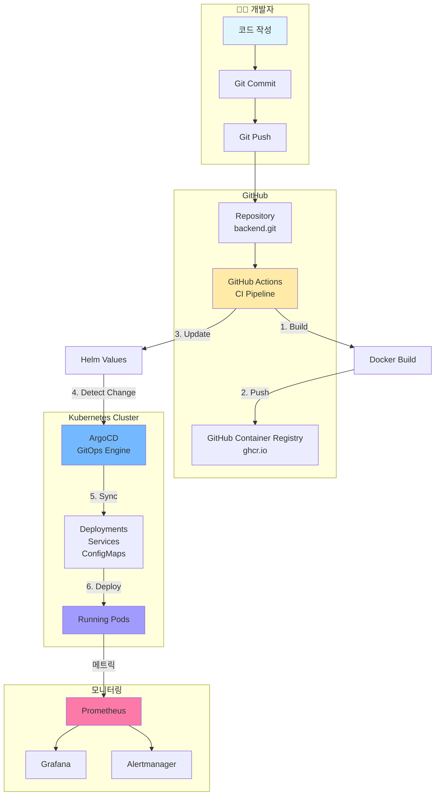

---

## 📦 CI Pipeline (GitHub Actions)

### 전체 CI 워크플로우

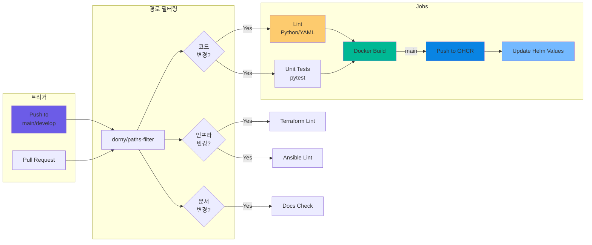

### CI 단계 상세

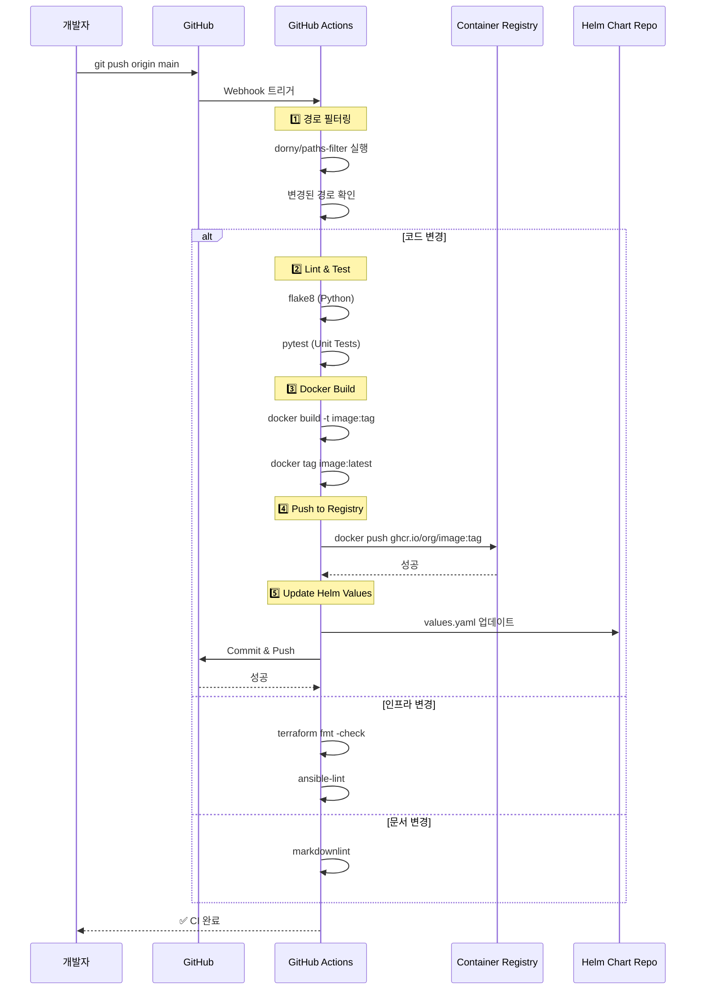

---

## 🔄 CD Pipeline (ArgoCD GitOps)

### ArgoCD 배포 플로우

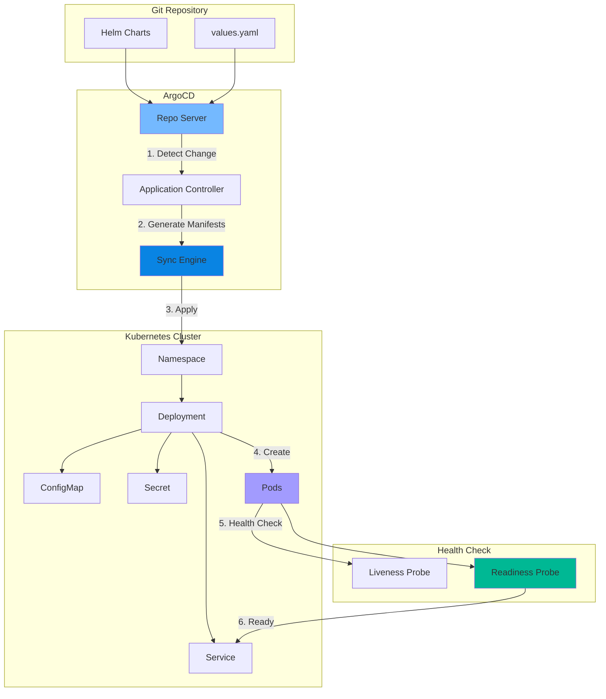

### ArgoCD Sync 상세

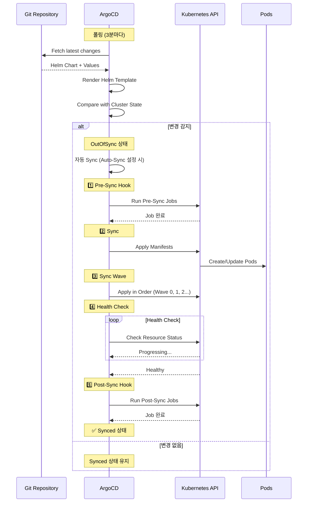

---

## 🚀 배포 흐름 (End-to-End)

### 전체 배포 프로세스

```mermaid
graph TB
    subgraph Phase1["Phase 1: 개발"]
        Code[코드 작성]
        LocalTest[로컬 테스트]
        Commit[Git Commit]
    end
    
    subgraph Phase2["Phase 2: CI (GitHub Actions)"]
        Push[Git Push]
        Lint[Linting]
        Test[Testing]
        Build[Docker Build]
        Push2Registry[Push to GHCR]
    end
    
    subgraph Phase3["Phase 3: 이미지 업데이트"]
        UpdateValues[Update values.yaml]
        CommitValues[Commit values.yaml]
        PushValues[Push to Git]
    end
    
    subgraph Phase4["Phase 4: CD (ArgoCD)"]
        DetectChange[변경 감지]
        RenderHelm[Helm Template 렌더링]
        ApplyManifests[Manifests 적용]
        CreatePods[Pod 생성]
    end
    
    subgraph Phase5["Phase 5: 배포 완료"]
        HealthCheck[Health Check]
        ReadinessProbe[Readiness Probe]
        ServiceReady[Service Ready]
        Monitor[Monitoring]
    end
    
    Code --> LocalTest
    LocalTest --> Commit
    Commit --> Push
    
    Push --> Lint
    Lint --> Test
    Test --> Build
    Build --> Push2Registry
    
    Push2Registry --> UpdateValues
    UpdateValues --> CommitValues
    CommitValues --> PushValues
    
    PushValues --> DetectChange
    DetectChange --> RenderHelm
    RenderHelm --> ApplyManifests
    ApplyManifests --> CreatePods
    
    CreatePods --> HealthCheck
    HealthCheck --> ReadinessProbe
    ReadinessProbe --> ServiceReady
    ServiceReady --> Monitor
    
    style Phase1 fill:#e1f5ff
    style Phase2 fill:#ffeaa7
    style Phase3 fill:#81ecec
    style Phase4 fill:#74b9ff
    style Phase5 fill:#a29bfe
```

### 배포 타임라인

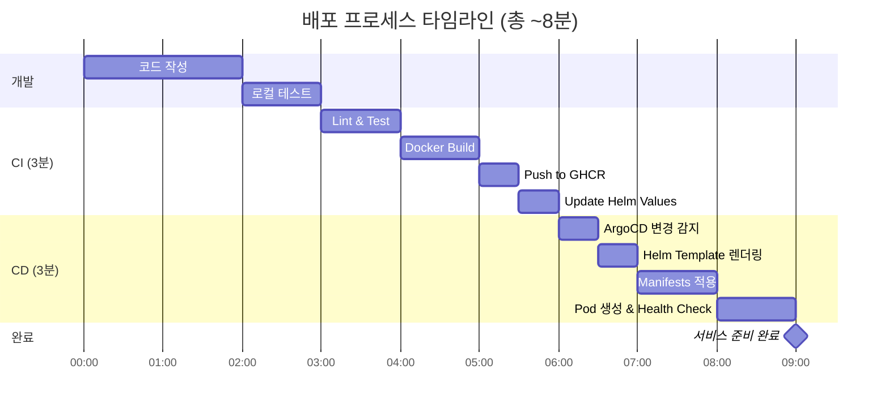

---

## 🔁 롤백 전략

### ArgoCD 롤백 프로세스

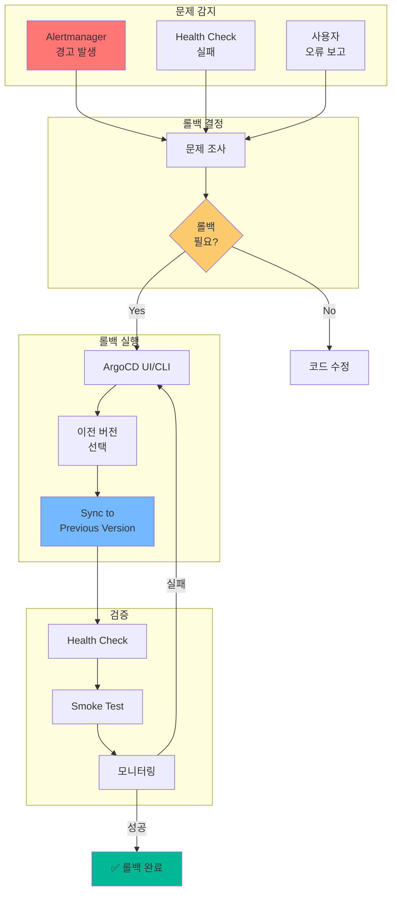

### 롤백 방법

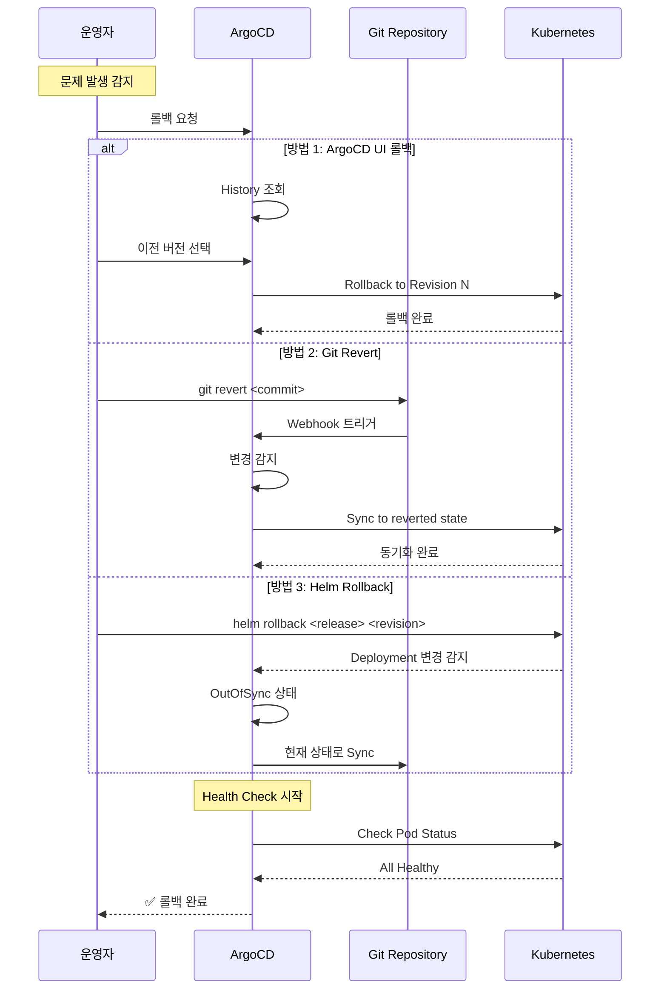

---

## 📊 배포 전략

### Blue-Green 배포

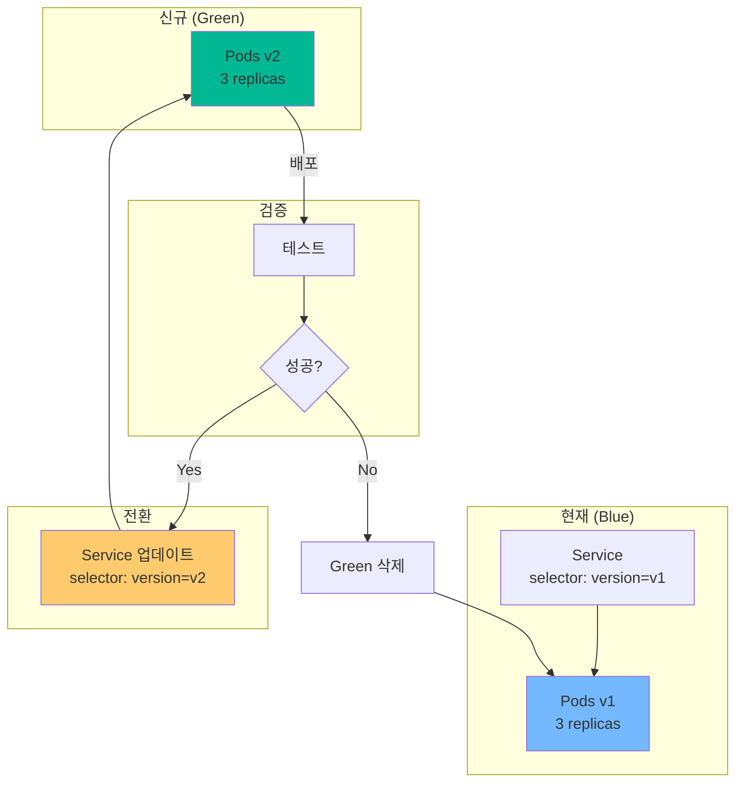

### Canary 배포

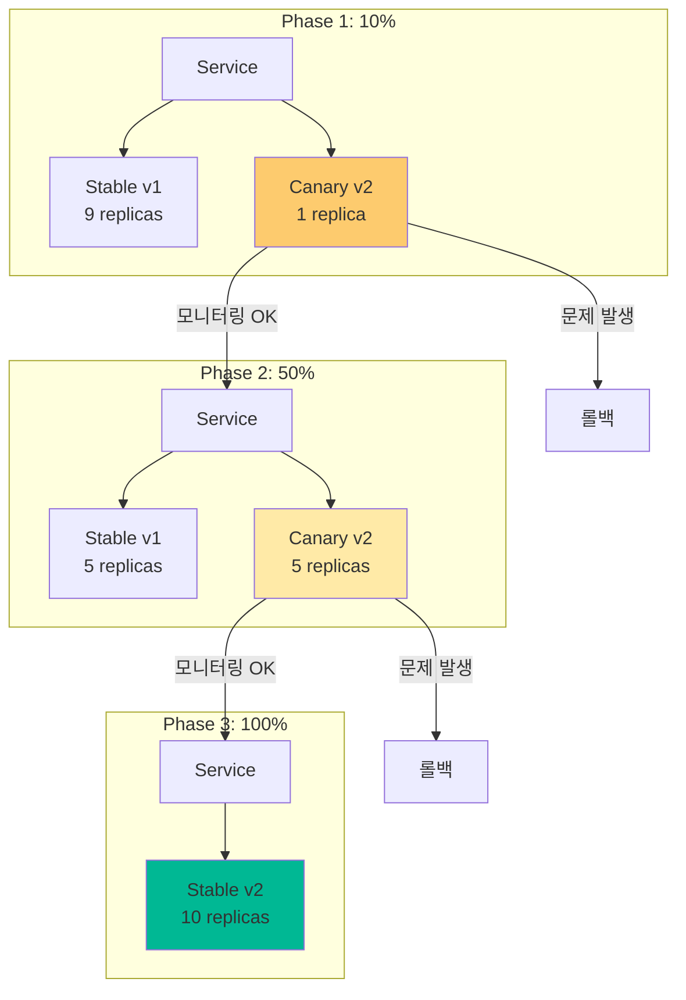

---

## 🔧 CI/CD 설정

### GitHub Actions Workflow

```yaml
# .github/workflows/ci-cd.yml
name: CI/CD Pipeline

on:
  push:
    branches: [main, develop]
  pull_request:
    branches: [main, develop]

jobs:
  # 경로 필터링
  changes:
    runs-on: ubuntu-latest
    outputs:
      backend: ${{ steps.filter.outputs.backend }}
      infra: ${{ steps.filter.outputs.infra }}
    steps:
      - uses: actions/checkout@v4
      - uses: dorny/paths-filter@v2
        id: filter
        with:
          filters: |
            backend:
              - 'services/**'
              - 'Dockerfile'
            infra:
              - 'terraform/**'
              - 'ansible/**'

  # CI: Build & Push
  build:
    needs: changes
    if: needs.changes.outputs.backend == 'true'
    runs-on: ubuntu-latest
    steps:
      - uses: actions/checkout@v4
      
      - name: Lint
        run: flake8 .
      
      - name: Test
        run: pytest
      
      - name: Build Docker Image
        run: |
          docker build -t ghcr.io/${{ github.repository }}:${{ github.sha }} .
          docker tag ghcr.io/${{ github.repository }}:${{ github.sha }} \
                     ghcr.io/${{ github.repository }}:latest
      
      - name: Push to GHCR
        run: |
          echo ${{ secrets.GITHUB_TOKEN }} | docker login ghcr.io -u ${{ github.actor }} --password-stdin
          docker push ghcr.io/${{ github.repository }}:${{ github.sha }}
          docker push ghcr.io/${{ github.repository }}:latest
      
      - name: Update Helm Values
        if: github.ref == 'refs/heads/main'
        run: |
          sed -i "s|tag:.*|tag: ${{ github.sha }}|" charts/values.yaml
          git config user.name "GitHub Actions"
          git config user.email "actions@github.com"
          git add charts/values.yaml
          git commit -m "chore: update image tag to ${{ github.sha }}"
          git push
```

### ArgoCD Application

```yaml
# argocd/applications/backend.yaml
apiVersion: argoproj.io/v1alpha1
kind: Application
metadata:
  name: backend
  namespace: argocd
spec:
  project: default
  source:
    repoURL: https://github.com/SeSACTHON/backend.git
    targetRevision: main
    path: charts/backend
    helm:
      valueFiles:
        - values.yaml
  destination:
    server: https://kubernetes.default.svc
    namespace: default
  syncPolicy:
    automated:
      prune: true
      selfHeal: true
      allowEmpty: false
    syncOptions:
      - CreateNamespace=true
    retry:
      limit: 5
      backoff:
        duration: 5s
        factor: 2
        maxDuration: 3m
```

---

## 📈 모니터링 및 알림

### 배포 모니터링

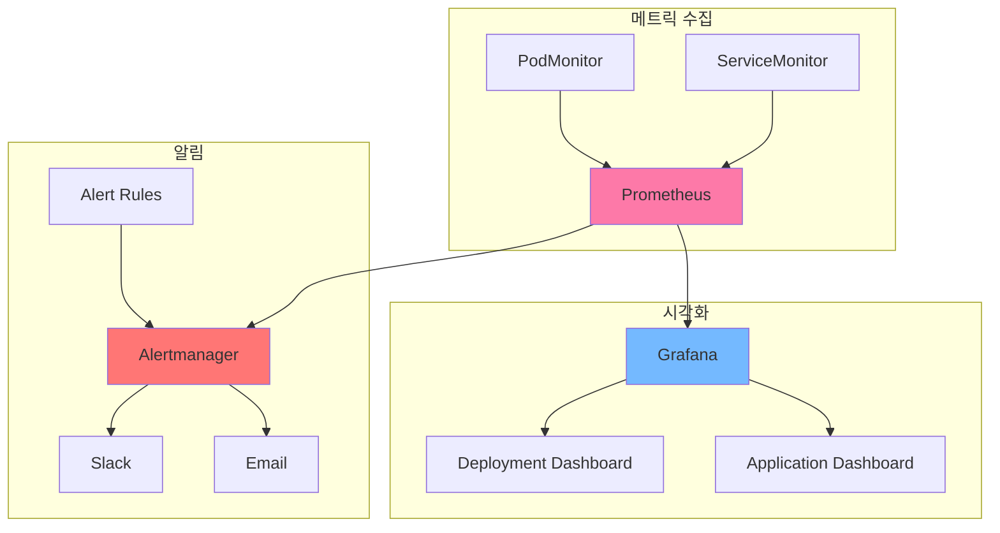

### 주요 메트릭

```yaml
# Prometheus Alert Rules
groups:
  - name: deployment
    interval: 30s
    rules:
      # 배포 실패
      - alert: DeploymentFailed
        expr: kube_deployment_status_replicas_available == 0
        for: 5m
        annotations:
          summary: "Deployment {{ $labels.deployment }} has no available replicas"
      
      # Pod Crash Loop
      - alert: PodCrashLooping
        expr: rate(kube_pod_container_status_restarts_total[15m]) > 0
        for: 5m
        annotations:
          summary: "Pod {{ $labels.pod }} is crash looping"
      
      # 높은 에러율
      - alert: HighErrorRate
        expr: rate(http_requests_total{status=~"5.."}[5m]) > 0.05
        for: 5m
        annotations:
          summary: "High error rate detected: {{ $value }}%"
```

---

## 🎯 Best Practices

### CI/CD 권장사항

1. **경로 필터링 사용**
   - 불필요한 빌드 방지
   - 리소스 절약

2. **자동화 테스트**
   - 단위 테스트 (pytest)
   - 통합 테스트
   - E2E 테스트

3. **이미지 태깅 전략**
   - Git SHA 사용
   - Semantic Versioning
   - Latest 태그 병행

4. **보안**
   - 이미지 스캔 (Trivy)
   - Secret 관리 (Sealed Secrets)
   - RBAC 적용

5. **롤백 전략**
   - Blue-Green 배포
   - Canary 배포
   - 자동 롤백 설정

6. **모니터링**
   - 배포 메트릭 수집
   - 알림 설정
   - 대시보드 구성

---

## 📚 관련 문서

- [인프라 배포 다이어그램](INFRASTRUCTURE_DEPLOYMENT_DIAGRAM.md)
- [최종 K8s 아키텍처](final-k8s-architecture.md)
- [GitOps ArgoCD Helm](../deployment/gitops-argocd-helm.md)
- [GitHub Actions 설정](../../.github/workflows/)

---

**문서 버전**: 1.0  
**최종 업데이트**: 2025-11-05  
**작성자**: Infrastructure Team  
**상태**: ✅ 프로덕션 준비 완료

