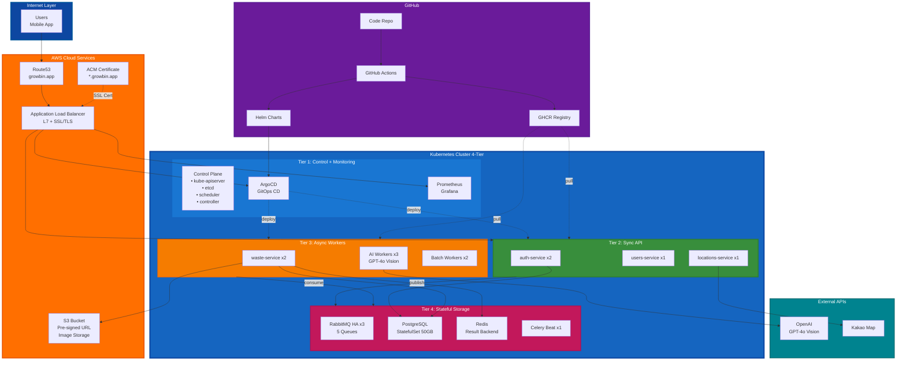
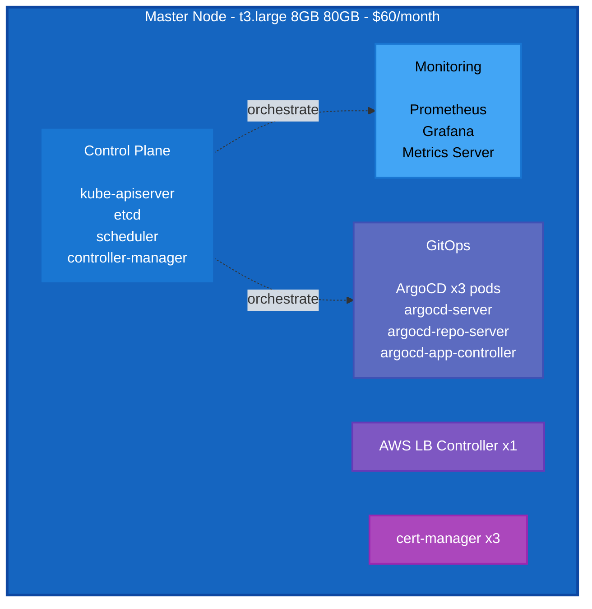
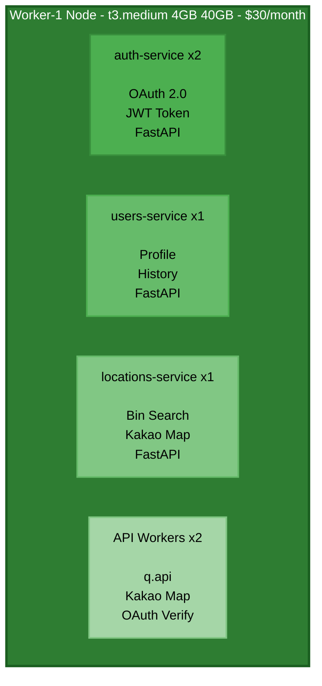
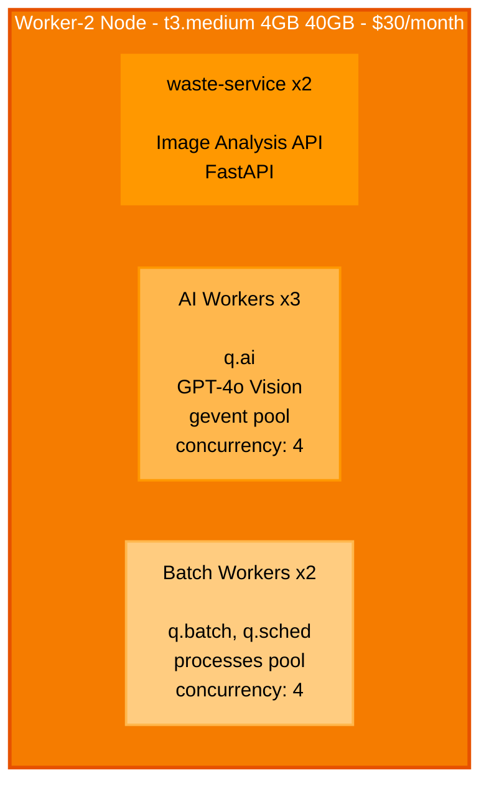
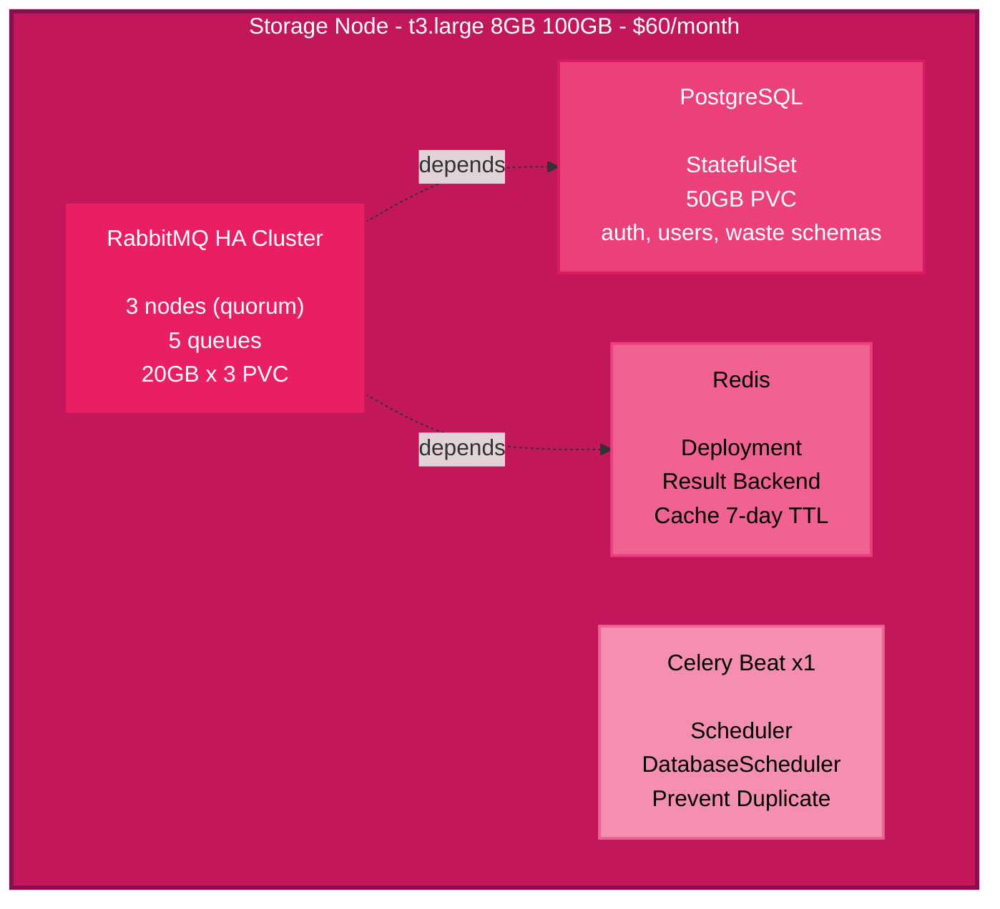
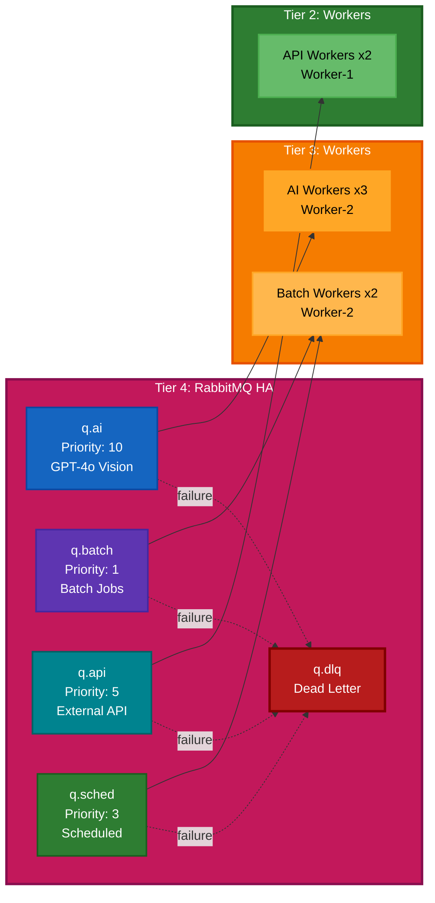
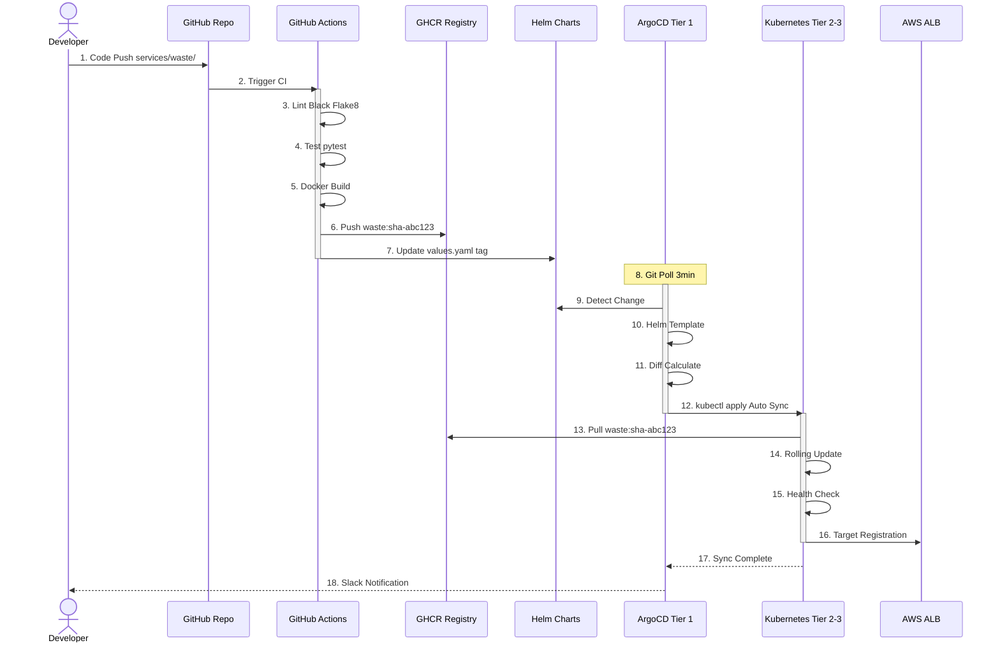
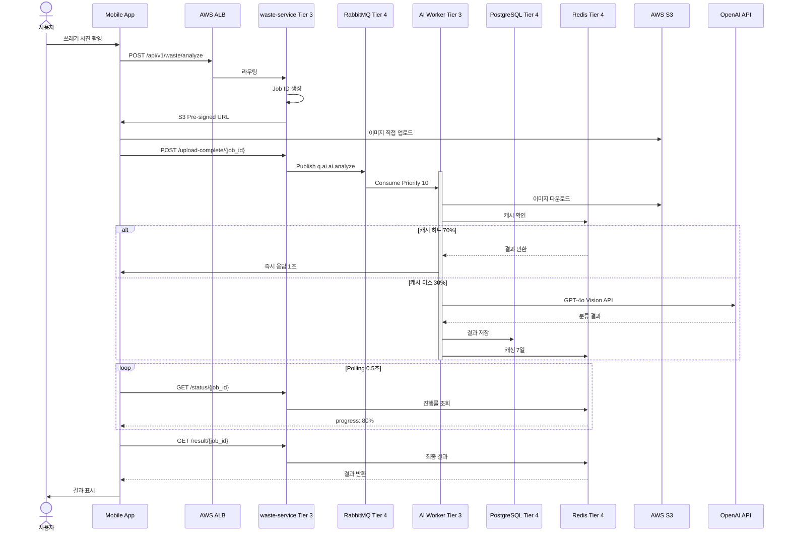
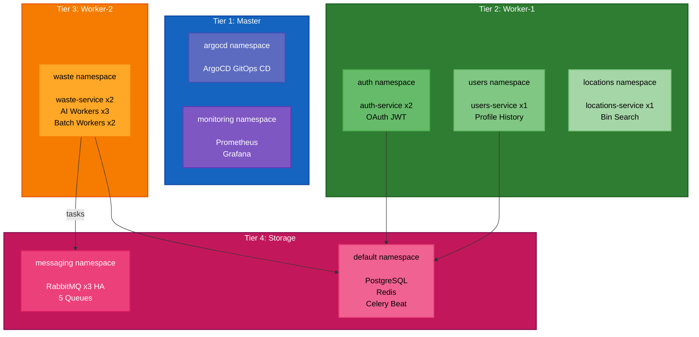

# 🏗️ 최종 Kubernetes 아키텍처

> **AI Waste Coach Backend - 4-Tier 프로덕션 인프라**  
> **날짜**: 2025-10-31  
> **상태**: ✅ 프로덕션 배포 완료

## 📋 목차

1. [전체 아키텍처](#전체-아키텍처)
2. [4-Tier 구성](#4-tier-구성)
3. [서비스 배치](#서비스-배치)
4. [Task Queue 구조](#task-queue-구조)
5. [GitOps 파이프라인](#gitops-파이프라인)
6. [데이터 흐름](#데이터-흐름)

---

## 🌐 전체 아키텍처



---

## 🖥️ 4-Tier 구성

### Tier 1: Control + Monitoring



**리소스 할당:**
```
vCPU: 2 cores
Memory: 8GB
Disk: 80GB (gp3)
비용: $60/월

사용률:
├─ Control Plane: 0.5 CPU, 1.5GB
├─ etcd: 0.2 CPU, 0.5GB
├─ Prometheus: 0.3 CPU, 1.5GB
├─ Grafana: 0.2 CPU, 0.5GB
└─ ArgoCD: 0.3 CPU, 1GB

여유: 0.5 CPU, 3GB (30%)
```

### Tier 2: Sync API (Application)



**리소스 할당:**
```
vCPU: 2 cores
Memory: 4GB
Disk: 40GB (gp3)
비용: $30/월

배치:
├─ auth-service ×2: 200m CPU, 256Mi
├─ users-service ×1: 100m CPU, 128Mi
├─ locations-service ×1: 100m CPU, 128Mi
└─ API Workers ×2: 200m CPU, 256Mi

여유: 1.2 CPU, 2.8GB (60%)
패턴: Reactor (Sync, 즉시 응답 <100ms)
```

### Tier 3: Async Workers



**리소스 할당:**
```
vCPU: 2 cores
Memory: 4GB
Disk: 40GB (gp3)
비용: $30/월

배치:
├─ waste-service ×2: 400m CPU, 512Mi
├─ AI Workers ×3: 1500m CPU, 3Gi
└─ Batch Workers ×2: 600m CPU, 1Gi

여유: 0.4 CPU, 1.1GB (25%)
패턴: Task Queue (Async, 백그라운드)
```

### Tier 4: Stateful Storage



**리소스 할당:**
```
vCPU: 2 cores
Memory: 8GB
Disk: 100GB (gp3)
비용: $60/월

배치:
├─ RabbitMQ ×3: 600m CPU, 3Gi (HA)
├─ PostgreSQL: 500m CPU, 2Gi
├─ Redis: 200m CPU, 1Gi
└─ Celery Beat: 50m CPU, 128Mi

여유: 0.7 CPU, 2GB (25%)
패턴: Robin Storage (Stateful 격리)
```

---

## 🐰 Task Queue 구조

### Queue → Worker 매핑



### Queue별 처리

```
q.ai (Tier 3, AI Workers x3):
├─ image.analyze (GPT-4o Vision, 2-5초)
├─ classification.identify (1-3초)
├─ feedback.generate (3-8초)
└─ 처리량: ~20 req/min

q.batch (Tier 3, Batch Workers x2):
├─ analytics.daily (30-60초)
├─ report.generate (60-120초)
└─ 처리량: ~2 req/min

q.api (Tier 2, API Workers x2):
├─ map.search (Kakao Map, 0.5초)
├─ oauth.verify (소셜 로그인, 0.3초)
└─ 처리량: ~100 req/min

q.sched (Tier 3, Batch Workers):
├─ cleanup.cache (매시간)
├─ backup.database (매일 02:00)
└─ stats.aggregate (매일 03:00)

q.dlq (Tier 4, 모니터링만):
└─ 실패 메시지 수집 및 재처리
```

---

## 🔄 GitOps 파이프라인



---

## 📊 데이터 흐름

### 이미지 분석 전체 흐름



---

## 🗺️ 서비스 배치

### Namespace별 서비스



---

## 🎯 핵심 사양

### 클러스터

```
Kubernetes (kubeadm):
├─ Version: v1.28
├─ CNI: Calico VXLAN (BGP 비활성화)
├─ Nodes: 4개 (4-Tier)
├─ HA: non-HA (단일 Master)
└─ 패턴: Instagram + Robin Storage

총 리소스:
├─ vCPU: 8 cores
├─ Memory: 24GB
├─ Storage: 260GB
└─ 비용: $185/월
```

### 네트워킹

```
AWS Load Balancer Controller:
├─ Type: Application Load Balancer (L7)
├─ SSL/TLS: ACM (자동 갱신)
├─ Routing: Path-based
└─ Target: IP (Pod 직접 연결)

Path Routes:
├─ /argocd          → argocd-server (Tier 1)
├─ /grafana         → grafana (Tier 1)
├─ /api/v1/auth/*   → auth-service (Tier 2)
├─ /api/v1/users/*  → users-service (Tier 2)
├─ /api/v1/waste/*  → waste-service (Tier 3)
├─ /api/v1/locations/* → locations-service (Tier 2)
└─ /                → default-backend
```

### Stateful Services (Tier 4)

```
PostgreSQL:
├─ Type: StatefulSet
├─ PVC: 50GB EBS gp3
├─ Schemas: auth, users, waste
└─ Backup: etcd 백업 포함

Redis:
├─ Type: Deployment
├─ 용도: Celery Result Backend, Cache
└─ TTL: 7일

RabbitMQ:
├─ Type: StatefulSet (HA 3-node)
├─ PVC: 20GB × 3
├─ Queues: 5개 (Quorum Queue)
└─ Management UI: 포트 15672
```

---

## 📈 확장 전략

### Tier별 독립 스케일링

```
Tier 2 확장 (API 트래픽 증가):
├─ Worker-1 노드 추가
├─ auth-service HPA (2 → 5)
└─ 비용: +$30/월

Tier 3 확장 (AI 처리 증가):
├─ Worker-2 노드 추가
├─ AI Workers HPA (3 → 10)
└─ 비용: +$30/월

Tier 4 확장 (Storage 증가):
├─ PostgreSQL 읽기 복제본
├─ Redis Cluster (3-node)
└─ 비용: +$60/월
```

### HPA 설정

```yaml
# AI Worker HPA
apiVersion: autoscaling/v2
kind: HorizontalPodAutoscaler
metadata:
  name: ai-worker
  namespace: waste
spec:
  scaleTargetRef:
    kind: Deployment
    name: ai-worker
  minReplicas: 3
  maxReplicas: 10
  metrics:
  - type: External
    external:
      metric:
        name: rabbitmq_queue_messages
        selector:
          matchLabels:
            queue: q.ai
      target:
        type: AverageValue
        averageValue: "10"
```

---

## 🔒 보안

### Network Policies

```yaml
# Tier 4 격리 (Robin Storage Pattern)
apiVersion: networking.k8s.io/v1
kind: NetworkPolicy
metadata:
  name: storage-isolation
  namespace: messaging
spec:
  podSelector:
    matchLabels:
      app: rabbitmq
  policyTypes:
  - Ingress
  ingress:
  # Tier 2 Worker-1
  - from:
    - namespaceSelector:
        matchLabels:
          tier: sync-api
    ports:
    - protocol: TCP
      port: 5672
  # Tier 3 Worker-2
  - from:
    - namespaceSelector:
        matchLabels:
          tier: async-workers
    ports:
    - protocol: TCP
      port: 5672
```

---

## 📊 모니터링

### Prometheus Metrics

```
Tier 1 (Master):
├─ node_cpu_usage
├─ node_memory_usage
├─ etcd_health
└─ apiserver_latency

Tier 2 (Worker-1):
├─ pod_cpu_usage{tier="sync-api"}
├─ pod_memory_usage{tier="sync-api"}
├─ http_request_duration_seconds
└─ http_requests_total

Tier 3 (Worker-2):
├─ celery_task_duration_seconds{queue="q.ai"}
├─ celery_task_failures_total
├─ pod_cpu_usage{tier="async-workers"}
└─ pod_memory_usage{tier="async-workers"}

Tier 4 (Storage):
├─ rabbitmq_queue_messages{queue="q.ai"}
├─ rabbitmq_queue_messages{queue="q.dlq"}
├─ postgresql_connections_active
├─ redis_memory_used_bytes
└─ rabbitmq_cluster_status
```

### Grafana Dashboards

```
1. Cluster Overview
   ├─ 4-Tier Node Status
   ├─ Total Resource Usage
   └─ Pod Distribution

2. Tier별 Dashboard
   ├─ Tier 1: Control Plane Health
   ├─ Tier 2: API Performance
   ├─ Tier 3: Worker Queue Length
   └─ Tier 4: Storage Metrics

3. RabbitMQ Dashboard
   ├─ Queue Lengths (5개)
   ├─ Consumer Count
   ├─ Message Rates
   └─ DLQ Monitoring
```

---

## 🎯 요약

### 4-Tier Architecture

```
Tier 1: Control + Monitoring (Master, $60)
└─ Kubernetes Control Plane + Observability

Tier 2: Sync API (Worker-1, $30)
└─ FastAPI Reactor Pattern (즉시 응답)

Tier 3: Async Workers (Worker-2, $30)
└─ Celery Task Queue (백그라운드 처리)

Tier 4: Stateful Storage (Storage, $60)
└─ RabbitMQ HA + PostgreSQL + Redis (Robin 패턴)

━━━━━━━━━━━━━━━━━━━━━━━━━━━━━━━━━━━━━━━━
총: $185/월, 8 vCPU, 24GB RAM
패턴: Instagram (분리) + Robin (격리)
```

### Task Queue

```
5개 Queue (RabbitMQ HA, Tier 4):
├─ q.ai (AI Vision, Priority 10)
├─ q.batch (배치, Priority 1)
├─ q.api (외부 API, Priority 5)
├─ q.sched (예약, Priority 3)
└─ q.dlq (실패 메시지)

7개 Celery Workers:
├─ Tier 2: API Workers ×2
├─ Tier 3: AI Workers ×3
├─ Tier 3: Batch Workers ×2
└─ Tier 4: Celery Beat ×1

장점:
✅ Queue 폭주 방지 (TTL + max-length)
✅ 장애 격리 (Queue별 분리)
✅ HA 클러스터 (3-node)
✅ 독립 스케일링 (Tier별)
```

---

## 📚 관련 문서

- [4-Tier 배포 아키텍처](deployment-architecture-4node.md) - 전체 시스템
- [Task Queue 설계](task-queue-design.md) - RabbitMQ + Celery
- [VPC 네트워크 설계](../infrastructure/vpc-network-design.md) - 보안 그룹
- [배포 가이드](../../DEPLOYMENT_GUIDE.md) - 자동 배포

---

**작성일**: 2025-10-31  
**구성**: 4-Tier Kubernetes + AWS ALB + RabbitMQ HA  
**총 비용**: $185/월  
**상태**: ✅ 프로덕션 배포 완료  
**패턴**: Instagram (Worker 분리) + Robin Storage (Stateful 격리)
