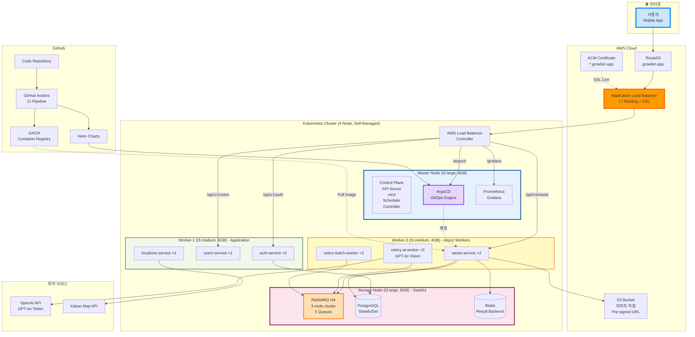
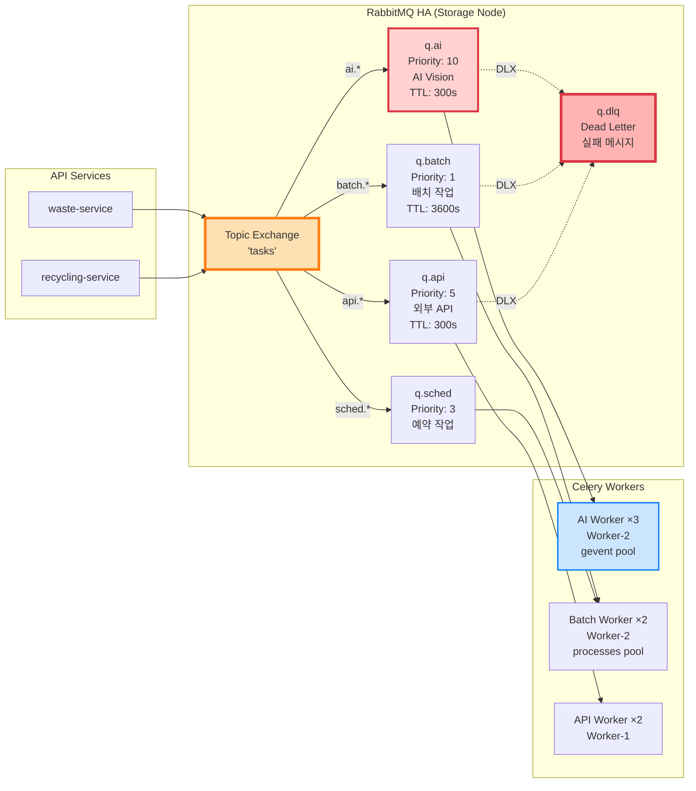
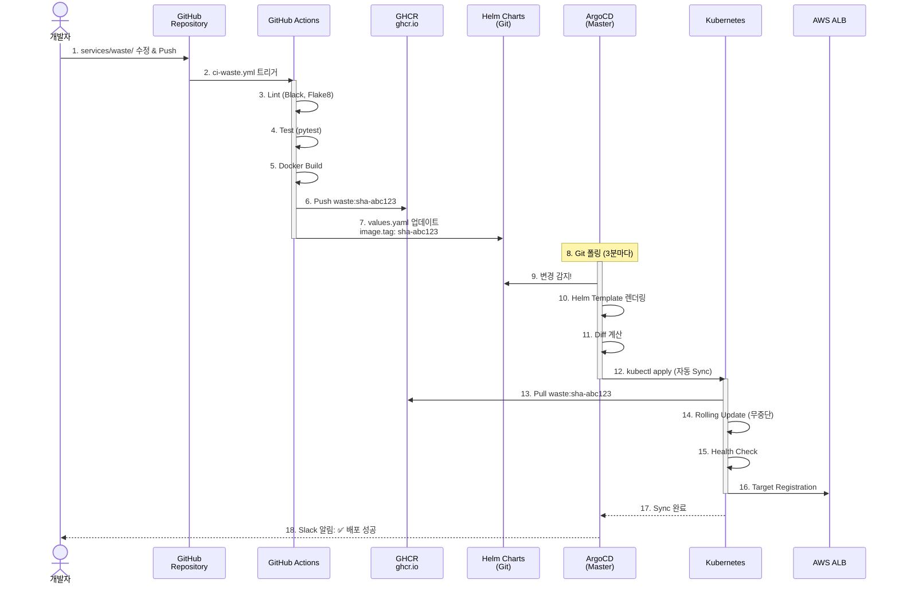
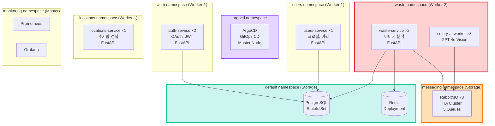
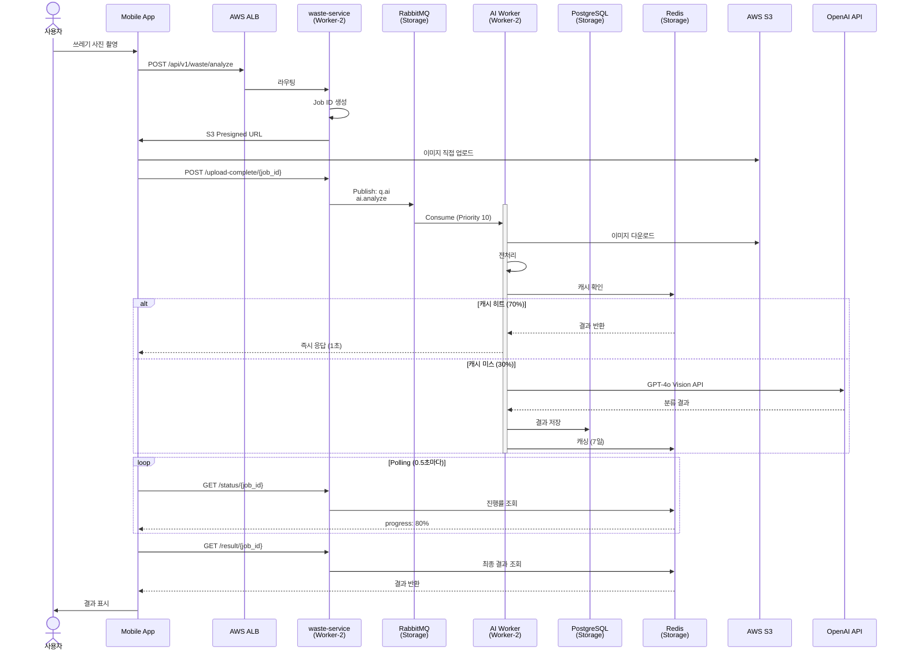

# 🏗️ 최종 Kubernetes 아키텍처

> **AI Waste Coach Backend - 4-Node 프로덕션 인프라**  
> **날짜**: 2025-10-31  
> **상태**: ✅ 프로덕션 배포 완료

## 📋 목차

1. [전체 아키텍처](#전체-아키텍처)
2. [4-Node 클러스터 구성](#4-node-클러스터-구성)
3. [마이크로서비스 배치](#마이크로서비스-배치)
4. [Task Queue 구조](#task-queue-구조)
5. [GitOps 파이프라인](#gitops-파이프라인)
6. [데이터 흐름](#데이터-흐름)

---

## 🌐 전체 아키텍처



---

## 🖥️ 4-Node 클러스터 구성

### 노드별 역할 (Instagram + Robin Storage 패턴)

```mermaid
graph TB
    subgraph Tier1["Tier 1: Control + Monitoring"]
        Master[Master Node<br/>t3.large, 8GB, 80GB<br/>$60/월<br/><br/>Control Plane:<br/>- kube-apiserver<br/>- etcd<br/>- scheduler<br/>- controller<br/><br/>Monitoring:<br/>- Prometheus<br/>- Grafana<br/>- Metrics Server<br/><br/>GitOps:<br/>- ArgoCD]
    end
    
    subgraph Tier2["Tier 2: Sync API (Application)"]
        Worker1[Worker-1 Node<br/>t3.medium, 4GB, 40GB<br/>$30/월<br/><br/>FastAPI Pods:<br/>- auth-service ×2<br/>- users-service ×1<br/>- locations-service ×1<br/><br/>Pattern:<br/>Reactor (Sync API)]
    end
    
    subgraph Tier3["Tier 3: Async Workers"]
        Worker2[Worker-2 Node<br/>t3.medium, 4GB, 40GB<br/>$30/월<br/><br/>Celery Workers:<br/>- AI Worker ×3<br/>- Batch Worker ×2<br/>- waste-service ×2<br/><br/>Pattern:<br/>Task Queue]
    end
    
    subgraph Tier4["Tier 4: Stateful Storage"]
        Storage[Storage Node<br/>t3.large, 8GB, 100GB<br/>$60/월<br/><br/>Stateful Services:<br/>- RabbitMQ ×3 (HA)<br/>- PostgreSQL<br/>- Redis<br/><br/>Pattern:<br/>Robin Storage]
    end
    
    Master -.->|orchestrate| Worker1
    Master -.->|orchestrate| Worker2
    Master -.->|orchestrate| Storage
    Worker1 -->|publish task| Storage
    Worker2 -->|consume task| Storage
    
    style Master fill:#e3f2fd,stroke:#0d47a1,stroke-width:3px
    style Worker1 fill:#f1f8e9,stroke:#33691e,stroke-width:2px
    style Worker2 fill:#fff9c4,stroke:#f57f17,stroke-width:2px
    style Storage fill:#fce4ec,stroke:#880e4f,stroke-width:3px
```

### 리소스 할당 및 비용

```
Tier 1: Master (Control + Monitoring)
├─ Instance: t3.large (2 vCPU, 8GB RAM, 80GB EBS)
├─ 비용: $60/월
├─ 사용률:
│  ├─ Control Plane: 0.5 CPU, 1.5GB
│  ├─ etcd: 0.2 CPU, 0.5GB
│  ├─ Prometheus: 0.3 CPU, 1.5GB
│  ├─ Grafana: 0.2 CPU, 0.5GB
│  └─ ArgoCD: 0.3 CPU, 1GB
└─ 여유: 0.5 CPU, 3GB (30%)

Tier 2: Worker-1 (Application)
├─ Instance: t3.medium (2 vCPU, 4GB RAM, 40GB EBS)
├─ 비용: $30/월
├─ 사용률:
│  ├─ auth-service ×2: 0.4 CPU, 0.6GB
│  ├─ users-service ×1: 0.2 CPU, 0.3GB
│  └─ locations-service ×1: 0.2 CPU, 0.3GB
└─ 여유: 1.2 CPU, 2.8GB (60%)

Tier 3: Worker-2 (Async)
├─ Instance: t3.medium (2 vCPU, 4GB RAM, 40GB EBS)
├─ 비용: $30/월
├─ 사용률:
│  ├─ celery-ai-worker ×3: 0.8 CPU, 1.5GB
│  ├─ celery-batch-worker ×2: 0.4 CPU, 0.8GB
│  └─ waste-service ×2: 0.4 CPU, 0.6GB
└─ 여유: 0.4 CPU, 1.1GB (25%)

Tier 4: Storage (Stateful)
├─ Instance: t3.large (2 vCPU, 8GB RAM, 100GB EBS)
├─ 비용: $60/월
├─ 사용률:
│  ├─ RabbitMQ ×3: 0.6 CPU, 3GB
│  ├─ PostgreSQL ×1: 0.5 CPU, 2GB
│  └─ Redis ×1: 0.2 CPU, 1GB
└─ 여유: 0.7 CPU, 2GB (25%)

━━━━━━━━━━━━━━━━━━━━━━━━━━━━━━━━━━
총 리소스:
├─ 노드: 4개
├─ vCPU: 8 cores
├─ Memory: 24GB
├─ Storage: 260GB
└─ 비용: $185/월 (EC2 $180 + S3 $5)
```

---

## 🐰 Task Queue 구조

### RabbitMQ + Celery (5개 큐)



### Queue별 작업

```
q.ai (Worker-2, prefetch=2):
├─ image.analyze (GPT-4o Vision, 2-5초)
├─ image.classify (Vision Model, 1-3초)
└─ 처리량: ~20 req/min

q.batch (Worker-2, prefetch=1):
├─ analytics.daily (30-60초)
├─ report.generate (60-120초)
└─ 처리량: ~2 req/min

q.api (Worker-1, prefetch=4):
├─ map.search (Kakao Map, 0.5초)
├─ oauth.verify (소셜 로그인, 0.3초)
└─ 처리량: ~100 req/min

q.sched (Worker-2):
├─ cleanup.cache (매시간)
├─ backup.database (매일 02:00)
└─ stats.aggregate (매일 03:00)

q.dlq:
└─ 실패 메시지 수집 및 재처리
```

---

## 🔄 GitOps 파이프라인

### CI/CD 전체 흐름



---

## 🗺️ 마이크로서비스 배치

### Namespace별 서비스



---

## 📊 데이터 흐름

### 이미지 분석 요청 전체 흐름



---

## 🎯 핵심 사양

### 클러스터

```
Kubernetes (kubeadm):
├─ 버전: v1.28
├─ CNI: Calico VXLAN (BGP 비활성화)
├─ 노드: 4개 (1M + 3W)
├─ HA: non-HA (단일 Master)
└─ 패턴: Instagram (Worker 분리) + Robin (Storage 격리)

총 리소스:
├─ vCPU: 8 cores
├─ Memory: 24GB
├─ Storage: 260GB
└─ 비용: $185/월
```

### 네트워킹

```
AWS Load Balancer Controller:
├─ Type: Application Load Balancer (L7)
├─ SSL/TLS: ACM (자동 갱신)
├─ Routing: Path-based
└─ Target: IP (Pod 직접 연결)

Path Routes:
├─ /argocd       → argocd-server (Master)
├─ /grafana      → grafana-service (Master)
├─ /api/v1/auth  → auth-service (Worker-1)
├─ /api/v1/users → users-service (Worker-1)
├─ /api/v1/waste → waste-service (Worker-2)
└─ /              → default-backend
```

### Stateful Services

```
PostgreSQL (Storage Node):
├─ Type: StatefulSet
├─ PVC: 50GB EBS gp3
└─ Schema: 분리 (auth, users, waste)

Redis (Storage Node):
├─ Type: Deployment
├─ 용도: Celery Result Backend, Caching
└─ TTL: 7일

RabbitMQ (Storage Node):
├─ Type: StatefulSet (HA 3-node)
├─ PVC: 20GB × 3
└─ Queues: 5개 (ai, batch, api, sched, dlq)
```

---

## 📈 확장 계획

### HPA (Horizontal Pod Autoscaler)

```yaml
# waste-service HPA
apiVersion: autoscaling/v2
kind: HorizontalPodAutoscaler
metadata:
  name: waste-service
  namespace: waste
spec:
  scaleTargetRef:
    kind: Deployment
    name: waste-service
  minReplicas: 2
  maxReplicas: 10
  metrics:
  - type: Resource
    resource:
      name: cpu
      target:
        type: Utilization
        averageUtilization: 70
```

### Cluster Scaling

```
노드 추가 시나리오:
1. Worker-1 복제 → Application 확장
2. Worker-2 복제 → Async 확장
3. Storage 복제 → DB 읽기 복제본

Spot Instance 활용:
├─ t3.medium Spot: $9/월 (70% 할인)
└─ 비중요 Worker에 적용
```

---

## 🔒 보안

### Network Policies

```yaml
# Storage Namespace 격리
apiVersion: networking.k8s.io/v1
kind: NetworkPolicy
metadata:
  name: storage-isolation
  namespace: messaging
spec:
  podSelector:
    matchLabels:
      app: rabbitmq
  policyTypes:
  - Ingress
  ingress:
  - from:
    - podSelector:
        matchLabels:
          app: waste-service
    - podSelector:
        matchLabels:
          app: celery-worker
    ports:
    - protocol: TCP
      port: 5672
```

---

## 📊 모니터링

### Prometheus + Grafana (Master Node)

```
Metrics:
├─ Node: CPU, Memory, Disk, Network
├─ Pod: 상태, Restart, Ready
├─ RabbitMQ: Queue 길이, 처리율
├─ Celery: Task 성공/실패율
├─ ALB: Request/s, Latency, 5xx
└─ PostgreSQL: 커넥션, Query 시간

Alerts:
├─ q.dlq 길이 > 100
├─ Pod CrashLoopBackOff
├─ Node CPU > 85%
├─ Disk > 80%
└─ ALB 5xx > 1%
```

---

## 🎯 요약

```
4-Node Kubernetes Cluster:
├─ Self-Managed (kubeadm)
├─ Calico VXLAN CNI
├─ AWS ALB Controller
├─ Instagram + Robin 패턴
└─ $185/월

서비스:
├─ API Services: 6 Pods
├─ Celery Workers: 7 Pods
├─ RabbitMQ: 3-node HA
├─ PostgreSQL: StatefulSet
└─ Redis: Cache + Result Backend

GitOps:
├─ ArgoCD (자동 배포)
├─ GitHub Actions (CI)
├─ Helm Charts
└─ GHCR (무료)

성능:
├─ 동시 사용자: 100-500명
├─ 처리 시간: < 5초
├─ 캐시 히트율: 70%
└─ 가용성: 99%+
```

---

## 📚 관련 문서

- [4-Node 배포 아키텍처](deployment-architecture-4node.md) - 상세 다이어그램
- [Self-Managed K8s 선택 배경](why-self-managed-k8s.md) - EKS vs kubeadm
- [VPC 네트워크 설계](../infrastructure/vpc-network-design.md) - 보안 그룹
- [Task Queue 설계](task-queue-design.md) - RabbitMQ + Celery

---

**작성일**: 2025-10-31  
**구성**: 4-Node Kubernetes (kubeadm) + ArgoCD + Calico VXLAN + AWS ALB  
**총 비용**: $185/월  
**상태**: ✅ 프로덕션 배포 완료
