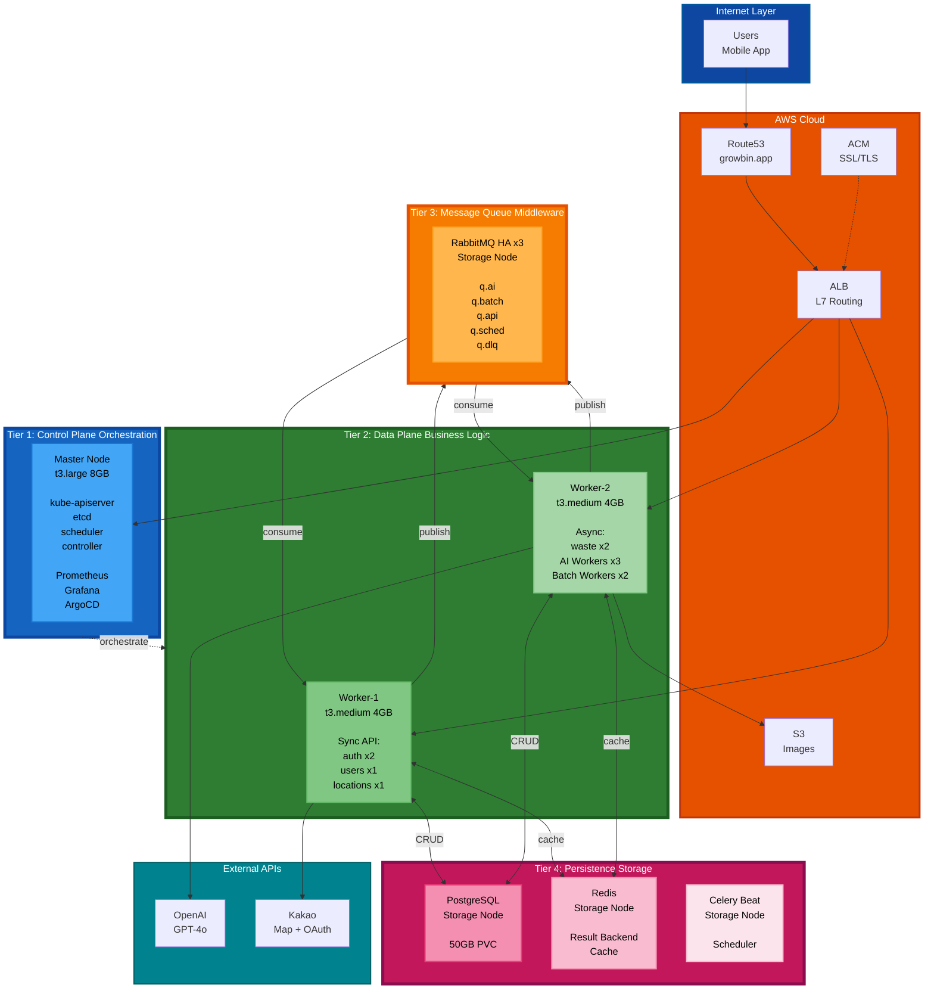
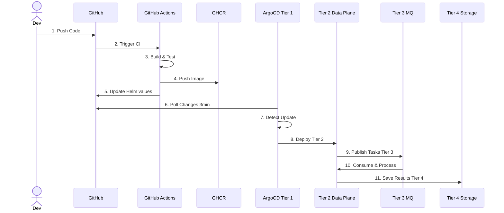
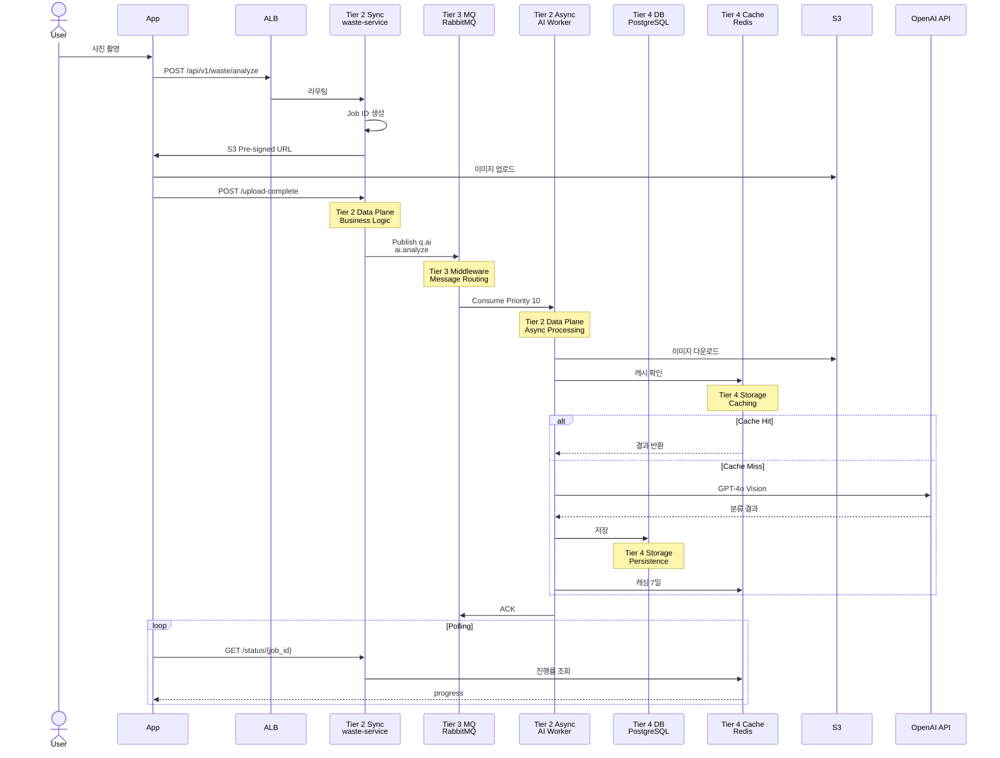

# 🏗️ 최종 Kubernetes 아키텍처

> **AI Waste Coach Backend - 4-Tier Layered Architecture**  
> **날짜**: 2025-10-31  
> **상태**: ✅ 프로덕션 배포 완료

## 📋 목차

1. [4-Tier 아키텍처](#4-tier-아키텍처)
2. [Tier별 상세](#tier별-상세)
3. [GitOps 파이프라인](#gitops-파이프라인)
4. [데이터 흐름](#데이터-흐름)
5. [확장 전략](#확장-전략)

---

## 🏗️ 4-Tier 아키텍처

### Layered Architecture Overview



---

## 📊 Tier별 상세

### Tier 1: Control Plane (Orchestration Layer)

```
Physical Node: Master (t3.large, 8GB, 80GB, $60/월)

책임 (Responsibility):
✅ Cluster Orchestration
✅ Resource Scheduling
✅ State Management
✅ Monitoring & Observability
✅ GitOps CD

구성:
├─ kube-apiserver: API 서버
├─ etcd: 클러스터 상태 저장
├─ kube-scheduler: Pod 스케줄링
├─ kube-controller-manager: 컨트롤러 관리
├─ Prometheus: 메트릭 수집
├─ Grafana: 시각화
└─ ArgoCD: GitOps CD

관심사 (Concern):
└─ "어떻게 워크로드를 배치하고 관리할 것인가?"

리소스:
├─ CPU: 2 cores, 사용 50%
├─ Memory: 8GB, 사용 60%
└─ 여유: 1 core, 3GB
```

### Tier 2: Data Plane (Business Logic Layer)

```
Physical Nodes: Worker-1 + Worker-2 (t3.medium ×2, 4GB ×2, $60/월)

책임:
✅ Business Logic Processing
✅ Request/Response Handling
✅ Domain Logic Execution
✅ Integration with External APIs

관심사:
└─ "비즈니스 요구사항을 어떻게 처리할 것인가?"
   (Sync/Async는 구현 세부사항)

구성:

Worker-1 (Sync API - Reactor Pattern):
├─ auth-service ×2
│  └─ OAuth 로그인 (Kakao, Google, Naver) - 동기
│  └─ JWT 발급 - 동기
│  └─ 응답 시간: ~1-2초
│
├─ users-service ×1
│  └─ 프로필, 이력 - 동기
│  └─ 응답 시간: <100ms
│
└─ locations-service ×1
   └─ 수거함 검색 - 동기
   └─ 응답 시간: <500ms

Worker-2 (Async Processing - Task Queue Pattern):
├─ waste-service ×2
│  └─ 이미지 분석 API - 동기 (Job 생성만)
│  └─ 실제 분석은 AI Workers에게 위임
│
├─ AI Workers ×3 (Celery)
│  └─ Queue: q.ai (Tier 3)
│  └─ GPT-4o Vision 분석
│  └─ 처리 시간: 2-5초
│
└─ Batch Workers ×2 (Celery)
   └─ Queue: q.batch, q.sched (Tier 3)
   └─ 배치 작업, 예약 작업
   └─ 처리 시간: 30-600초

리소스:
├─ Worker-1: 2 cores, 4GB (사용 40%)
├─ Worker-2: 2 cores, 4GB (사용 70%)
└─ 총: 4 cores, 8GB
```

### Tier 3: Message Queue (Middleware Layer)

```
Physical Node: Storage (t3.large의 일부)
Logical Tier: Middleware

책임:
✅ Message Routing (라우팅 키 기반)
✅ Delivery Guarantee (메시지 보장)
✅ Priority Management (우선순위)
✅ Dead Letter Handling (실패 처리)
✅ High Availability (3-node Cluster)

구성:
└─ RabbitMQ HA ×3 (Quorum Queues)
   ├─ q.ai (Priority 10, AI Vision)
   ├─ q.batch (Priority 1, 배치 작업)
   ├─ q.api (Priority 5, 외부 API)
   ├─ q.sched (Priority 3, 예약 작업)
   └─ q.dlq (Dead Letter)

관심사:
└─ "메시지를 어떻게 안전하고 효율적으로 전달할 것인가?"

리소스:
├─ CPU: 600m (3개 Pod 합계)
├─ Memory: 3GB
└─ Disk: 60GB (20GB × 3 PVC)

위치:
✅ Storage 노드 (물리적)
✅ Tier 3 (논리적, Middleware)
```

### Tier 4: Persistence (Storage Layer)

```
Physical Node: Storage (t3.large의 일부)
Logical Tier: Persistence

책임:
✅ Data Persistence (ACID 트랜잭션)
✅ Result Backend (Celery 결과 저장)
✅ Caching (성능 최적화)
✅ Scheduled Task Management

구성:
├─ PostgreSQL (StatefulSet)
│  ├─ Schemas: auth, users, waste
│  ├─ PVC: 50GB gp3
│  └─ Backup: 일일 백업
│
├─ Redis (Deployment)
│  ├─ Result Backend (Celery)
│  ├─ Cache (7-day TTL)
│  └─ Session Store
│
└─ Celery Beat ×1
   └─ Scheduler (DatabaseScheduler)
   └─ Replicas: 1 (중복 방지)

관심사:
└─ "데이터를 어떻게 영속적으로 저장하고 관리할 것인가?"

리소스:
├─ PostgreSQL: 500m CPU, 2GB
├─ Redis: 200m CPU, 1GB
├─ Beat: 50m CPU, 128Mi
└─ 총: 750m CPU, 3.1GB

위치:
✅ Storage 노드 (물리적)
✅ Tier 4 (논리적, Persistence)
```

---

## 🎯 핵심 개념

### 물리적 노드 vs 논리적 Tier

```
Physical Nodes (4개):
1. Master
2. Worker-1
3. Worker-2
4. Storage

Logical Tiers (4계층):
1. Control Plane (Master)
2. Data Plane (Worker-1 + Worker-2)
3. Message Queue (Storage의 RabbitMQ)
4. Persistence (Storage의 PostgreSQL + Redis)

핵심:
✅ Storage 노드 = Tier 3 + Tier 4 (논리적 분리)
✅ Tier ≠ Node (계층 ≠ 물리적 서버)
✅ Software Engineering Layered Architecture
```

### Dependency Flow

```
Tier 1 (Control Plane)
   ↓ orchestrates
Tier 2 (Data Plane)
   ↓ publishes    ↓ reads/writes
Tier 3 (MQ)    Tier 4 (Storage)
   ↓ consumes
Tier 2 (Workers)

✅ Clean dependency (상위 → 하위)
✅ No circular dependency
✅ Separation of Concerns
```

---

## 🔄 GitOps 파이프라인



---

## 📊 데이터 흐름 (4-Tier)

### 이미지 분석 요청



---

## 🎯 4-Tier 장점

### Layered Architecture Benefits

```
1. Separation of Concerns (관심사의 분리)
   ✅ Tier 1: Orchestration (어떻게 배치?)
   ✅ Tier 2: Business Logic (어떻게 처리?)
   ✅ Tier 3: Messaging (어떻게 전달?)
   ✅ Tier 4: Persistence (어떻게 저장?)

2. Single Responsibility (단일 책임)
   ✅ 각 Tier는 하나의 명확한 책임
   ✅ RabbitMQ: 메시지만 (Tier 3)
   ✅ PostgreSQL: 저장만 (Tier 4)

3. Clean Dependencies (깨끗한 의존성)
   ✅ Tier 1 → Tier 2 (orchestrate)
   ✅ Tier 2 → Tier 3 (publish/consume)
   ✅ Tier 2 → Tier 4 (read/write)
   ✅ 상위 → 하위만 의존

4. Independent Scaling (독립 확장)
   ✅ Tier 2 확장: Worker 노드 추가
   ✅ Tier 3 확장: RabbitMQ 클러스터 확장
   ✅ Tier 4 확장: PostgreSQL 읽기 복제본

5. Fault Isolation (장애 격리)
   ✅ Tier 3 다운 → Tier 2 Sync API 정상
   ✅ Tier 4 다운 → Tier 3 메시지 보존
   ✅ Tier 분리로 영향 최소화
```

---

## 📈 확장 전략

### Tier별 독립 확장

```
Tier 2 (Data Plane) 확장:
├─ API 트래픽 증가
│  └─ Worker-1 노드 추가 (+$30/월)
│  └─ auth-service HPA (2 → 5)
│
└─ AI 처리 증가
   └─ Worker-2 노드 추가 (+$30/월)
   └─ AI Workers HPA (3 → 10)

Tier 3 (Message Queue) 확장:
└─ 메시지 처리량 증가
   └─ RabbitMQ 노드 추가 (3 → 5)
   └─ Queue Sharding

Tier 4 (Persistence) 확장:
├─ DB 읽기 증가
│  └─ PostgreSQL 읽기 복제본
│
└─ Cache 증가
   └─ Redis Cluster (3-node)
```

---

## 🔒 보안 (Tier별 격리)

### Network Policies

```yaml
# Tier 2 → Tier 3 (MQ)
apiVersion: networking.k8s.io/v1
kind: NetworkPolicy
metadata:
  name: tier2-to-tier3
  namespace: messaging
spec:
  podSelector:
    matchLabels:
      tier: middleware  # Tier 3
  ingress:
  - from:
    - podSelector:
        matchLabels:
          tier: data-plane  # Tier 2만 허용
    ports:
    - protocol: TCP
      port: 5672

# Tier 2 → Tier 4 (DB)
---
apiVersion: networking.k8s.io/v1
kind: NetworkPolicy
metadata:
  name: tier2-to-tier4
  namespace: default
spec:
  podSelector:
    matchLabels:
      tier: persistence  # Tier 4
  ingress:
  - from:
    - podSelector:
        matchLabels:
          tier: data-plane  # Tier 2만 허용
    ports:
    - protocol: TCP
      port: 5432  # PostgreSQL
```

---

## 📚 관련 문서

- [4-Tier 배포 아키텍처](deployment-architecture-4node.md)
- [Task Queue 설계](task-queue-design.md) - Tier 3 상세
- [DEPLOYMENT_GUIDE](../../DEPLOYMENT_GUIDE.md)
- [VPC 네트워크](../infrastructure/vpc-network-design.md)

---

**작성일**: 2025-10-31  
**아키텍처**: 4-Tier Layered Architecture  
**총 비용**: $185/월  
**노드**: 4개 (Master, Worker-1, Worker-2, Storage)  
**Tier**: 4계층 (Control Plane → Data Plane → MQ → Storage)  
**패턴**: Separation of Concerns + Clean Architecture
