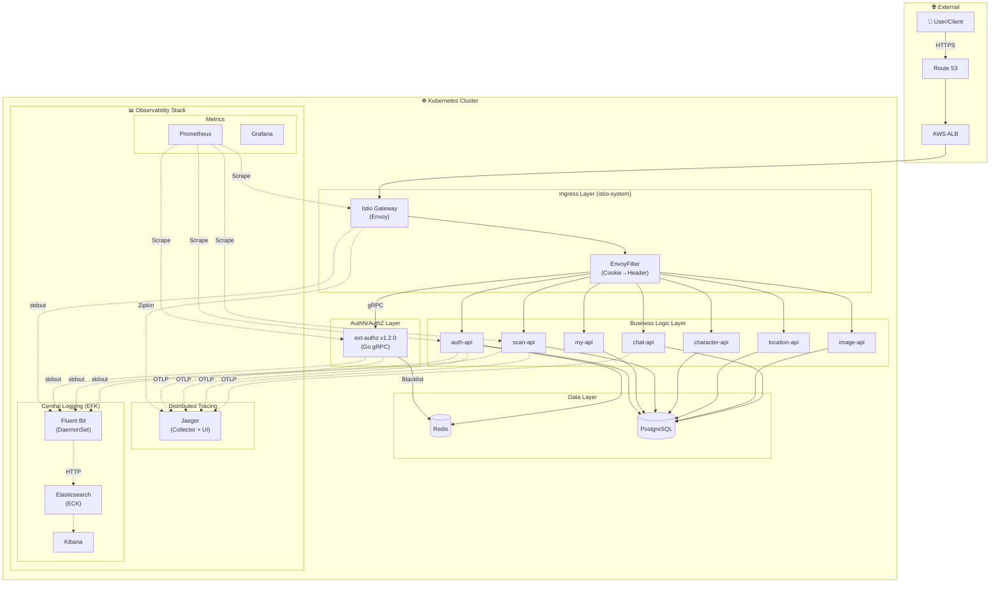
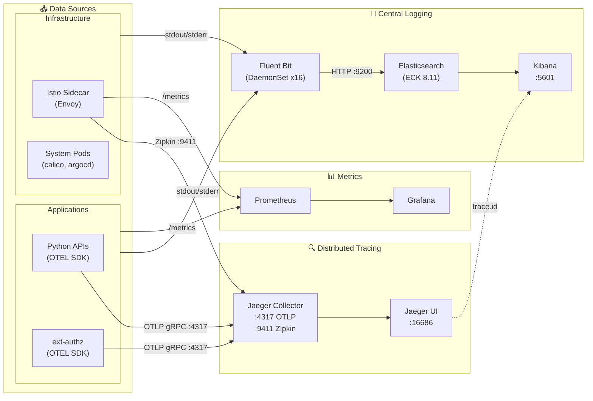
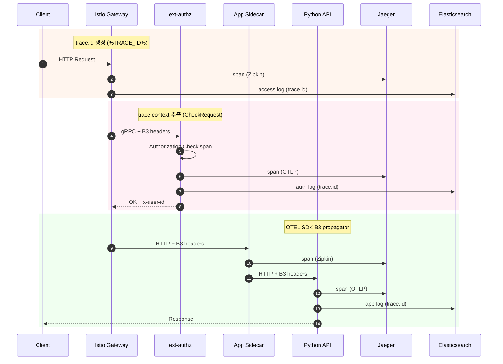
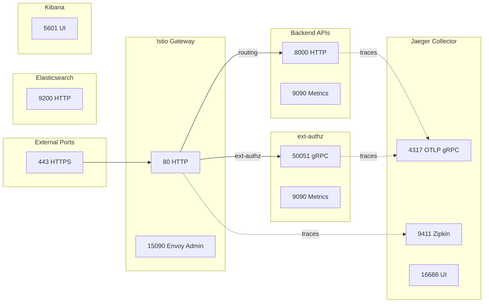

# 이코에코 서비스 아키텍처

> **작성일**: 2025-12-19  
> **버전**: develop (Observability Enhancement)

---

## 전체 서비스 아키텍처



---

## Observability 상세 아키텍처



---

## Trace Context 전파 흐름



---

## 컴포넌트별 Observability 지원

### Span 전송 현황 (Jaeger)

| 서비스 | Istio Sidecar | OTEL SDK | Jaeger 등록 |
|--------|:---:|:---:|:---:|
| istio-ingressgateway | ✅ Zipkin | - | ✅ |
| **ext-authz** | ✅ Zipkin | ✅ OTLP | ✅ |
| auth-api | ✅ Zipkin | ✅ OTLP | ✅ |
| scan-api | ✅ Zipkin | ✅ OTLP | ✅ |
| chat-api | ✅ Zipkin | ✅ OTLP | ✅ |
| character-api | ✅ Zipkin | ✅ OTLP | ✅ |
| location-api | ✅ Zipkin | ✅ OTLP | ✅ |
| image-api | ✅ Zipkin | ✅ OTLP | ✅ |
| my-api | ✅ Zipkin | ✅ OTLP | ✅ |

### 로그 수집 현황 (EFK)

| 소스 | trace.id | service.name | ECS 호환 |
|------|:---:|:---:|:---:|
| Python APIs | ✅ OTEL 자동 | ✅ App 코드 | ✅ |
| ext-authz | ✅ 수동 추출 | ✅ App 코드 | ✅ |
| istio-proxy | ✅ EnvoyFilter | ✅ Lua 생성 | ✅ |
| 시스템 로그 | ❌ | ✅ Lua 생성 | ✅ |

---

## 서비스 포트 매핑



---

## 핵심 설정 요약

### Istio Tracing 설정

```yaml
# meshConfig
defaultConfig:
  tracing:
    sampling: 100
    zipkin:
      address: jaeger-collector-clusterip:9411
enableTracing: true
```

### OTEL SDK 환경변수 (Python)

```yaml
OTEL_SERVICE_NAME: auth-api
OTEL_TRACES_EXPORTER: otlp
OTEL_EXPORTER_OTLP_ENDPOINT: http://jaeger-collector:4317
OTEL_PROPAGATORS: b3,tracecontext,baggage
```

### OTEL SDK 환경변수 (Go ext-authz)

```yaml
OTEL_ENABLED: "true"
OTEL_EXPORTER_OTLP_ENDPOINT: jaeger-collector:4317
OTEL_SAMPLING_RATE: "1.0"
```

### Fluent Bit → Elasticsearch

```ini
[OUTPUT]
    Name            es
    Host            eco2-logs-es-http.logging
    Port            9200
    Logstash_Format On
    Logstash_Prefix logs
    Replace_Dots    Off  # ECS dot notation
```

### Index Template (ECS)

```json
{
  "mappings": {
    "subobjects": false,
    "properties": {
      "trace.id": { "type": "keyword" },
      "span.id": { "type": "keyword" },
      "service.name": { "type": "keyword" }
    }
  }
}
```

---

## 실측 데이터 (2025-12-19)

| 메트릭 | 값 |
|--------|-----|
| Jaeger 서비스 수 | 17개 |
| trace.id 커버리지 | 7.16% (125K / 1.7M) |
| Fluent Bit 노드 | 16개 (DaemonSet) |
| ES 인덱스 | logs-YYYY.MM.DD |
| 일일 로그 볼륨 | ~50MB |

---

## 관련 문서

- [네트워크 토폴로지](./network-topology.md)
- [Observability 블로그 시리즈](../blogs/observability/)
- [Log-Trace Correlation](../blogs/observability/12-log-trace-correlation.md)
