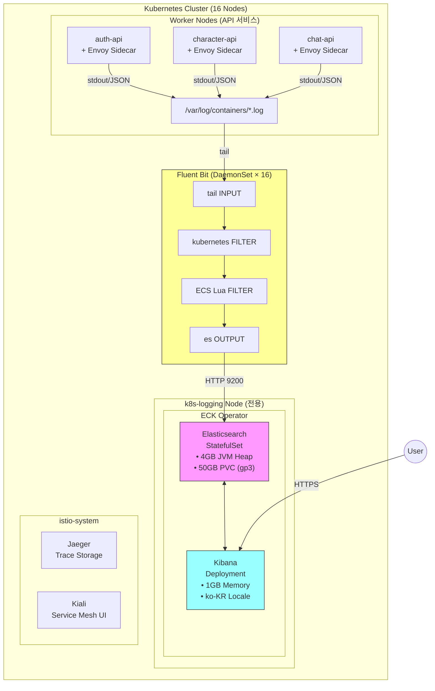
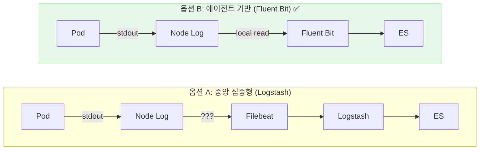
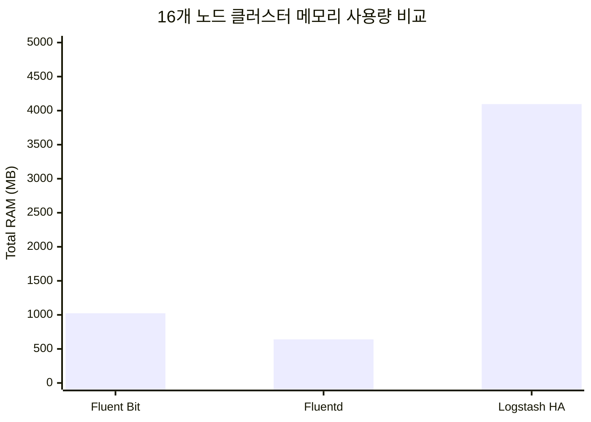
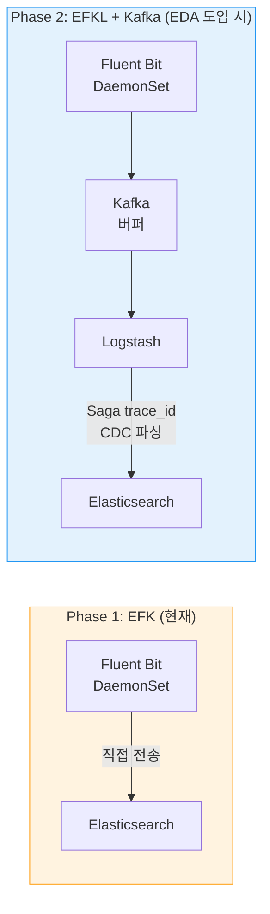
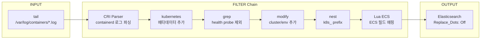

# 이코에코(Eco²) Observability #1: 로깅 파이프라인 구축

> **시리즈**: Eco² Observability Enhancement  
> **작성일**: 2025-12-17  
> **수정일**: 2025-12-18  
> **태그**: `#Kubernetes` `#ECK` `#Elasticsearch` `#Kibana` `#FluentBit` `#ECS`

---

## 📋 개요

이번 글에서는 ECK(Elastic Cloud on Kubernetes) Operator를 사용하여 EFK 스택을 구축하는 전체 과정을 다룹니다.

### 구축 순서

1. 인프라 프로비저닝 (Terraform/Ansible)
2. ECK Operator 설치
3. Elasticsearch CR 배포
4. Kibana CR 배포
5. Fluent Bit DaemonSet 배포
6. External Secrets 연동

---

## 🏗️ Observability 아키텍처 구조

### 전체 구조도



### 컴포넌트 구성 및 역할

| 컴포넌트 | 배포 방식 | 역할 | 리소스 |
|----------|----------|------|--------|
| **Fluent Bit** | DaemonSet (16 노드) | 로그 수집, 파싱, ECS 변환, 전송 | ~64MB/노드 |
| **Elasticsearch** | StatefulSet (ECK CR) | 로그 저장, 인덱싱, 검색 | 4GB heap, 50GB disk |
| **Kibana** | Deployment (ECK CR) | 시각화, 대시보드, 검색 UI | 1GB |
| **ECK Operator** | Deployment | ES/Kibana CRD 관리 | 200MB |

### 현재 클러스터 상태

| 항목 | 상태 |
|------|------|
| Fluent Bit DaemonSet | 16/16 Ready |
| Elasticsearch | green (1 node) |
| 일일 로그량 | ~500K+ docs/day |
| 인덱스 크기 | ~420MB/day |

---

## 🎯 Fluent Bit: 에이전트 기반 수집 전략

### 왜 Fluent Bit을 에이전트(DaemonSet)로 선택했는가?

#### 1. Kubernetes 네이티브 설계



| 비교 항목 | 중앙 집중형 (Logstash) | 에이전트 기반 (Fluent Bit) |
|----------|----------------------|---------------------------|
| 네트워크 | 원격 수집 필요 | 로컬 파일 읽기 |
| 확장성 | 노드 추가 시 설정 변경 | DaemonSet 자동 배포 |
| 장애 격리 | SPOF 위험 | 노드별 독립 |

#### 2. 경량 리소스 사용



| 솔루션 | 노드당 메모리 | 총 사용량 (16노드) |
|--------|-------------|-------------------|
| **Fluent Bit** | ~64MB | ~1GB |
| Fluentd | ~40MB | ~640MB |
| Logstash HA | 2GB × 2 | ~4GB |

#### 3. ECS 표준 필드 자동 매핑

현재 구현된 Lua 스크립트로 K8s 메타데이터를 ECS 필드로 자동 변환:

```lua
-- service.name 매핑 우선순위
-- 1. 앱 로그의 기존 service.name 유지
-- 2. k8s_labels_app
-- 3. k8s_labels_app.kubernetes.io/name
-- 4. k8s_labels_k8s-app
-- 5. k8s_container_name
```

---

## 🔄 향후 Kafka 전환을 위한 설계

[EDA 전환 로드맵](https://rooftopsnow.tistory.com/27)에 따라, EDA 도입 시 **Fluent Bit → Kafka → Logstash → ES** 구조로 전환합니다.

### Phase 1 (현재) vs Phase 2 (EDA) 비교



### Fluent Bit output 변경만으로 전환

```yaml
# Phase 1: Elasticsearch 직접 전송 (현재)
[OUTPUT]
    Name            es
    Match           kube.*
    Host            eco2-logs-es-http.logging.svc.cluster.local
    Port            9200

# Phase 2: Kafka로 전송 (output만 변경)
[OUTPUT]
    Name            kafka
    Match           kube.*
    Brokers         kafka.kafka.svc.cluster.local:9092
    Topics          logs-raw
    Format          json
```

---

## 🔧 Step 1: 인프라 프로비저닝

### Terraform - 로깅 전용 노드 추가

```hcl
# terraform/instances.tf
resource "aws_instance" "logging" {
  count         = 1
  ami           = data.aws_ami.ubuntu.id
  instance_type = "t3.large"  # 8GB RAM
  
  root_block_device {
    volume_size = 100
    volume_type = "gp3"
  }
  
  tags = {
    Name     = "k8s-logging"
    Role     = "logging"
    Workload = "logging"
  }
}
```

### Ansible - 노드 설정

```yaml
# ansible/playbooks/03-worker-join.yml
- name: Configure logging node
  hosts: logging
  tasks:
    - name: Apply node labels
      command: >
        kubectl label node k8s-logging
        workload=logging --overwrite
        
    - name: Apply node taints
      command: >
        kubectl taint node k8s-logging
        domain=observability:NoSchedule --overwrite
```

---

## 🔧 Step 2: ECK Operator 설치

### ArgoCD Application

```yaml
# clusters/dev/apps/62-eck-operator.yaml
apiVersion: argoproj.io/v1alpha1
kind: Application
metadata:
  name: eck-operator
  namespace: argocd
  annotations:
    argocd.argoproj.io/sync-wave: "62"
spec:
  project: default
  source:
    chart: eck-operator
    repoURL: https://helm.elastic.co
    targetRevision: 2.11.0
    helm:
      values: |
        installCRDs: true
        resources:
          requests:
            memory: 150Mi
            cpu: 100m
          limits:
            memory: 200Mi
            cpu: 200m
  destination:
    server: https://kubernetes.default.svc
    namespace: elastic-system
```

---

## 🔧 Step 3: Elasticsearch CR 배포

### Elasticsearch Custom Resource

```yaml
# workloads/logging/base/elasticsearch.yaml
apiVersion: elasticsearch.k8s.elastic.co/v1
kind: Elasticsearch
metadata:
  name: eco2-logs
  namespace: logging
spec:
  version: 8.11.0
  nodeSets:
  - name: default
    count: 1
    config:
      node.store.allow_mmap: false
      indices.memory.index_buffer_size: 20%
      discovery.seed_hosts: []
      cluster.initial_master_nodes:
      - eco2-logs-es-default-0
    
    podTemplate:
      spec:
        nodeSelector:
          workload: logging
        tolerations:
        - key: domain
          operator: Equal
          value: observability
          effect: NoSchedule
        
        containers:
        - name: elasticsearch
          env:
          - name: ES_JAVA_OPTS
            value: "-Xms4g -Xmx4g"
          resources:
            requests:
              memory: 5Gi
              cpu: 500m
            limits:
              memory: 5Gi
              cpu: 2000m
        
        initContainers:
        - name: sysctl
          securityContext:
            privileged: true
            runAsUser: 0
          command: ['sh', '-c', 'sysctl -w vm.max_map_count=262144']
    
    volumeClaimTemplates:
    - metadata:
        name: elasticsearch-data
      spec:
        accessModes: [ReadWriteOnce]
        storageClassName: gp3
        resources:
          requests:
            storage: 50Gi
  
  http:
    tls:
      selfSignedCertificate:
        disabled: true
```

### ECK가 자동 생성하는 리소스

| 리소스 종류 | 이름 | 용도 |
|-------------|------|------|
| StatefulSet | `eco2-logs-es-default` | ES Pod 관리 |
| Service | `eco2-logs-es-http` | HTTP 엔드포인트 (9200) |
| Service | `eco2-logs-es-transport` | Transport (9300) |
| Secret | `eco2-logs-es-elastic-user` | elastic 사용자 비밀번호 |

---

## 🔧 Step 4: Kibana CR 배포

### Kibana Custom Resource

```yaml
# workloads/logging/base/kibana.yaml
apiVersion: kibana.k8s.elastic.co/v1
kind: Kibana
metadata:
  name: eco2-kibana
  namespace: logging
spec:
  version: 8.11.0
  count: 1
  
  elasticsearchRef:
    name: eco2-logs
  
  config:
    server.name: kibana
    server.host: "0.0.0.0"
    server.publicBaseUrl: https://kibana.dev.growbin.app
    i18n.locale: ko-KR
    monitoring.ui.container.elasticsearch.enabled: true
  
  podTemplate:
    spec:
      nodeSelector:
        workload: logging
      tolerations:
      - key: domain
        operator: Equal
        value: observability
        effect: NoSchedule
      containers:
      - name: kibana
        env:
        - name: NODE_OPTIONS
          value: "--max-old-space-size=1024"
        resources:
          requests:
            memory: 1Gi
            cpu: 200m
          limits:
            memory: 1Gi
            cpu: 1000m
  
  http:
    tls:
      selfSignedCertificate:
        disabled: true
```

---

## 🔧 Step 5: Fluent Bit DaemonSet 배포

### Fluent Bit 파이프라인



### 주요 설정

```yaml
# workloads/logging/base/fluent-bit.yaml (핵심 부분)
[INPUT]
    Name              tail
    Tag               kube.*
    Path              /var/log/containers/*.log
    Parser            cri  # containerd 런타임용
    Mem_Buf_Limit     50MB

[FILTER]
    Name                kubernetes
    Match               kube.*
    Merge_Log           On      # JSON 병합
    Keep_Log            Off     # 원본 log 필드 제거
    Labels              On

# ECS 필드 자동 매핑 (Lua 스크립트)
[FILTER]
    Name          lua
    Match         kube.*
    script        /fluent-bit/etc/ecs-enrichment.lua
    call          enrich_with_ecs_fields

[OUTPUT]
    Name            es
    Match           kube.*
    Host            eco2-logs-es-http.logging.svc.cluster.local
    Logstash_Format On
    Logstash_Prefix logs
    Replace_Dots    Off  # ECS dot notation 유지
    Buffer_Size     5MB
```

### ECS Enrichment Lua 스크립트

```lua
function enrich_with_ecs_fields(tag, timestamp, record)
    -- service.name 매핑 (앱 로그 우선)
    if not record["service.name"] then
        local service_name = record["k8s_labels_app"]
                          or record["k8s_labels_app.kubernetes.io/name"]
                          or record["k8s_container_name"]
        if service_name then
            record["service.name"] = service_name
        end
    end
    
    -- kubernetes.* ECS 필드 매핑
    record["kubernetes.namespace"] = record["k8s_namespace_name"]
    record["kubernetes.pod.name"] = record["k8s_pod_name"]
    record["kubernetes.container.name"] = record["k8s_container_name"]
    
    return 1, timestamp, record
end
```

---

## 🔧 Step 6: External Secrets 연동

### ExternalSecret 리소스

```yaml
# workloads/secrets/external-secrets/dev/logging-secrets.yaml
apiVersion: external-secrets.io/v1beta1
kind: ExternalSecret
metadata:
  name: elasticsearch-credentials
  namespace: logging
spec:
  refreshInterval: 1h
  secretStoreRef:
    kind: ClusterSecretStore
    name: aws-ssm-store
  data:
  - secretKey: ES_PASSWORD
    remoteRef:
      key: /sesacthon/dev/observability/elasticsearch-password
  target:
    name: elasticsearch-credentials
    template:
      data:
        ES_USER: elastic
        ES_PASSWORD: "{{ .ES_PASSWORD }}"
```

---

## 🔒 NetworkPolicy 설정

```yaml
apiVersion: networking.k8s.io/v1
kind: NetworkPolicy
metadata:
  name: allow-fluent-bit-to-es
  namespace: logging
spec:
  podSelector:
    matchLabels:
      common.k8s.elastic.co/type: elasticsearch
  ingress:
  - from:
    - namespaceSelector: {}
      podSelector:
        matchLabels:
          app: fluent-bit
    ports:
    - port: 9200
```

---

## ✅ 배포 검증

### 1. ES 클러스터 상태 확인

```bash
# Pod 상태
kubectl get pods -n logging

# ES 클러스터 헬스
kubectl exec -it eco2-logs-es-default-0 -n logging -- \
  curl -u elastic:$ES_PASSWORD localhost:9200/_cluster/health?pretty
```

### 2. 로그 인덱스 확인

```bash
kubectl exec -it eco2-logs-es-default-0 -n logging -- \
  curl -u elastic:$ES_PASSWORD localhost:9200/_cat/indices?v

# 현재 상태 (2025-12-18 기준):
# logs-2025.12.17  1.1M docs  421MB
# logs-2025.12.18  500K+ docs  237MB
```

### 3. Kibana 접속

```
URL: https://kibana.dev.growbin.app
ID: elastic
PW: <ECK가 생성한 비밀번호>
```

---

## 🐛 트러블슈팅

### Issue 1: Fluent Bit 401 Unauthorized

```
[error] [output:es:es.0] HTTP status=401 URI=/_bulk
```

**원인**: ES 인증 정보 누락  
**해결**: External Secrets로 `ES_USER`, `ES_PASSWORD` 환경변수 주입

### Issue 2: CRI Parser 오류 (containerd)

```
[error] invalid JSON in log field
```

**원인**: docker parser 사용 (containerd 런타임에서)  
**해결**: `Parser cri` 사용

```
[PARSER]
    Name        cri
    Format      regex
    Regex       ^(?<time>[^ ]+) (?<stream>stdout|stderr) (?<logtag>[^ ]*) (?<log>.*)$
```

### Issue 3: ECS dot notation 필드 인덱싱 오류

```
mapper_parsing_exception: Could not dynamically add mapping for field [service.name]
```

**원인**: ES가 dot을 nested object로 해석  
**해결**: 
1. Fluent Bit: `Replace_Dots Off`
2. ES Index Template: `subobjects: false`

---

## 📚 다음 글 미리보기

**[#2: 로깅 정책 수립]** - Google SRE, Netflix, Uber 등 빅테크 사례를 분석하고 프로젝트에 맞는 로깅 정책을 수립합니다.

---

## 🔗 참고 자료

- [이코에코(Eco²) EDA 전환 로드맵](https://rooftopsnow.tistory.com/27)
- [ECK Quickstart](https://www.elastic.co/guide/en/cloud-on-k8s/current/k8s-quickstart.html)
- [Fluent Bit Kubernetes Filter](https://docs.fluentbit.io/manual/pipeline/filters/kubernetes)
- [Elastic Common Schema (ECS)](https://www.elastic.co/guide/en/ecs/current/index.html)
- [External Secrets Operator](https://external-secrets.io/)
