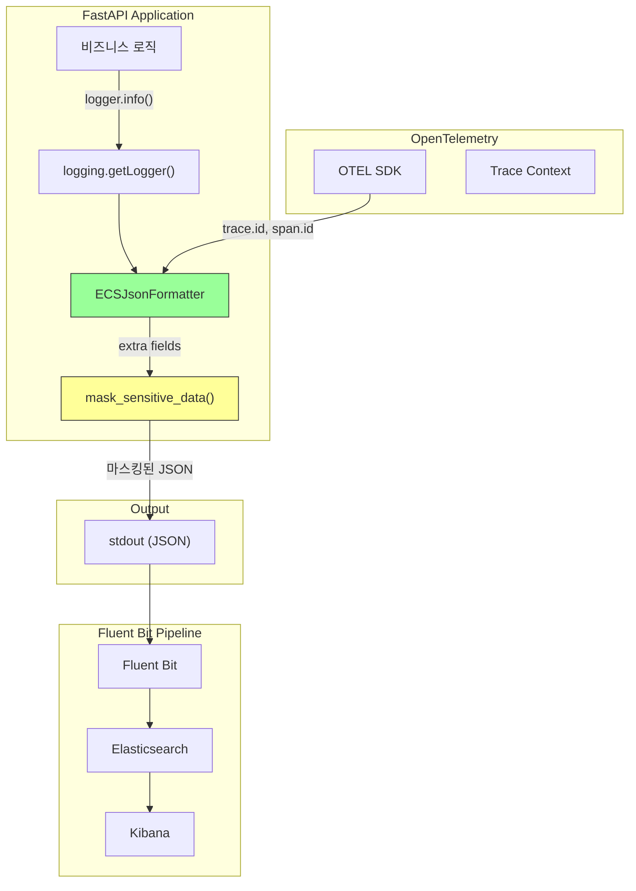
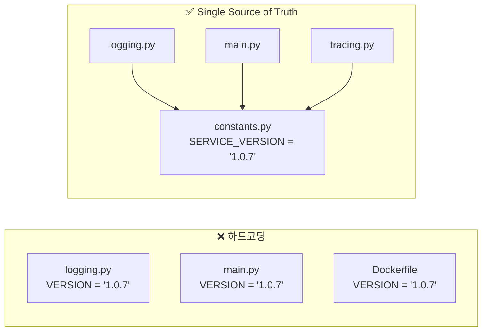
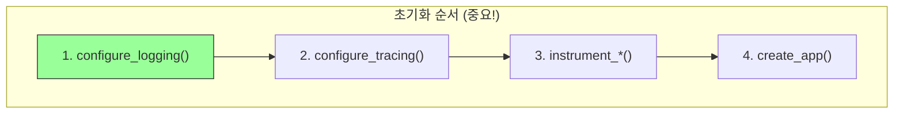
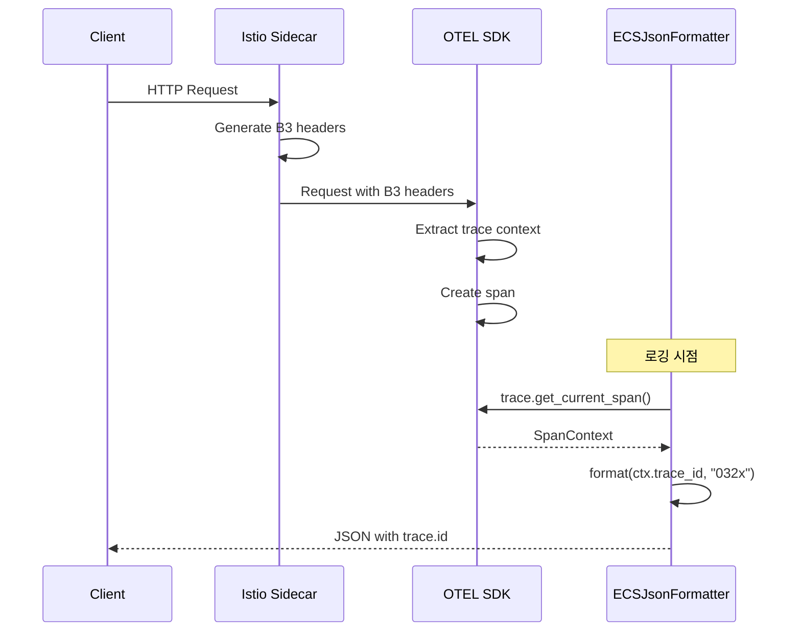

# 이코에코(Eco²) Observability #3: 도메인별 ECS 구조화 로깅

> **시리즈**: Eco² Observability Enhancement  
> **작성일**: 2025-12-17  
> **수정일**: 2025-12-18  
> **태그**: `#Python` `#FastAPI` `#ECS` `#StructuredLogging` `#OpenTelemetry`

---

## 📋 개요

이번 글에서는 Python/FastAPI 서비스에 ECS(Elastic Common Schema) 기반 구조화된 로깅을 구현하는 전체 과정을 다룹니다. OpenTelemetry와의 연동으로 trace_id를 자동 주입하고, 민감 정보 자동 마스킹을 통해 OWASP 보안 가이드라인을 준수합니다.

---

## 🎯 목표

1. JSON 구조화 로그 출력
2. ECS 8.11 스키마 준수
3. OpenTelemetry trace_id/span_id 자동 주입
4. **민감 정보 자동 마스킹** (OWASP 준수)
5. 환경별 로그 포맷 전환 (JSON/Text)
6. 외부 라이브러리 로그 레벨 제어

---

## 🏗️ 아키텍처

### 로그 처리 흐름



### 핵심 컴포넌트

| 컴포넌트 | 역할 | 파일 |
|----------|------|------|
| `ECSJsonFormatter` | ECS 스키마 JSON 포맷터 | `core/logging.py` |
| `mask_sensitive_data()` | 재귀적 PII 마스킹 | `core/logging.py` |
| `constants.py` | 상수 정의 (Single Source of Truth) | `core/constants.py` |
| `configure_logging()` | 로거 초기화 | `core/logging.py` |

---

## 🔧 구현: constants.py (Single Source of Truth)

### 왜 constants.py를 분리했는가?



**이유:**
1. **버전 동기화**: 로깅, 트레이싱, FastAPI 모두 동일 버전 사용
2. **12-Factor App**: 설정을 코드에서 분리
3. **타입 안전성**: IDE 자동완성, 오타 방지

### 전체 코드

```python
# domains/auth/core/constants.py
"""
Service Constants (Single Source of Truth)

정적 상수 정의 - 빌드 타임에 결정되며 환경변수로 변경되지 않음
"""

# =============================================================================
# Service Identity
# =============================================================================
SERVICE_NAME = "auth-api"
SERVICE_VERSION = "1.0.7"

# =============================================================================
# Logging Constants (12-Factor App Compliance)
# =============================================================================
# Environment variable keys
ENV_KEY_ENVIRONMENT = "ENVIRONMENT"
ENV_KEY_LOG_LEVEL = "LOG_LEVEL"
ENV_KEY_LOG_FORMAT = "LOG_FORMAT"

# Default values
DEFAULT_ENVIRONMENT = "dev"
DEFAULT_LOG_LEVEL = "DEBUG"
DEFAULT_LOG_FORMAT = "json"

# ECS (Elastic Common Schema) version
ECS_VERSION = "8.11.0"

# LogRecord attributes to exclude from extra fields
# Reference: https://docs.python.org/3/library/logging.html#logrecord-attributes
EXCLUDED_LOG_RECORD_ATTRS = frozenset({
    "name", "msg", "args", "created", "filename", "funcName",
    "levelname", "levelno", "lineno", "module", "msecs",
    "pathname", "process", "processName", "relativeCreated",
    "stack_info", "exc_info", "exc_text", "thread", "threadName",
    "taskName", "message",
})

# =============================================================================
# PII Masking Configuration (OWASP Logging Cheat Sheet)
# =============================================================================
SENSITIVE_FIELD_PATTERNS = frozenset({
    "password",       # 사용자 비밀번호
    "secret",         # jwt_secret_key, client_secret
    "token",          # JWT, OAuth tokens
    "api_key",        # External API keys
    "authorization",  # HTTP Authorization header
})

MASK_PLACEHOLDER = "***REDACTED***"
MASK_PRESERVE_PREFIX = 4  # 앞 4자리 표시
MASK_PRESERVE_SUFFIX = 4  # 뒤 4자리 표시
MASK_MIN_LENGTH = 10      # 부분 마스킹 최소 길이
```

---

## 🔧 구현: ECSJsonFormatter

### 왜 커스텀 Formatter인가?

| 옵션 | 장점 | 단점 |
|------|------|------|
| **python-json-logger** | 쉬운 설정 | ECS 필드명 커스텀 어려움 |
| **ecs-logging-python** | 공식 ECS 라이브러리 | OTEL 통합 부족 |
| **커스텀 Formatter** ✅ | 완전한 제어, OTEL 통합 | 직접 구현 필요 |

**선택 이유:**
1. OpenTelemetry `trace.get_current_span()` 직접 호출 필요
2. 민감 정보 마스킹 로직 통합
3. ECS 필드명 정확히 맞추기 (`trace.id` not `trace_id`)

### 전체 코드

```python
# domains/auth/core/logging.py
"""
Structured Logging Configuration (ECS-based)

Elastic Common Schema (ECS) 기반 JSON 로깅 설정
OpenTelemetry trace_id 자동 연동

Log Collection Protocol:
- Fluent Bit → Elasticsearch: HTTP (9200)
- OpenTelemetry → Jaeger: gRPC OTLP (4317)
"""

import json
import logging
import os
import sys
from datetime import datetime, timezone
from typing import Any

from domains.auth.core.constants import (
    DEFAULT_ENVIRONMENT, DEFAULT_LOG_FORMAT, DEFAULT_LOG_LEVEL,
    ECS_VERSION, ENV_KEY_ENVIRONMENT, ENV_KEY_LOG_FORMAT, ENV_KEY_LOG_LEVEL,
    EXCLUDED_LOG_RECORD_ATTRS, MASK_MIN_LENGTH, MASK_PLACEHOLDER,
    MASK_PRESERVE_PREFIX, MASK_PRESERVE_SUFFIX, SENSITIVE_FIELD_PATTERNS,
    SERVICE_NAME, SERVICE_VERSION,
)

try:
    from opentelemetry import trace
    HAS_OPENTELEMETRY = True
except ImportError:
    HAS_OPENTELEMETRY = False


# =============================================================================
# PII Masking (OWASP Compliance)
# =============================================================================

def _is_sensitive_key(key: str) -> bool:
    """Check if a key matches sensitive field patterns (case-insensitive)."""
    key_lower = key.lower()
    return any(pattern in key_lower for pattern in SENSITIVE_FIELD_PATTERNS)


def _mask_value(value: Any) -> str:
    """Mask a sensitive value with partial visibility for debugging."""
    if value is None:
        return MASK_PLACEHOLDER

    str_value = str(value)
    if len(str_value) <= MASK_MIN_LENGTH:
        return MASK_PLACEHOLDER

    # Partial masking: show prefix...suffix (예: eyJh...4fQk)
    return f"{str_value[:MASK_PRESERVE_PREFIX]}...{str_value[-MASK_PRESERVE_SUFFIX:]}"


def mask_sensitive_data(data: dict[str, Any]) -> dict[str, Any]:
    """
    Recursively mask sensitive fields in a dictionary.
    
    Args:
        data: Dictionary that may contain sensitive information
    
    Returns:
        Dictionary with sensitive values masked
    """
    if not isinstance(data, dict):
        return data

    result = {}
    for key, value in data.items():
        if _is_sensitive_key(key):
            result[key] = _mask_value(value)
        elif isinstance(value, dict):
            result[key] = mask_sensitive_data(value)
        elif isinstance(value, list):
            result[key] = [
                mask_sensitive_data(item) if isinstance(item, dict) else item
                for item in value
            ]
        else:
            result[key] = value

    return result


# =============================================================================
# ECS JSON Formatter
# =============================================================================

class ECSJsonFormatter(logging.Formatter):
    """
    Elastic Common Schema (ECS) 기반 JSON 포매터
    
    Features:
    - ECS 8.11 스키마 준수
    - OpenTelemetry trace.id/span.id 자동 주입
    - 민감 정보 자동 마스킹
    """

    def __init__(
        self,
        service_name: str = SERVICE_NAME,
        service_version: str = SERVICE_VERSION,
        environment: str = DEFAULT_ENVIRONMENT,
    ):
        super().__init__()
        self.service_name = service_name
        self.service_version = service_version
        self.environment = environment

    def format(self, record: logging.LogRecord) -> str:
        # 1. 기본 ECS 필드
        log_obj: dict[str, Any] = {
            "@timestamp": datetime.now(timezone.utc).isoformat(timespec="milliseconds"),
            "message": record.getMessage(),
            "log.level": record.levelname.lower(),
            "log.logger": record.name,
            "ecs.version": ECS_VERSION,
            "service.name": self.service_name,
            "service.version": self.service_version,
            "service.environment": self.environment,
        }

        # 2. OpenTelemetry trace context 주입
        if HAS_OPENTELEMETRY:
            span = trace.get_current_span()
            ctx = span.get_span_context()
            if ctx.is_valid:
                log_obj["trace.id"] = format(ctx.trace_id, "032x")
                log_obj["span.id"] = format(ctx.span_id, "016x")

        # 3. 에러 정보 (ECS error.* 필드)
        if record.exc_info:
            log_obj["error.type"] = record.exc_info[0].__name__ if record.exc_info[0] else None
            log_obj["error.message"] = str(record.exc_info[1]) if record.exc_info[1] else None
            log_obj["error.stack_trace"] = self.formatException(record.exc_info)

        # 4. extra 필드 → labels (마스킹 적용)
        extra_fields = {
            key: value
            for key, value in record.__dict__.items()
            if key not in EXCLUDED_LOG_RECORD_ATTRS
        }
        if extra_fields:
            log_obj["labels"] = mask_sensitive_data(extra_fields)

        return json.dumps(log_obj, ensure_ascii=False, default=str)


# =============================================================================
# Logger Configuration
# =============================================================================

def configure_logging(
    service_name: str = SERVICE_NAME,
    service_version: str = SERVICE_VERSION,
    log_level: str | None = None,
    json_format: bool | None = None,
) -> None:
    """애플리케이션 로깅 설정"""
    environment = os.getenv(ENV_KEY_ENVIRONMENT, DEFAULT_ENVIRONMENT)
    level = log_level or os.getenv(ENV_KEY_LOG_LEVEL, DEFAULT_LOG_LEVEL)
    use_json = (
        json_format if json_format is not None
        else os.getenv(ENV_KEY_LOG_FORMAT, DEFAULT_LOG_FORMAT) == "json"
    )

    numeric_level = getattr(logging, level.upper(), logging.DEBUG)

    root_logger = logging.getLogger()
    root_logger.setLevel(numeric_level)

    # 기존 핸들러 제거
    for handler in root_logger.handlers[:]:
        root_logger.removeHandler(handler)

    handler = logging.StreamHandler(sys.stdout)
    handler.setLevel(numeric_level)

    if use_json:
        handler.setFormatter(ECSJsonFormatter(
            service_name=service_name,
            service_version=service_version,
            environment=environment,
        ))
    else:
        # 로컬 개발: 가독성 좋은 텍스트 포맷
        handler.setFormatter(logging.Formatter(
            "%(asctime)s | %(levelname)-8s | %(name)s | %(message)s",
            datefmt="%Y-%m-%d %H:%M:%S",
        ))

    root_logger.addHandler(handler)

    # 외부 라이브러리 로그 레벨 억제
    for logger_name in ("uvicorn", "uvicorn.access", "uvicorn.error",
                        "httpx", "httpcore", "asyncio"):
        logging.getLogger(logger_name).setLevel(logging.WARNING)
```

---

## 🔧 FastAPI 적용

### main.py 구조



**순서가 중요한 이유:**
- 로깅이 먼저 설정되어야 트레이싱 초기화 로그가 기록됨
- instrumentation은 app 생성 전에 호출해야 자동 계측됨

### 실제 코드

```python
# domains/auth/main.py
from domains.auth.core.constants import (
    DEFAULT_ENVIRONMENT, ENV_KEY_ENVIRONMENT,
    SERVICE_NAME, SERVICE_VERSION,
)
from domains.auth.core.logging import configure_logging
from domains.auth.core.tracing import (
    configure_tracing, instrument_fastapi,
    instrument_httpx, instrument_redis, shutdown_tracing,
)

# 1. 구조화된 로깅 설정 (ECS JSON 포맷)
configure_logging()

# 2. OpenTelemetry 분산 트레이싱 설정
environment = os.getenv(ENV_KEY_ENVIRONMENT, DEFAULT_ENVIRONMENT)
configure_tracing(
    service_name=SERVICE_NAME,
    service_version=SERVICE_VERSION,
    environment=environment,
)

# 3. 글로벌 instrumentation (앱 생성 전)
instrument_httpx()
instrument_redis(None)


@asynccontextmanager
async def lifespan(app: FastAPI):
    # Startup
    KeyManager.ensure_keys()
    yield
    # Shutdown
    shutdown_tracing()


def create_app() -> FastAPI:
    app = FastAPI(
        title="Auth API",
        version=SERVICE_VERSION,
        lifespan=lifespan,
    )
    
    # OpenTelemetry FastAPI instrumentation
    instrument_fastapi(app)
    
    return app


app = create_app()
```

---

## 🔧 사용 예시

### 기본 로깅

```python
import logging

logger = logging.getLogger(__name__)

# 기본 로그
logger.info("User login successful")

# extra 필드 추가
logger.info("OAuth callback received", extra={
    "provider": "kakao",
    "user_id": "usr-123",
    "response_time_ms": 45.2
})
```

### 출력 결과

```json
{
  "@timestamp": "2025-12-17T10:00:00.123Z",
  "message": "OAuth callback received",
  "log.level": "info",
  "log.logger": "domains.auth.services.auth",
  "ecs.version": "8.11.0",
  "service.name": "auth-api",
  "service.version": "1.0.7",
  "service.environment": "dev",
  "trace.id": "4bf92f3577b34da6a3ce929d0e0e4736",
  "span.id": "00f067aa0ba902b7",
  "labels": {
    "provider": "kakao",
    "user_id": "usr-123",
    "response_time_ms": 45.2
  }
}
```

### 민감 정보 자동 마스킹

```python
# ⚠️ 실수로 토큰을 로깅해도 자동 마스킹됨
logger.info("Token issued", extra={
    "access_token": "eyJhbGciOiJSUzI1NiIsInR5cCI6IkpXVCJ9...",
    "user_id": "usr-123"
})
```

### 마스킹된 출력

```json
{
  "message": "Token issued",
  "labels": {
    "access_token": "eyJh...J9...",  // ← 자동 마스킹
    "user_id": "usr-123"              // ← 그대로 유지
  }
}
```

### 에러 로깅

```python
try:
    await external_api.call()
except Exception as e:
    logger.error("External API call failed", extra={
        "service": "kakao-oauth",
        "endpoint": "/oauth/token"
    }, exc_info=True)
```

### 에러 출력 결과

```json
{
  "@timestamp": "2025-12-17T10:00:00.456Z",
  "message": "External API call failed",
  "log.level": "error",
  "log.logger": "domains.auth.services.oauth",
  "service.name": "auth-api",
  "service.version": "1.0.7",
  "error.type": "ConnectionError",
  "error.message": "Connection refused",
  "error.stack_trace": "Traceback (most recent call last):\n...",
  "labels": {
    "service": "kakao-oauth",
    "endpoint": "/oauth/token"
  }
}
```

---

## 🔧 OpenTelemetry 연동

### Dockerfile

```dockerfile
# 기존
CMD ["uvicorn", "domains.auth.main:app", "--host", "0.0.0.0", "--port", "8000"]

# OpenTelemetry 자동 계측 적용
CMD ["opentelemetry-instrument", "uvicorn", "domains.auth.main:app", "--host", "0.0.0.0", "--port", "8000"]
```

### trace.id 주입 원리



---

## 🔧 도메인별 적용 방식

### 파일 구조

```
domains/
├── auth/
│   ├── core/
│   │   ├── logging.py      ✅ ECSJsonFormatter + 마스킹
│   │   └── constants.py    ✅ SERVICE_NAME, VERSION, 마스킹 패턴
│   └── main.py             ✅ configure_logging()
├── character/
│   ├── core/
│   │   ├── logging.py      ✅ 동일 구조
│   │   └── constants.py    ✅ SERVICE_NAME = "character-api"
│   └── main.py
├── chat/
│   └── core/...            ✅ 동일 구조
├── scan/
│   └── core/...            ✅ 동일 구조
├── my/
│   └── core/...            ✅ 동일 구조
├── location/
│   └── core/...            ✅ 동일 구조
└── image/
    └── core/...            ✅ 동일 구조
```

### 왜 도메인별 독립 구현인가?

| 방식 | 장점 | 단점 |
|------|------|------|
| 공통 모듈 | 코드 중복 없음 | 배포 의존성, 버전 충돌 |
| **독립 구현** ✅ | 배포 독립, 커스터마이징 | ~200줄 복사 |

**선택 이유:**
1. 마이크로서비스 원칙: 각 서비스 독립 배포
2. 도메인별 민감 필드 커스터마이징 가능
3. 공통 모듈 변경 시 전체 서비스 재배포 불필요

---

## 🔧 환경 변수 설정

### ConfigMap

```yaml
# workloads/domains/auth/base/configmap.yaml
apiVersion: v1
kind: ConfigMap
metadata:
  name: auth-config
data:
  ENVIRONMENT: "dev"
  LOG_LEVEL: "INFO"
  LOG_FORMAT: "json"
```

### 환경별 설정

| 환경 | LOG_LEVEL | LOG_FORMAT | 용도 |
|------|-----------|------------|------|
| local | DEBUG | text | 로컬 개발 (가독성) |
| dev | DEBUG | json | 개발 클러스터 |
| staging | INFO | json | 스테이징 |
| production | INFO | json | 프로덕션 |

---

## ✅ Kibana에서 확인

### Index Pattern 생성

1. Kibana → Stack Management → Index Patterns
2. `logs-*` 패턴 생성
3. `@timestamp` 필드 선택

### 유용한 검색 쿼리

```
# 서비스별 필터
service.name: "auth-api"

# 에러만 검색
log.level: "error"

# trace_id로 전체 요청 흐름 조회
trace.id: "4bf92f3577b34da6a3ce929d0e0e4736"

# 특정 사용자 검색
labels.user_id: "usr-123"

# OAuth 관련 로그
labels.provider: "kakao" AND message: *callback*
```

---

## 🐛 트러블슈팅

### Issue 1: OpenTelemetry 모듈 없음

```
ModuleNotFoundError: No module named 'opentelemetry'
```

**원인**: 로컬 개발 환경에서 opentelemetry 미설치

**해결**: `try-except`로 조건부 import

```python
try:
    from opentelemetry import trace
    HAS_OPENTELEMETRY = True
except ImportError:
    HAS_OPENTELEMETRY = False
```

### Issue 2: Protobuf 버전 충돌

```
ImportError: cannot import name 'InstrumentationScope'
```

**원인**: protobuf 6.x와 OpenTelemetry 비호환

**해결**: `protobuf==5.29.2`로 다운그레이드

### Issue 3: trace.id가 로그에 없음

**원인**: 
1. OpenTelemetry instrumentation 미적용
2. 로깅이 span 외부에서 발생

**해결**:
1. Dockerfile에서 `opentelemetry-instrument` 확인
2. 로깅이 요청 컨텍스트 내에서 발생하는지 확인

---

## 📚 다음 글 미리보기

**[#4: 분산 트레이싱 통합]** - Kiali, Jaeger, OpenTelemetry를 활용한 서비스 메시 시각화와 분산 트레이싱 구축 과정을 다룹니다.

---

## 🔗 참고 자료

- [Python logging 공식 문서](https://docs.python.org/3/library/logging.html)
- [Elastic Common Schema Reference](https://www.elastic.co/guide/en/ecs/current/ecs-reference.html)
- [OpenTelemetry Python](https://opentelemetry.io/docs/languages/python/)
- [OWASP Logging Cheat Sheet](https://cheatsheetseries.owasp.org/cheatsheets/Logging_Cheat_Sheet.html)
- [12-Factor App - Config](https://12factor.net/config)
