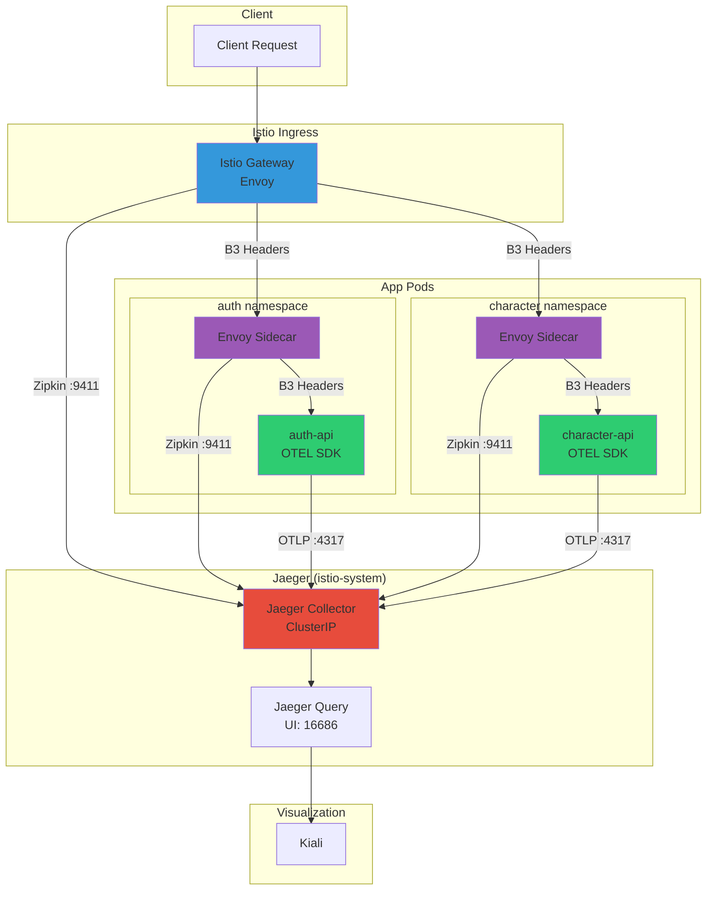
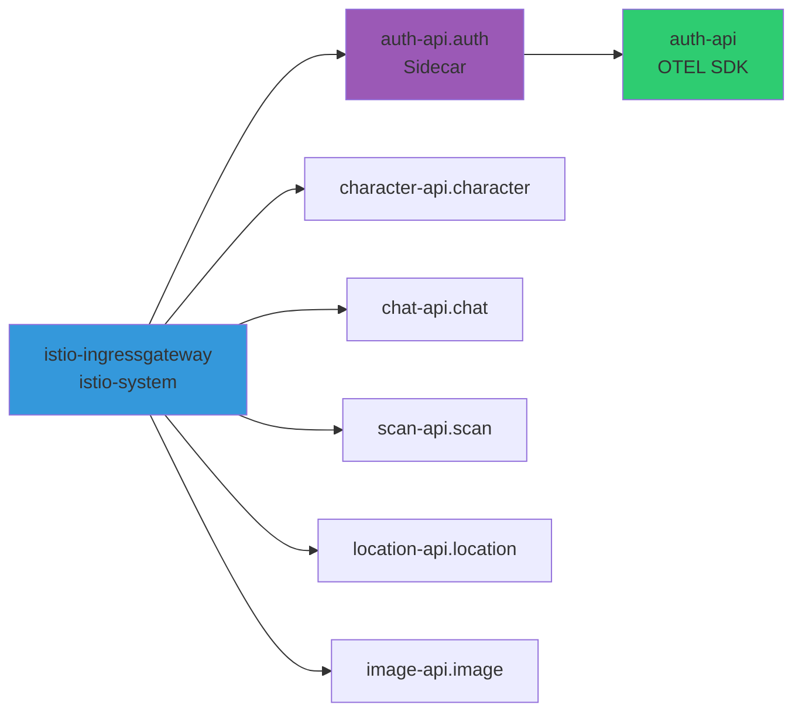

# 이코에코(Eco²) Observability #4: 분산 트레이싱 통합

> **시리즈**: Eco² Observability Enhancement  
> **작성일**: 2025-12-17  
> **수정일**: 2025-12-18  
> **태그**: `#Istio` `#Kiali` `#Jaeger` `#OpenTelemetry` `#Tracing` `#B3Propagation`

---

## 📋 개요

마이크로서비스 환경에서 하나의 요청이 여러 서비스를 거치며 처리됩니다. 이 글에서는 Kiali, Jaeger, OpenTelemetry를 활용하여 서비스 간 호출 관계를 시각화하고, E2E 트랜잭션을 추적하는 방법을 다룹니다.

**2025-12-18 업데이트**: Istio Sidecar와 App OTEL SDK 간 트레이스 연결 완료. B3 Propagator를 통해 동일 traceID로 전체 요청 흐름 추적 가능.

---

## 🎯 목표

1. **서비스 토폴로지 시각화**: Kiali로 서비스 간 관계 파악
2. **분산 트레이싱**: Jaeger로 요청 흐름 추적
3. **자동 계측**: OpenTelemetry로 코드 수정 없이 트레이싱
4. **외부 서비스 시각화**: OAuth, OpenAI 등 외부 의존성 표시
5. **E2E 트레이스 연결**: Istio Sidecar ↔ App OTEL SDK 트레이스 통합

---

## 🔧 아키텍처

### 전체 트레이싱 파이프라인



### 프로토콜별 트래픽 흐름

| 소스 | 대상 | 프로토콜 | 포트 | 용도 |
|------|------|----------|------|------|
| Istio Sidecar | Jaeger | **Zipkin** | 9411 | Envoy 트레이스 전송 |
| App OTEL SDK | Jaeger | **OTLP gRPC** | 4317 | 앱 트레이스 전송 |
| Sidecar → App | - | **B3 Headers** | - | Trace Context 전파 |

### Trace Context 연결 (B3 Propagation)

```
┌─────────────────────────────────────────────────────────────────────┐
│  Request Header (B3 Format)                                         │
│  x-b3-traceid: 525f6e625d8086f9d3ce929d0e0e4736                     │
│  x-b3-spanid: a3ce929d0e0e4736                                      │
│  x-b3-sampled: 1                                                    │
└─────────────────────────────────────────────────────────────────────┘
                                │
        ┌───────────────────────┼───────────────────────┐
        ▼                       ▼                       ▼
┌───────────────┐       ┌───────────────┐       ┌───────────────┐
│ Istio Gateway │       │ Envoy Sidecar │       │ App OTEL SDK  │
│   (Span 1)    │──────▶│   (Span 2)    │──────▶│   (Span 3)    │
│               │       │               │       │               │
│ traceID: 525f │       │ traceID: 525f │       │ traceID: 525f │
└───────────────┘       └───────────────┘       └───────────────┘
        │                       │                       │
        └───────────────────────┴───────────────────────┘
                                │
                    ┌───────────▼───────────┐
                    │      Jaeger UI        │
                    │  동일 traceID로 조회  │
                    │  → 3개 서비스 연결    │
                    └───────────────────────┘
```

---

## 🏛️ 아키텍처 결정: Trace Source of Truth

### 핵심 결정

**Trace의 Source of Truth는 Istio Ingress Gateway (Envoy)입니다.**

모든 요청은 Istio Ingress Gateway에서 trace가 시작되며, 이 trace.id가 전체 요청 흐름에서 공유됩니다.

### 결정 배경

분산 트레이싱에서 "누가 trace를 시작하는가"는 중요한 아키텍처 결정입니다:

| 옵션 | 장점 | 단점 |
|------|------|------|
| **① Istio (선택)** | 모든 요청 추적, 앱 미도달도 가능 | Istio 의존성 |
| ② App OTEL SDK | 앱 로직 세밀 추적 | 인프라 레벨 blind spot |
| ③ 클라이언트 | E2E 완전 추적 | 클라이언트 통제 필요 |

**선택 이유**:
- 100% 샘플링으로 모든 요청 추적
- ext-authz 거부, 404 등 앱 미도달 요청도 추적 가능
- B3 헤더 전파로 앱 OTEL SDK와 자연스럽게 연결

### Trace Propagation 흐름

```
┌──────────────────────────────────────────────────────────────────────┐
│                    Trace ID Propagation Path                         │
├──────────────────────────────────────────────────────────────────────┤
│                                                                      │
│  [Client] ─────────────────────────────────────────────────────────▶ │
│     │                                                                │
│     │ (no trace header)                                              │
│     ▼                                                                │
│  ┌──────────────────┐                                               │
│  │ Istio Ingress    │  ◀── SOURCE OF TRUTH                          │
│  │ Gateway          │      trace.id = %TRACE_ID% (Envoy 생성)       │
│  └────────┬─────────┘                                               │
│           │                                                          │
│           │ X-B3-TraceId: <generated>                               │
│           │ X-B3-SpanId: <generated>                                │
│           ▼                                                          │
│  ┌──────────────────┐                                               │
│  │ ext-authz        │  ◀── 헤더 수신 (includeHeadersInCheck)        │
│  │ (인증 서비스)    │      x-b3-traceid, x-b3-spanid 포함          │
│  └────────┬─────────┘                                               │
│           │                                                          │
│           │ 인증 성공 시 계속                                        │
│           ▼                                                          │
│  ┌──────────────────┐                                               │
│  │ App Sidecar      │  ◀── trace context 유지                       │
│  │ (istio-proxy)    │      access log: trace.id 기록               │
│  └────────┬─────────┘                                               │
│           │                                                          │
│           │ X-B3-TraceId: <same>                                    │
│           ▼                                                          │
│  ┌──────────────────┐                                               │
│  │ App Container    │  ◀── OTEL SDK가 B3 헤더 읽음                  │
│  │ (auth-api)       │      동일한 trace.id로 span 생성             │
│  └──────────────────┘                                               │
│                                                                      │
│  ═══════════════════════════════════════════════════════════════════ │
│  All components share the SAME trace.id generated by Istio Ingress  │
└──────────────────────────────────────────────────────────────────────┘
```

### 설정 요약

#### 1. Istio MeshConfig (Trace 생성)

```yaml
meshConfig:
  enableTracing: true
  defaultConfig:
    tracing:
      sampling: 100  # 100% 샘플링
      zipkin:
        address: jaeger-collector-clusterip.istio-system.svc.cluster.local:9411
  defaultProviders:
    tracing:
    - jaeger
```

#### 2. ext-authz 헤더 전달

```yaml
meshConfig:
  extensionProviders:
  - envoyExtAuthzGrpc:
      includeHeadersInCheck:
      - authorization
      - x-request-id
      - x-b3-traceid    # ✅ trace 전파
      - x-b3-spanid     # ✅ span 전파
```

#### 3. EnvoyFilter Access Log (`%TRACE_ID%`)

```yaml
# workloads/istio/base/envoy-filter-access-log.yaml
log_format:
  json_format:
    trace.id: '%TRACE_ID%'  # Envoy 내부 trace ID (항상 생성)
    span.id: '%REQ(X-B3-SPANID)%'
```

> **중요**: `%REQ(X-B3-TRACEID)%` 대신 `%TRACE_ID%`를 사용합니다.
> - `%REQ(X-B3-TRACEID)%`: 클라이언트가 보낸 헤더 (없으면 빈 값)
> - `%TRACE_ID%`: Envoy 내부 trace ID (항상 자동 생성) ✅

#### 4. App OTEL SDK (Trace 연결)

```yaml
env:
- name: OTEL_PROPAGATORS
  value: "b3,tracecontext,baggage"  # B3 헤더 읽기
```

### 검증 결과

| 항목 | 상태 | 설명 |
|------|------|------|
| Istio trace 생성 | ✅ | `enableTracing: true`, `sampling: 100` |
| ext-authz 헤더 전파 | ✅ | `includeHeadersInCheck`에 B3 헤더 포함 |
| App trace 연결 | ✅ | OTEL SDK B3 Propagator로 동일 trace 사용 |
| 앱 미도달 요청 | ✅ | `%TRACE_ID%`로 모든 요청에 trace.id 포함 |
| Jaeger 연결 | ✅ | 여러 span이 같은 trace로 연결 |

### 실제 검증 예시

```bash
# 같은 요청의 istio-proxy와 auth-api 로그
{
  "service.name": "istio-proxy",
  "trace.id": "49069056832712b6d1a76403290e3520",
  "url.path": "/api/v1/auth/refresh"
}

{
  "service.name": "auth-api",
  "trace.id": "49069056832712b6d1a76403290e3520",  # ✅ 동일
  "message": "HTTP 401 UNAUTHORIZED: Missing refresh token"
}
```

---

## 🔧 Step 1: Kiali 배포

### ArgoCD Application

```yaml
# clusters/dev/apps/60-kiali.yaml
apiVersion: argoproj.io/v1alpha1
kind: Application
metadata:
  name: kiali
  namespace: argocd
  annotations:
    argocd.argoproj.io/sync-wave: "60"
spec:
  project: default
  source:
    chart: kiali-server
    repoURL: https://kiali.org/helm-charts
    targetRevision: 2.1.0
    helm:
      values: |
        auth:
          strategy: anonymous  # 개발 환경
        
        deployment:
          accessible_namespaces:
          - "**"
          
        external_services:
          prometheus:
            url: "http://prometheus-operated.prometheus.svc.cluster.local:9090"
          grafana:
            enabled: true
            url: "http://grafana.prometheus.svc.cluster.local"
          tracing:
            enabled: true
            provider: jaeger
            use_grpc: false
            in_cluster_url: "http://jaeger-query.istio-system.svc.cluster.local:16686"
            url: "https://jaeger.dev.growbin.app"
  destination:
    server: https://kubernetes.default.svc
    namespace: istio-system
```

### DNS 설정 (ExternalDNS)

```yaml
# workloads/routing/gateway/dev/patch-ingress.yaml
apiVersion: networking.k8s.io/v1
kind: Ingress
metadata:
  annotations:
    external-dns.alpha.kubernetes.io/hostname: >-
      api.dev.growbin.app,
      kibana.dev.growbin.app,
      kiali.dev.growbin.app,
      jaeger.dev.growbin.app
```

---

## 🔧 Step 2: Jaeger 배포

### ArgoCD Application

```yaml
# clusters/dev/apps/61-jaeger.yaml
apiVersion: argoproj.io/v1alpha1
kind: Application
metadata:
  name: jaeger
  namespace: argocd
  annotations:
    argocd.argoproj.io/sync-wave: "61"
spec:
  project: default
  source:
    chart: jaeger
    repoURL: https://jaegertracing.github.io/helm-charts
    targetRevision: 3.4.1
    helm:
      values: |
        # All-in-One 배포 (개발 환경)
        allInOne:
          enabled: true
          replicas: 1
          resources:
            requests:
              memory: 256Mi
              cpu: 100m
            limits:
              memory: 512Mi
              cpu: 500m
          
        storage:
          type: memory  # 개발 환경: 메모리 저장소
          
        collector:
          enabled: false  # All-in-One 사용
          
        query:
          enabled: false  # All-in-One 사용
  destination:
    server: https://kubernetes.default.svc
    namespace: istio-system
```

---

## 🔧 Step 3: OpenTelemetry Auto-Instrumentation

### 전략: Zero-code Change

코드 수정 없이 Dockerfile의 실행 명령어만 변경하여 자동 계측을 적용합니다.

### requirements.txt

```txt
# OpenTelemetry - 2025.12 stable versions
opentelemetry-distro==0.50b0
opentelemetry-exporter-otlp==1.29.0
opentelemetry-instrumentation-fastapi==0.50b0
opentelemetry-instrumentation-sqlalchemy==0.50b0
opentelemetry-instrumentation-httpx==0.50b0
opentelemetry-instrumentation-redis==0.50b0
opentelemetry-instrumentation-asyncpg==0.50b0

# Istio Sidecar와 Trace Context 연결을 위한 B3 Propagator
opentelemetry-propagator-b3==1.29.0
```

### Dockerfile

```dockerfile
FROM python:3.11-slim

WORKDIR /app
COPY requirements.txt .
RUN pip install --no-cache-dir -r requirements.txt

COPY . .

# OpenTelemetry 자동 계측 적용
CMD ["opentelemetry-instrument", \
     "uvicorn", "domains.auth.main:app", \
     "--host", "0.0.0.0", "--port", "8000"]
```

### Deployment 환경변수

```yaml
# workloads/domains/auth/base/deployment.yaml
spec:
  template:
    spec:
      containers:
      - name: auth-api
        env:
        # OpenTelemetry 설정
        - name: OTEL_SERVICE_NAME
          value: "auth-api"
        - name: OTEL_TRACES_EXPORTER
          value: "otlp"
        # ⚠️ ClusterIP Service 사용 (Headless Service 호환 이슈로 변경)
        - name: OTEL_EXPORTER_OTLP_ENDPOINT
          value: "http://jaeger-collector-clusterip.istio-system.svc.cluster.local:4317"
        - name: OTEL_METRICS_EXPORTER
          value: "none"
        - name: OTEL_LOGS_EXPORTER
          value: "none"
        # ✅ B3 Propagator: Istio Sidecar와 Trace Context 연결
        - name: OTEL_PROPAGATORS
          value: "b3,tracecontext,baggage"
```

> **중요**: `OTEL_PROPAGATORS`에 `b3`를 추가해야 Istio Envoy Sidecar가 전파하는 B3 헤더를 앱의 OTEL SDK가 인식합니다. 이 설정 없이는 Sidecar 트레이스와 App 트레이스가 별도의 traceID로 분리됩니다.

### 자동 계측되는 라이브러리

| 라이브러리 | 계측 내용 |
|------------|----------|
| FastAPI | HTTP 요청/응답 |
| SQLAlchemy | DB 쿼리 |
| asyncpg | PostgreSQL 연결 |
| Redis | 캐시 조회/저장 |
| httpx | 외부 API 호출 |

---

## 🔧 Step 4: 외부 서비스 시각화 (ServiceEntry)

### 문제: PassthroughCluster

Istio 외부로 나가는 트래픽은 기본적으로 `PassthroughCluster`로 표시되어 어떤 외부 서비스인지 알 수 없습니다.

### 해결: ServiceEntry 등록

```yaml
# workloads/routing/global/external-services.yaml
apiVersion: networking.istio.io/v1beta1
kind: ServiceEntry
metadata:
  name: google-oauth
  namespace: istio-system
spec:
  hosts:
  - accounts.google.com
  - oauth2.googleapis.com
  - www.googleapis.com
  location: MESH_EXTERNAL
  ports:
  - number: 443
    name: https
    protocol: HTTPS
  resolution: DNS
---
apiVersion: networking.istio.io/v1beta1
kind: ServiceEntry
metadata:
  name: kakao-oauth
  namespace: istio-system
spec:
  hosts:
  - kauth.kakao.com
  - kapi.kakao.com
  location: MESH_EXTERNAL
  ports:
  - number: 443
    name: https
    protocol: HTTPS
  resolution: DNS
---
apiVersion: networking.istio.io/v1beta1
kind: ServiceEntry
metadata:
  name: openai-external
  namespace: istio-system
spec:
  hosts:
  - api.openai.com
  location: MESH_EXTERNAL
  ports:
  - number: 443
    name: https
    protocol: HTTPS
  resolution: DNS
```

### 결과

Kiali 그래프에서:
- Before: `PassthroughCluster` → 불명확
- After: `google-oauth`, `kakao-oauth`, `openai-external` → 명확한 노드 표시

---

## 🔧 Step 5: Trace Sampling 100%

개발 환경에서 모든 요청을 분석하기 위해 100% 샘플링을 설정합니다.

### Telemetry 리소스

```yaml
# workloads/routing/global/telemetry.yaml
apiVersion: telemetry.istio.io/v1alpha1
kind: Telemetry
metadata:
  name: global-sampling
  namespace: istio-system
spec:
  tracing:
  - providers:
    - name: jaeger
    randomSamplingPercentage: 100.00
```

---

## 🔧 Step 6: Istio MeshConfig (Jaeger 연동)

Istio Sidecar(Envoy)가 Jaeger로 트레이스를 전송하려면 MeshConfig에 tracing provider를 설정해야 합니다.

### Istiod Helm Values

```yaml
# clusters/dev/apps/05-istio.yaml
valuesObject:
  meshConfig:
    # Jaeger tracing 활성화
    enableTracing: true
    defaultConfig:
      tracing:
        sampling: 100.0
        zipkin:
          # ⚠️ ClusterIP Service 사용 (Headless 호환 이슈)
          address: jaeger-collector-clusterip.istio-system.svc.cluster.local:9411
    defaultProviders:
      tracing:
      - jaeger
    extensionProviders:
    - name: jaeger
      zipkin:
        service: jaeger-collector-clusterip.istio-system.svc.cluster.local
        port: 9411
```

### Jaeger Collector ClusterIP Service

Jaeger Helm Chart는 기본적으로 Headless Service를 생성합니다. Istio가 안정적으로 연결하려면 별도의 ClusterIP Service가 필요합니다.

```yaml
# 수동 생성 필요
apiVersion: v1
kind: Service
metadata:
  name: jaeger-collector-clusterip
  namespace: istio-system
spec:
  type: ClusterIP
  ports:
  - name: http-zipkin
    port: 9411
    targetPort: 9411
  - name: grpc-otlp
    port: 4317
    targetPort: 4317
  - name: http-otlp
    port: 4318
    targetPort: 4318
  selector:
    app.kubernetes.io/component: all-in-one
    app.kubernetes.io/instance: jaeger
    app.kubernetes.io/name: jaeger
```

---

## 🔧 Step 7: NetworkPolicy 설정

분산 트레이싱이 동작하려면 두 가지 경로의 egress가 모두 허용되어야 합니다.

### 필수 포트 목록

| 프로토콜 | 포트 | 사용처 | 
|----------|------|--------|
| OTLP gRPC | 4317 | App OTEL SDK → Jaeger |
| OTLP HTTP | 4318 | App OTEL SDK → Jaeger |
| **Zipkin** | **9411** | **Istio Sidecar → Jaeger** |

### allow-jaeger-egress NetworkPolicy

```yaml
# workloads/network-policies/base/allow-jaeger-egress.yaml
apiVersion: networking.k8s.io/v1
kind: NetworkPolicy
metadata:
  name: allow-jaeger-egress
  namespace: auth  # 각 앱 네임스페이스별로 적용
spec:
  podSelector: {}
  policyTypes:
  - Egress
  egress:
  - to:
    - namespaceSelector:
        matchLabels:
          kubernetes.io/metadata.name: istio-system
      podSelector:
        matchLabels:
          app.kubernetes.io/name: jaeger
    ports:
    - port: 4317
      protocol: TCP
    - port: 4318
      protocol: TCP
    - port: 9411      # ⚠️ 필수! Istio Sidecar용
      protocol: TCP
```

> **⚠️ 주의**: `port: 9411`이 누락되면 Istio Sidecar의 트레이스가 Jaeger에 전송되지 않아 "No service dependencies found" 오류가 발생합니다.

---

## ✅ 결과 확인

### Jaeger Dependencies (Service Map)



### Jaeger API 검증

```bash
# Dependencies 확인
curl "http://jaeger:16686/api/dependencies?endTs=$(date +%s)000&lookback=300000" | jq ".data"

# 결과 예시
[
  {"parent": "istio-ingressgateway.istio-system", "child": "auth-api.auth", "callCount": 5},
  {"parent": "auth-api.auth", "child": "auth-api", "callCount": 5}
]
```

### 동일 traceID에 연결된 서비스

```json
{
  "traceID": "525f6e625d8086f9",
  "services": [
    "auth-api",                          // App OTEL SDK
    "auth-api.auth",                     // Istio Sidecar
    "istio-ingressgateway.istio-system"  // Ingress Gateway
  ],
  "spanCount": 5
}
```

### Kiali Graph

**접속**: `https://kiali.dev.growbin.app`

**캡처 포인트:**
1. Display 설정: Traffic Animation, Security 활성화
2. OAuth 흐름: `Gateway` → `auth` → `google-oauth` → `auth` → `postgres`
3. AI 파이프라인: `chat` → `openai-external`

### Jaeger Trace

**접속**: `https://jaeger.dev.growbin.app`

**검색 방법:**
1. Service: `auth-api` 선택
2. Operation: `POST /api/v1/auth/kakao/callback` 선택
3. Find Traces 클릭

**Span 구조 예시 (E2E 연결):**
```
istio-ingressgateway: POST /api/v1/auth/health (traceID: 525f6e625d8086f9)
└── auth-api.auth: inbound (Envoy Sidecar)
    └── auth-api: POST /api/v1/auth/health (OTEL SDK)
        ├── asyncpg: SELECT users... (5ms)
        └── redis: GET auth:session:xxx (2ms)
```

---

## 🔗 로그-트레이스 연결

### Kibana에서 trace_id 검색

```
trace.id: "4bf92f3577b34da6a3ce929d0e0e4736"
```

### Jaeger에서 동일 trace 확인

```
https://jaeger.dev.growbin.app/trace/4bf92f3577b34da6a3ce929d0e0e4736
```

### 연결 흐름

```
Kibana (로그)  ←── trace.id ──→  Jaeger (트레이스)
     ↓                                ↓
  에러 발생 시점               어떤 span에서 지연?
  컨텍스트 정보               서비스 간 호출 순서
```

---

## 📊 OpenTelemetry Exporter 설정 전략

### 세 가지 텔레메트리 신호

OpenTelemetry는 **Traces, Metrics, Logs** 세 가지 신호를 지원합니다. ECO2에서는 각 신호별로 최적의 수집 파이프라인을 선택했습니다.

```
┌─────────────────────────────────────────────────────────────────┐
│                         ECO2 Service                            │
├─────────────────────────────────────────────────────────────────┤
│                                                                 │
│  [Traces]     OTel SDK → OTLP/gRPC → Jaeger → Elasticsearch     │
│               (OTEL_TRACES_EXPORTER=otlp) ✅                    │
│                                                                 │
│  [Metrics]    prometheus-client → /metrics → Prometheus scrape  │
│               (OTEL_METRICS_EXPORTER=none) ❌ OTel 미사용       │
│                                                                 │
│  [Logs]       JSON stdout → Fluent Bit → Elasticsearch          │
│               (OTEL_LOGS_EXPORTER=none) ❌ OTel 미사용          │
│                                                                 │
└─────────────────────────────────────────────────────────────────┘
```

### Deployment 환경변수 (전체)

```yaml
env:
  - name: OTEL_SERVICE_NAME
    value: "auth-api"
  - name: OTEL_TRACES_EXPORTER
    value: "otlp"                    # ✅ Jaeger로 전송
  - name: OTEL_EXPORTER_OTLP_ENDPOINT
    value: "http://jaeger-collector-clusterip.istio-system.svc.cluster.local:4317"
  - name: OTEL_METRICS_EXPORTER
    value: "none"                    # ❌ Prometheus가 scrape
  - name: OTEL_LOGS_EXPORTER
    value: "none"                    # ❌ Fluent Bit가 수집
  # ✅ B3 Propagator: Istio Sidecar 트레이스와 연결
  - name: OTEL_PROPAGATORS
    value: "b3,tracecontext,baggage"
```

### 왜 Metrics/Logs는 `none`인가?

| 신호 | 기존 스택 | OTel 대체 시 장점 | 전환 비용 |
|------|----------|------------------|----------|
| **Traces** | 없음 → Jaeger | ✅ 신규 도입 | 낮음 |
| **Metrics** | Prometheus (de facto 표준) | 거의 없음 | 높음 (대시보드 재작성) |
| **Logs** | Fluent Bit + EFK | Log correlation 개선 | 중간 |

**설계 원칙**: *"Don't fix what isn't broken"* — 기존에 잘 동작하는 Prometheus/Fluent Bit 파이프라인을 유지하면서, 없었던 **Traces만 OTel로 추가**

### Prometheus Pull vs OTel Push

```yaml
# Prometheus Pull 모델 장점:
# ✅ 서비스가 죽어도 "scrape 실패" 자체가 알림
# ✅ PromQL - 강력한 쿼리 언어
# ✅ Grafana 생태계 완벽 호환
# ✅ ServiceMonitor CRD로 자동 발견

# OTel Push 모델:
# ❌ 서비스가 죽으면 데이터 유실 가능
# ❌ 추가 Collector 인프라 필요
```

---

## 🐛 트러블슈팅

### 📝 상세 트러블슈팅 문서

분산 트레이싱 구축 과정에서 발생한 주요 이슈들은 별도 문서로 상세히 정리되어 있습니다:

| 이슈 | 문서 | 소요시간 |
|------|------|----------|
| NetworkPolicy Zipkin 포트 누락 | [분산 트레이싱 트러블슈팅: NetworkPolicy, Zipkin, OpenTelemetry](https://rooftopsnow.tistory.com/29) | ~2시간 |
| Fluent Bit CRI Parser 오류 | [분산 트레이싱 트러블슈팅: Fluent Bit CRI Parser 오류](https://rooftopsnow.tistory.com/28) | ~30분 |

---

### Issue 1: Kiali에서 Prometheus 연결 실패

```
Could not fetch health
```

**원인**: Prometheus URL 오설정

**해결**: `external_services.prometheus.url` 수정
```yaml
prometheus:
  url: "http://prometheus-operated.prometheus.svc.cluster.local:9090"
```

### Issue 2: Jaeger에서 "No service dependencies found"

**증상**: 개별 서비스 트레이스는 수집되지만 서비스 간 dependencies가 표시되지 않음

**원인**: NetworkPolicy에서 Zipkin 포트(9411) 누락

**해결**: `allow-jaeger-egress` NetworkPolicy에 port 9411 추가
```yaml
ports:
  - port: 4317  # OTLP gRPC
  - port: 4318  # OTLP HTTP
  - port: 9411  # ✅ Zipkin (Istio Sidecar용)
```

**상세**: [트러블슈팅 블로그](https://rooftopsnow.tistory.com/29)

### Issue 3: App OTEL SDK 트레이스가 Sidecar와 연결 안됨

**증상**: Jaeger에서 동일 요청에 대해 Sidecar 트레이스와 App 트레이스가 별도 traceID로 분리됨

**원인**: App의 OTEL SDK가 B3 헤더를 인식하지 못함

**해결**: 
1. `opentelemetry-propagator-b3==1.29.0` 패키지 설치
2. 환경변수 설정: `OTEL_PROPAGATORS=b3,tracecontext,baggage`

### Issue 4: Jaeger Headless Service 호환성

**증상**: Istio VirtualService로 Jaeger UI 접근 시 503 오류

**원인**: Jaeger Helm Chart가 생성하는 Service가 Headless (`clusterIP: None`)

**해결**: 별도 ClusterIP Service 생성
```yaml
apiVersion: v1
kind: Service
metadata:
  name: jaeger-collector-clusterip
  name: jaeger-query-clusterip
spec:
  type: ClusterIP  # Headless 대신 ClusterIP
```

### Issue 5: 외부 서비스 NXDOMAIN

**원인**: ServiceEntry의 `resolution: NONE`으로 설정

**해결**: `resolution: DNS`로 변경

---

## 📚 다음 글 미리보기

**[#5: Kibana 대시보드 구성]** - 로그 데이터를 시각화하는 Kibana 대시보드 구성 방법을 다룹니다.

---

## 🔗 참고 자료

### 트러블슈팅 사례 (ECO2)

- [분산 트레이싱 트러블슈팅: NetworkPolicy, Zipkin, OpenTelemetry](https://rooftopsnow.tistory.com/29) - Zipkin 포트 누락 이슈
- [분산 트레이싱 트러블슈팅: Fluent Bit CRI Parser 오류](https://rooftopsnow.tistory.com/28) - containerd 로그 파싱 이슈

### CNCF & OpenTelemetry

- [OpenTelemetry Documentation](https://opentelemetry.io/docs/) - 공식 OTel 문서
- [OpenTelemetry Python Auto-Instrumentation](https://opentelemetry.io/docs/zero-code/python/) - Python 자동 계측
- [OpenTelemetry B3 Propagator](https://opentelemetry.io/docs/specs/otel/context/api-propagators/#b3-requirements) - B3 헤더 전파
- [Jaeger Documentation](https://www.jaegertracing.io/docs/latest/) - Jaeger v2 공식 문서

### 빅테크 아키텍처

- [Google Dapper Paper](https://research.google/pubs/dapper-a-large-scale-distributed-systems-tracing-infrastructure/) - 분산 트레이싱의 시초
- [Uber: Evolving Distributed Tracing](https://www.uber.com/blog/distributed-tracing/) - Jaeger 개발 배경
- [Netflix: Lessons from Building Observability Tools](https://netflixtechblog.com/lessons-from-building-observability-tools-at-netflix-7cfafed6ab17) - Netflix Observability 경험

### Service Mesh Integration

- [Istio Distributed Tracing](https://istio.io/latest/docs/tasks/observability/distributed-tracing/) - Istio 트레이싱 설정
- [Istio Telemetry API](https://istio.io/latest/docs/reference/config/telemetry/) - Telemetry 리소스 설정
- [Istio ServiceEntry](https://istio.io/latest/docs/reference/config/networking/service-entry/) - 외부 서비스 등록
- [Kiali Documentation](https://kiali.io/docs/) - Service Mesh 시각화

