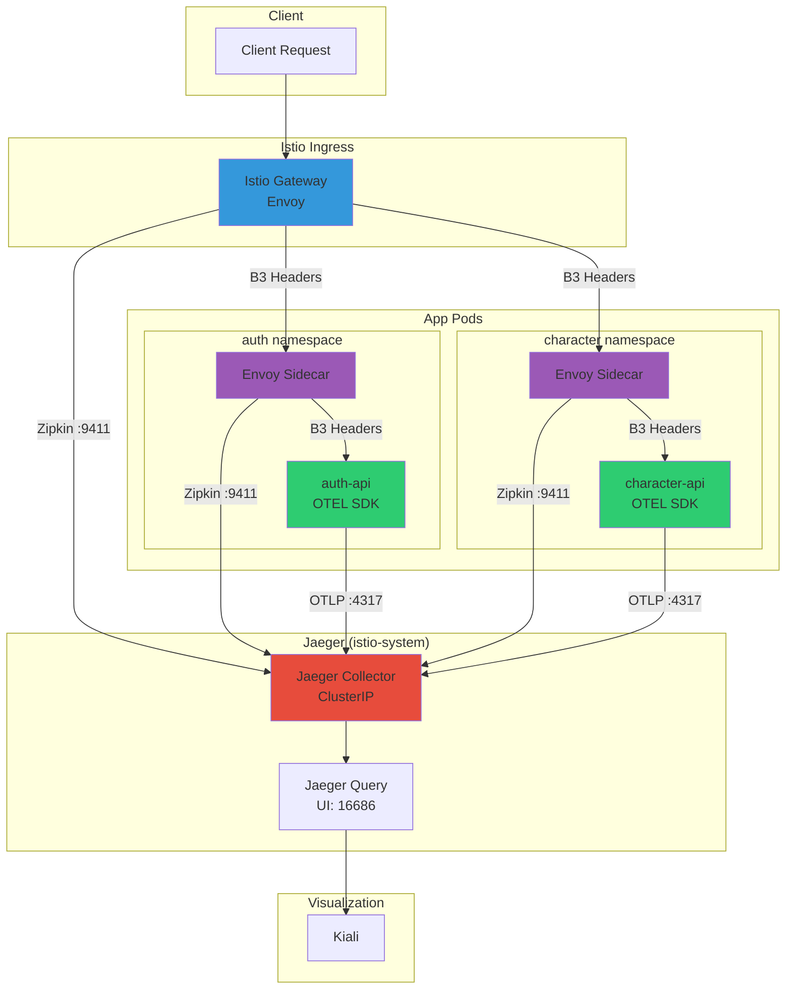
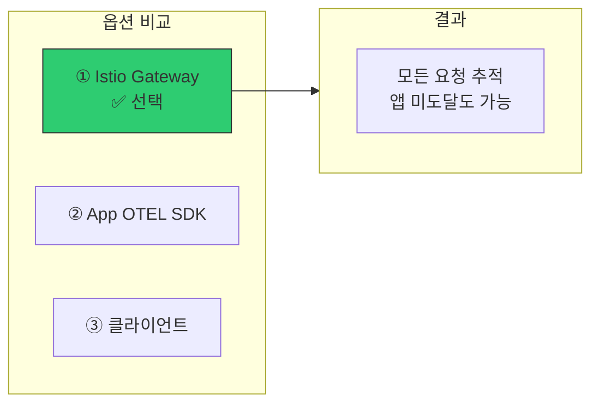
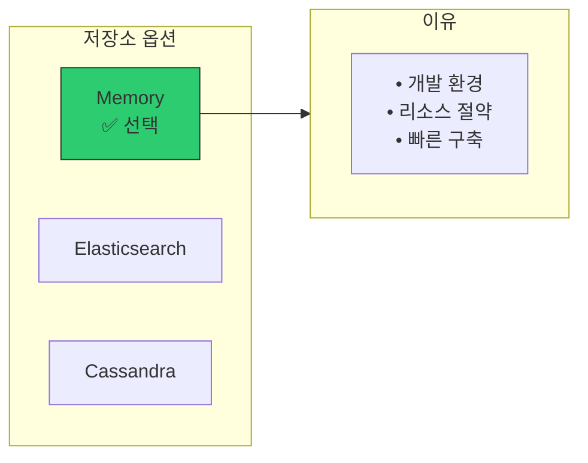
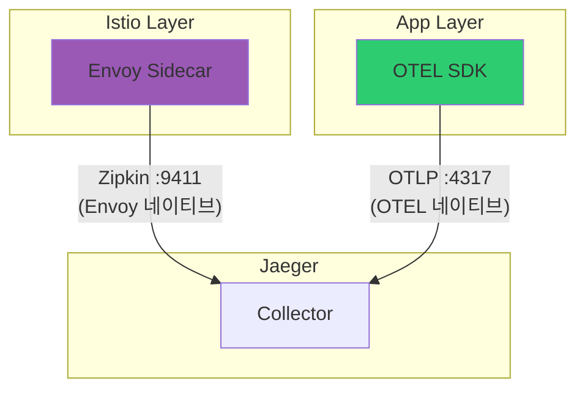
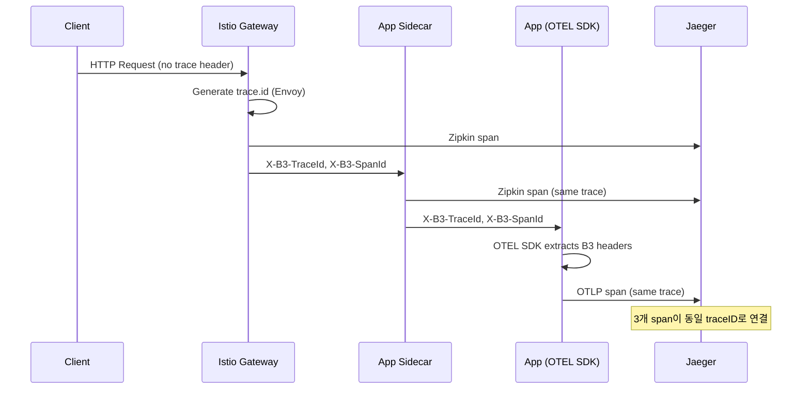
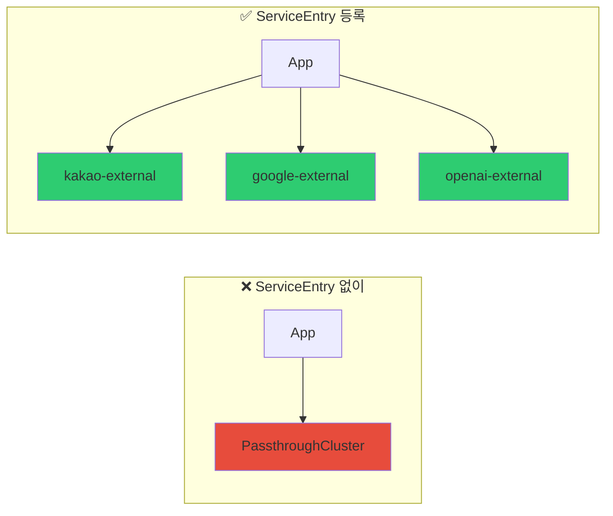
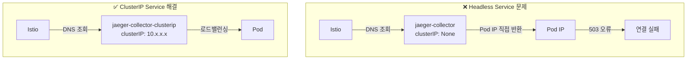
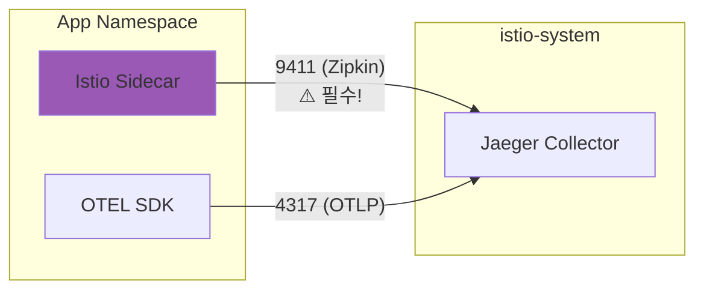
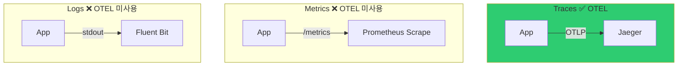
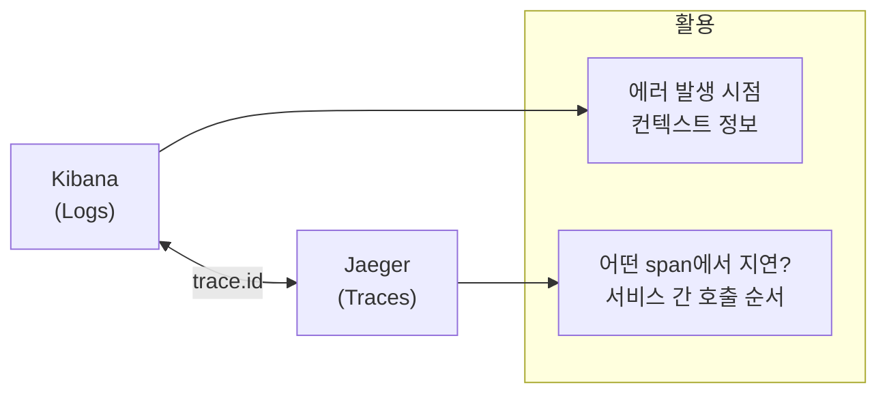

# 이코에코(Eco²) Observability #4: 분산 트레이싱 통합

> **시리즈**: Eco² Observability Enhancement  
> **작성일**: 2025-12-17  
> **수정일**: 2025-12-18  
> **태그**: `#Istio` `#Kiali` `#Jaeger` `#OpenTelemetry` `#Tracing` `#B3Propagation`

---

## 📋 개요

마이크로서비스 환경에서 하나의 요청이 여러 서비스를 거치며 처리됩니다. 이 글에서는 Kiali, Jaeger, OpenTelemetry를 활용하여 서비스 간 호출 관계를 시각화하고, E2E 트랜잭션을 추적하는 방법을 다룹니다.

**2025-12-18 업데이트**: Istio Sidecar와 App OTEL SDK 간 트레이스 연결 완료. B3 Propagator를 통해 동일 traceID로 전체 요청 흐름 추적 가능.

---

## 🎯 목표

1. **서비스 토폴로지 시각화**: Kiali로 서비스 간 관계 파악
2. **분산 트레이싱**: Jaeger로 요청 흐름 추적
3. **자동 계측**: OpenTelemetry로 코드 수정 없이 트레이싱
4. **외부 서비스 시각화**: OAuth, OpenAI, AWS 등 외부 의존성 표시
5. **E2E 트레이스 연결**: Istio Sidecar ↔ App OTEL SDK 트레이스 통합

---

## 🔧 아키텍처

### 전체 트레이싱 파이프라인



### 프로토콜별 트래픽 흐름

| 소스 | 대상 | 프로토콜 | 포트 | 용도 |
|------|------|----------|------|------|
| Istio Sidecar | Jaeger | **Zipkin** | 9411 | Envoy 트레이스 전송 |
| App OTEL SDK | Jaeger | **OTLP gRPC** | 4317 | 앱 트레이스 전송 |
| Sidecar → App | - | **B3 Headers** | - | Trace Context 전파 |

---

## 🎯 핵심 아키텍처 결정

### 결정 1: Trace Source of Truth = Istio Ingress Gateway



**결정 배경:**

| 옵션 | 장점 | 단점 |
|------|------|------|
| **① Istio (선택)** | 모든 요청 추적, 앱 미도달도 가능 | Istio 의존성 |
| ② App OTEL SDK | 앱 로직 세밀 추적 | 인프라 레벨 blind spot |
| ③ 클라이언트 | E2E 완전 추적 | 클라이언트 통제 필요 |

**선택 이유:**
1. **100% 샘플링으로 모든 요청 추적** - dev 환경에서 디버깅 용이
2. **ext-authz 거부, 404 등 앱 미도달 요청도 추적 가능** - 인프라 레벨 문제 파악
3. **B3 헤더 전파로 앱 OTEL SDK와 자연스럽게 연결** - 추가 설정 최소화

### 결정 2: Jaeger All-in-One (메모리 저장소)



**선택 이유:**
1. **개발 환경** - 트레이스 영구 보존 불필요
2. **리소스 절약** - ES 추가 배포 없이 512MB로 운영
3. **빠른 구축** - Helm All-in-One으로 5분 내 배포

### 결정 3: 듀얼 프로토콜 (Zipkin + OTLP)



**왜 두 프로토콜인가?**
- **Zipkin (9411)**: Envoy/Istio가 네이티브로 지원, 설정 변경 없이 사용
- **OTLP (4317)**: OpenTelemetry SDK 표준, 더 풍부한 메타데이터

### 결정 4: B3 Propagator로 Trace Context 연결

**문제:** Istio Sidecar와 App OTEL SDK가 별도 traceID 생성

```
❌ Before: 같은 요청인데 traceID가 다름
Sidecar: traceID=abc123
App:     traceID=xyz789  (연결 안됨)
```

**해결:** App에서 B3 헤더를 읽어 동일 traceID 사용

```yaml
env:
  - name: OTEL_PROPAGATORS
    value: "b3,tracecontext,baggage"  # B3 먼저!
```

```
✅ After: 동일 traceID로 연결
Sidecar: traceID=abc123
App:     traceID=abc123  (Jaeger에서 하나의 trace로 표시)
```

---

## 🔧 Trace Propagation 흐름



---

## 🔧 구현: Python tracing.py

### 왜 커스텀 tracing.py인가?

| 방식 | 장점 | 단점 |
|------|------|------|
| `opentelemetry-instrument` 만 | 제로 코드 | 세부 제어 어려움 |
| **커스텀 tracing.py** ✅ | 세부 제어, 조건부 비활성화 | 코드 필요 |

**선택 이유:**
1. `OTEL_ENABLED=false`로 완전 비활성화 가능
2. 샘플링 레이트 동적 조절
3. 수동 span 생성 헬퍼 제공

### 전체 코드

```python
# domains/auth/core/tracing.py
"""
OpenTelemetry Distributed Tracing Configuration

Architecture:
  App (OTel SDK) → OTLP/gRPC (4317) → Jaeger Collector → (Memory)
"""

import logging
import os
from typing import Optional

from fastapi import FastAPI

logger = logging.getLogger(__name__)

# Environment variables
OTEL_EXPORTER_ENDPOINT = os.getenv(
    "OTEL_EXPORTER_OTLP_ENDPOINT",
    "jaeger-collector-clusterip.istio-system.svc.cluster.local:4317",
)
OTEL_SAMPLING_RATE = float(os.getenv("OTEL_SAMPLING_RATE", "1.0"))
OTEL_ENABLED = os.getenv("OTEL_ENABLED", "true").lower() == "true"

_tracer_provider = None


def configure_tracing(
    service_name: str,
    service_version: str,
    environment: str = "dev",
) -> bool:
    """OpenTelemetry 트레이싱 설정"""
    global _tracer_provider

    if not OTEL_ENABLED:
        logger.info("OpenTelemetry tracing disabled (OTEL_ENABLED=false)")
        return False

    try:
        from opentelemetry import trace
        from opentelemetry.exporter.otlp.proto.grpc.trace_exporter import OTLPSpanExporter
        from opentelemetry.sdk.resources import Resource
        from opentelemetry.sdk.trace import TracerProvider
        from opentelemetry.sdk.trace.export import BatchSpanProcessor
        from opentelemetry.sdk.trace.sampling import TraceIdRatioBased

        # Resource attributes (ECS/OTel semantic conventions)
        resource = Resource.create({
            "service.name": service_name,
            "service.version": service_version,
            "deployment.environment": environment,
            "telemetry.sdk.name": "opentelemetry",
            "telemetry.sdk.language": "python",
        })

        # Sampler (production: 1%, dev: 100%)
        sampler = TraceIdRatioBased(OTEL_SAMPLING_RATE)

        _tracer_provider = TracerProvider(resource=resource, sampler=sampler)

        # OTLP gRPC Exporter
        exporter = OTLPSpanExporter(
            endpoint=OTEL_EXPORTER_ENDPOINT,
            insecure=True,  # ClusterIP, no TLS needed
        )

        # BatchSpanProcessor (async, low overhead)
        _tracer_provider.add_span_processor(
            BatchSpanProcessor(
                exporter,
                max_queue_size=2048,
                max_export_batch_size=512,
                schedule_delay_millis=1000,
            )
        )

        trace.set_tracer_provider(_tracer_provider)

        logger.info("OpenTelemetry tracing configured", extra={
            "service": service_name,
            "endpoint": OTEL_EXPORTER_ENDPOINT,
            "sampling_rate": OTEL_SAMPLING_RATE,
        })
        return True

    except ImportError as e:
        logger.warning(f"OpenTelemetry not available: {e}")
        return False


def instrument_fastapi(app: FastAPI) -> None:
    """FastAPI 자동 계측"""
    if not OTEL_ENABLED:
        return

    try:
        from opentelemetry.instrumentation.fastapi import FastAPIInstrumentor
        FastAPIInstrumentor.instrument_app(
            app,
            excluded_urls="health,ready,metrics",  # Health check 제외
        )
        logger.info("FastAPI instrumentation enabled")
    except ImportError:
        logger.warning("FastAPIInstrumentor not available")


def instrument_httpx() -> None:
    """HTTPX 자동 계측 (외부 API 호출 추적)"""
    if not OTEL_ENABLED:
        return

    try:
        from opentelemetry.instrumentation.httpx import HTTPXClientInstrumentor
        HTTPXClientInstrumentor().instrument()
        logger.info("HTTPX instrumentation enabled")
    except ImportError:
        logger.warning("HTTPXClientInstrumentor not available")


def shutdown_tracing() -> None:
    """트레이싱 종료 (graceful shutdown)"""
    global _tracer_provider
    if _tracer_provider is not None:
        _tracer_provider.shutdown()
        logger.info("OpenTelemetry tracing shutdown complete")
```

---

## 🔧 외부 서비스 시각화 (ServiceEntry)

### 현재 등록된 외부 서비스

| ServiceEntry | 호스트 | 용도 |
|--------------|--------|------|
| `google-external` | accounts.google.com, www.googleapis.com | Google OAuth |
| `kakao-external` | kauth.kakao.com, kapi.kakao.com | Kakao OAuth |
| `naver-external` | nid.naver.com, openapi.naver.com | Naver OAuth |
| `openai-external` | api.openai.com | AI 챗봇 |
| `aws-s3-external` | *.s3.amazonaws.com | 이미지 저장 |
| `aws-cloudfront` | *.cloudfront.net, images.dev.growbin.app | CDN |

### 왜 ServiceEntry가 필요한가?



**문제:** 외부 호출이 `PassthroughCluster`로 표시되어 구분 불가  
**해결:** ServiceEntry로 외부 서비스 명시적 등록

### 매니페스트

```yaml
# workloads/routing/global/external-services.yaml
apiVersion: networking.istio.io/v1alpha3
kind: ServiceEntry
metadata:
  name: kakao-external
  namespace: istio-system
spec:
  hosts:
  - kauth.kakao.com
  - kapi.kakao.com
  ports:
  - number: 443
    name: https
    protocol: HTTPS
  resolution: DNS
  location: MESH_EXTERNAL
---
apiVersion: networking.istio.io/v1alpha3
kind: ServiceEntry
metadata:
  name: openai-external
  namespace: istio-system
spec:
  hosts:
  - api.openai.com
  ports:
  - number: 443
    name: https
    protocol: HTTPS
  resolution: DNS
  location: MESH_EXTERNAL
---
# AWS는 와일드카드 DNS라 resolution: NONE
apiVersion: networking.istio.io/v1alpha3
kind: ServiceEntry
metadata:
  name: aws-s3-external
  namespace: istio-system
spec:
  hosts:
  - '*.s3.amazonaws.com'
  - '*.s3.ap-northeast-2.amazonaws.com'
  ports:
  - number: 443
    name: https
    protocol: HTTPS
  resolution: NONE  # 와일드카드는 DNS 해석 불가
  location: MESH_EXTERNAL
```

---

## 🔧 Jaeger ClusterIP Service

### 왜 별도 ClusterIP가 필요한가?



**문제:** Jaeger Helm Chart가 생성하는 Service가 Headless  
**증상:** Istio VirtualService로 접근 시 503 오류

**해결:** 별도 ClusterIP Service 생성

```yaml
apiVersion: v1
kind: Service
metadata:
  name: jaeger-collector-clusterip
  namespace: istio-system
spec:
  type: ClusterIP
  ports:
  - name: http-zipkin
    port: 9411
  - name: grpc-otlp
    port: 4317
  - name: http-otlp
    port: 4318
  selector:
    app.kubernetes.io/component: all-in-one
    app.kubernetes.io/name: jaeger
```

---

## 🔧 NetworkPolicy 설정

### 왜 9411 포트가 중요한가?



**문제:** 9411 누락 시 Sidecar 트레이스가 전송 안됨  
**증상:** Jaeger Dependencies에 "No service dependencies found"

### 매니페스트

```yaml
# workloads/network-policies/base/allow-jaeger-egress.yaml
apiVersion: networking.k8s.io/v1
kind: NetworkPolicy
metadata:
  name: allow-jaeger-egress
  namespace: auth  # 각 앱 네임스페이스별로 적용
spec:
  podSelector: {}
  policyTypes:
  - Egress
  egress:
  - to:
    - namespaceSelector:
        matchLabels:
          kubernetes.io/metadata.name: istio-system
      podSelector:
        matchLabels:
          app.kubernetes.io/name: jaeger
    ports:
    - port: 4317   # OTLP gRPC (App SDK)
    - port: 4318   # OTLP HTTP
    - port: 9411   # ⚠️ Zipkin (Istio Sidecar) - 필수!
```

---

## 📊 텔레메트리 신호별 수집 전략

### 왜 Traces만 OTEL인가?



| 신호 | 수집 방법 | OTEL 사용 | 이유 |
|------|----------|----------|------|
| **Traces** | OTLP → Jaeger | ✅ | 신규 도입, 표준화 |
| **Metrics** | Prometheus scrape | ❌ | 기존 인프라 활용, Pull 모델 장점 |
| **Logs** | Fluent Bit → ES | ❌ | EFK 스택 이미 구축 |

**설계 원칙:** *"Don't fix what isn't broken"*  
기존에 잘 동작하는 Prometheus/Fluent Bit 유지, 없었던 **Traces만 추가**

### Deployment 환경변수 (전체)

```yaml
env:
  - name: OTEL_SERVICE_NAME
    value: "auth-api"
  - name: OTEL_TRACES_EXPORTER
    value: "otlp"                    # ✅ Jaeger로 전송
  - name: OTEL_EXPORTER_OTLP_ENDPOINT
    value: "http://jaeger-collector-clusterip.istio-system.svc.cluster.local:4317"
  - name: OTEL_METRICS_EXPORTER
    value: "none"                    # ❌ Prometheus가 scrape
  - name: OTEL_LOGS_EXPORTER
    value: "none"                    # ❌ Fluent Bit가 수집
  - name: OTEL_PROPAGATORS
    value: "b3,tracecontext,baggage" # ✅ Istio와 연결
```

---

## ✅ 검증 결과

### Jaeger에서 확인

```bash
# 같은 요청의 istio-proxy와 auth-api 로그
{
  "service.name": "istio-proxy",
  "trace.id": "49069056832712b6d1a76403290e3520",
  "url.path": "/api/v1/auth/refresh"
}

{
  "service.name": "auth-api",
  "trace.id": "49069056832712b6d1a76403290e3520",  # ✅ 동일
  "message": "HTTP 401 UNAUTHORIZED: Missing refresh token"
}
```

### Span 구조 예시

```
istio-ingressgateway: POST /api/v1/auth/kakao/callback (traceID: 525f...)
└── auth-api.auth: inbound (Envoy Sidecar)
    └── auth-api: POST /api/v1/auth/kakao/callback (OTEL SDK)
        ├── httpx: POST kauth.kakao.com/oauth/token (15ms)
        ├── asyncpg: INSERT users... (5ms)
        └── redis: SET auth:session:xxx (2ms)
```

### 현재 클러스터 상태

| 항목 | 상태 |
|------|------|
| Telemetry 리소스 | `global-sampling` (100%), `mesh-default` (access logging) |
| Jaeger Services | `jaeger-collector-clusterip`, `jaeger-query-clusterip` |
| ServiceEntry | 6개 (Google, Kakao, Naver, OpenAI, AWS S3, CloudFront) |
| B3 Propagation | ✅ App OTEL SDK에서 활성화 |

---

## 🔗 로그-트레이스 연결



**검색 예시:**
```
# Kibana에서 trace.id 검색
trace.id: "4bf92f3577b34da6a3ce929d0e0e4736"

# Jaeger에서 동일 trace 확인
https://jaeger.dev.growbin.app/trace/4bf92f3577b34da6a3ce929d0e0e4736
```

---

## 🐛 트러블슈팅

### 📝 상세 트러블슈팅 문서

| 이슈 | 문서 | 소요시간 |
|------|------|----------|
| NetworkPolicy Zipkin 포트 누락 | [트러블슈팅 블로그](https://rooftopsnow.tistory.com/29) | ~2시간 |
| Fluent Bit CRI Parser 오류 | [트러블슈팅 블로그](https://rooftopsnow.tistory.com/28) | ~30분 |

### Issue 1: "No service dependencies found"

**증상:** 개별 서비스 트레이스는 있지만 dependencies 없음  
**원인:** NetworkPolicy에서 Zipkin 포트(9411) 누락  
**해결:** port 9411 추가

### Issue 2: App traceID가 Sidecar와 다름

**증상:** 같은 요청인데 별도 traceID  
**원인:** App OTEL SDK가 B3 헤더 미인식  
**해결:** `OTEL_PROPAGATORS=b3,tracecontext,baggage`

### Issue 3: Jaeger UI 503 오류

**증상:** VirtualService로 접근 시 503  
**원인:** Headless Service  
**해결:** ClusterIP Service 별도 생성

---

## 📚 다음 글 미리보기

**[#5: Kibana 대시보드 구성]** - 로그 데이터를 시각화하는 Kibana 대시보드 구성 방법을 다룹니다.

---

## 🔗 참고 자료

### 트러블슈팅 사례 (ECO2)

- [분산 트레이싱 트러블슈팅: NetworkPolicy, Zipkin](https://rooftopsnow.tistory.com/29)
- [분산 트레이싱 트러블슈팅: Fluent Bit CRI Parser](https://rooftopsnow.tistory.com/28)

### CNCF & OpenTelemetry

- [OpenTelemetry Documentation](https://opentelemetry.io/docs/)
- [OpenTelemetry B3 Propagator](https://opentelemetry.io/docs/specs/otel/context/api-propagators/)
- [Jaeger Documentation](https://www.jaegertracing.io/docs/latest/)

### 빅테크 아키텍처

- [Google Dapper Paper](https://research.google/pubs/dapper-a-large-scale-distributed-systems-tracing-infrastructure/)
- [Uber: Evolving Distributed Tracing](https://www.uber.com/blog/distributed-tracing/)

### Service Mesh Integration

- [Istio Distributed Tracing](https://istio.io/latest/docs/tasks/observability/distributed-tracing/)
- [Istio ServiceEntry](https://istio.io/latest/docs/reference/config/networking/service-entry/)
- [Kiali Documentation](https://kiali.io/docs/)
