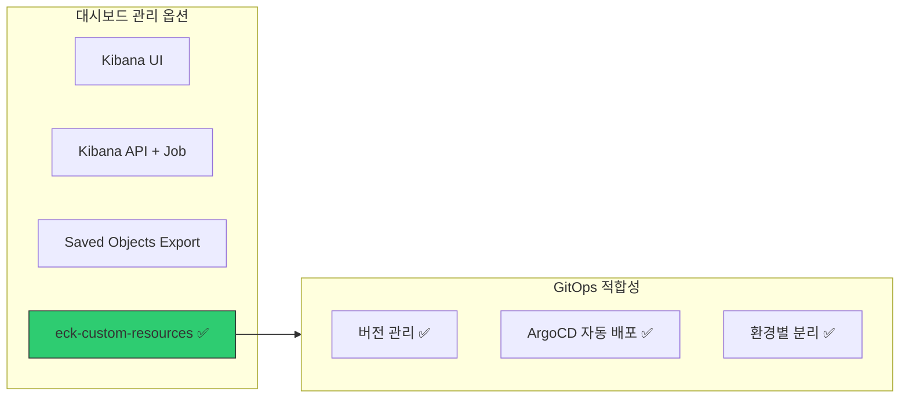
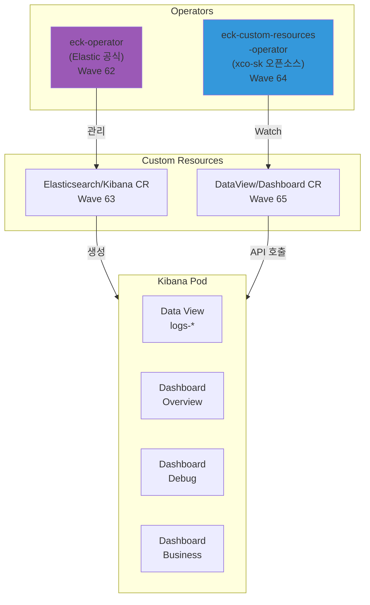
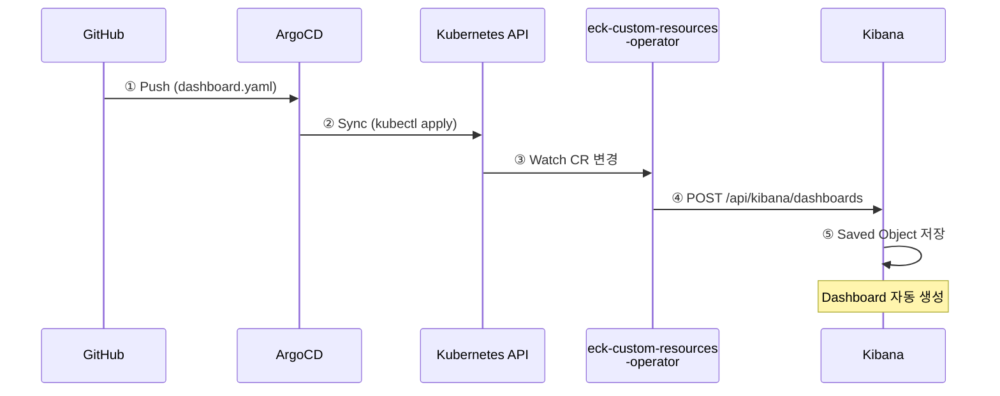
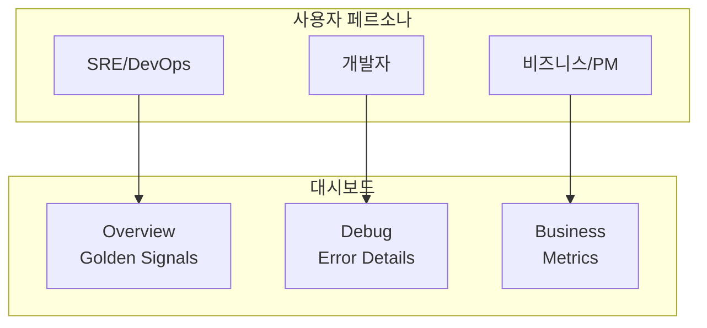

# 이코에코(Eco²) Observability #5: Kibana 대시보드 선언적 관리

> **시리즈**: Eco² Observability Enhancement  
> **작성일**: 2025-12-17  
> **수정일**: 2025-12-18  
> **태그**: `#ECK` `#eck-custom-resources` `#GitOps` `#DashboardAsCode`

---

## 📋 개요

Kibana 대시보드를 **선언적(Declarative)**으로 관리하여 GitOps 워크플로우에 통합합니다.
수동으로 UI에서 대시보드를 만드는 대신, Kubernetes CR(Custom Resource)로 정의하여 버전 관리와 자동 배포를 구현합니다.

---

## 🎯 목표

1. **Dashboard as Code**: 대시보드를 YAML로 정의하여 Git에서 관리
2. **GitOps 통합**: ArgoCD가 대시보드 변경사항을 자동 배포
3. **환경 분리**: dev/prod 환경별 대시보드 관리
4. **재현 가능성**: 클러스터 재구축 시에도 대시보드 자동 복원

---

## 🏗️ 아키텍처 선택

### 왜 eck-custom-resources인가?



| 방식 | 장점 | 단점 | GitOps 적합 |
|------|------|------|-------------|
| **Kibana UI** | 직관적 | 버전 관리 불가, 재현 어려움 | ❌ |
| **Kibana API + Job** | 유연함 | 복잡한 스크립트, 멱등성 보장 어려움 | △ |
| **Saved Objects Export** | 공식 지원 | 수동 작업, CI/CD 통합 번거로움 | △ |
| **eck-custom-resources** ✅ | K8s 네이티브, CR로 선언적 관리 | 별도 Operator 필요 | ✅ |

**선택 이유:**
1. Kubernetes CR로 정의 → ArgoCD가 자동 sync
2. ECK(Elastic Cloud on Kubernetes)와 자연스럽게 통합
3. Dashboard, DataView, Visualization 등 다양한 리소스 지원

---

## 📦 4개 컴포넌트 역할



### 각 컴포넌트 상세

| 컴포넌트 | 역할 | CRD/API Group | 배포 Wave |
|----------|------|---------------|-----------|
| **eck-operator** | Elasticsearch/Kibana Pod 생성 및 관리 | `*.k8s.elastic.co` | 62 |
| **eck-cr** | ES/Kibana 인스턴스 정의 (CR) | `Elasticsearch`, `Kibana` | 63 |
| **eck-custom-resources-operator** | Dashboard/DataView CR → Kibana API 호출 | `*.eck.github.com` | 64 |
| **eck-custom-resources-cr** | 대시보드, 데이터뷰 정의 (CR) | `Dashboard`, `DataView` | 65 |

---

## 🔄 선언적 배포 흐름



---

## ✅ 현재 클러스터 상태

### 배포된 리소스

| 리소스 타입 | 이름 | 상태 |
|-------------|------|------|
| DataView | `logs-eco2-app` | ✅ Active |
| Dashboard | `logs-eco2-overview` | ✅ Active |
| Dashboard | `logs-eco2-debug` | ✅ Active |
| Dashboard | `logs-eco2-business` | ✅ Active |

### Operator 상태

```bash
# eck-custom-resources-operator
kubectl get pods -n elastic-system -l app.kubernetes.io/name=eck-custom-resources-operator

NAME                                                              READY   STATUS
eck-custom-resources-eck-custom-resources-operator-558bd79vxgf9   1/1     Running
```

### CRD 목록 (설치됨)

```bash
kubectl get crd | grep eck.github.com

dashboards.kibana.eck.github.com                        # Dashboard CR
dataviews.kibana.eck.github.com                         # DataView (Index Pattern)
kibanainstances.kibana.eck.github.com                   # Kibana 연결 설정
visualizations.kibana.eck.github.com                    # Visualization
savedsearches.kibana.eck.github.com                     # Saved Search
lens.kibana.eck.github.com                              # Lens
indextemplates.es.eck.github.com                        # ES Index Template
indexlifecyclepolicies.es.eck.github.com                # ILM
```

---

## 🔧 구현

### 1. ArgoCD Application 구성 (sync-wave 순서)

```yaml
# clusters/dev/apps/62-eck-operator.yaml (Wave 62)
# → ECK Operator Helm 배포

# clusters/dev/apps/63-eck-cr.yaml (Wave 63)
# → Elasticsearch, Kibana CR 배포

# clusters/dev/apps/64-eck-custom-resources-operator.yaml (Wave 64)
# → eck-custom-resources Operator Helm 배포

# clusters/dev/apps/65-eck-custom-resources-cr.yaml (Wave 65)
# → DataView, Dashboard CR 배포
```

### 2. DataView CR (Index Pattern)

```yaml
# 현재 배포된 DataView
apiVersion: kibana.eck.github.com/v1alpha1
kind: DataView
metadata:
  name: logs-eco2-app
  namespace: logging
  labels:
    app.kubernetes.io/part-of: ecoeco-observability
    environment: dev
spec:
  targetInstance:
    name: eco2-kibana
  body: |
    {
      "title": "logs-*",
      "name": "logs-eco2-app",
      "timeFieldName": "@timestamp"
    }
```

### 3. Dashboard CR (실제 배포된 Overview 예시)

```yaml
apiVersion: kibana.eck.github.com/v1alpha1
kind: Dashboard
metadata:
  name: logs-eco2-overview
  namespace: logging
  labels:
    dashboard-type: sre
    environment: dev
spec:
  targetInstance:
    name: eco2-kibana
  body: |
    {
      "attributes": {
        "title": "[Logs ECO2] Overview",
        "description": "Golden Signals based monitoring following Google SRE best practices",
        "timeRestore": true,
        "timeFrom": "now-24h",
        "timeTo": "now",
        "refreshInterval": {
          "pause": false,
          "value": 300000
        },
        "panelsJSON": "[...]"
      },
      "references": [
        {"id": "logs-eco2-app", "name": "...", "type": "index-pattern"}
      ]
    }
```

---

## 📊 대시보드 구성

### 왜 3개 대시보드인가?



| 대시보드 | 대상 | 목적 | 주요 패널 |
|----------|------|------|----------|
| **Overview** | SRE | 서비스 헬스 모니터링 | Traffic, Errors, Service Health, Log Level |
| **Debug** | 개발자 | 에러 분석 및 디버깅 | Error by Type, Error Details, trace.id 검색 |
| **Business** | PM/비즈니스 | 비즈니스 메트릭 | OAuth 로그인, 기능 사용량, Daily Active |

### Overview Dashboard (Golden Signals)

```
┌─────────────────────────────────────────────────────────────┐
│  Navigation Links  │        Traffic Volume (Line Chart)     │
│  • Overview        │        서비스별 요청량 추이             │
│  • Debug           │        (Golden Signal: Traffic)        │
│  • Business        │                                        │
├─────────────────────────────────────────────────────────────┤
│                    Error Trend (Line Chart)                 │
│                    서비스별 에러 발생 추이                   │
│                    (Golden Signal: Errors)                  │
├────────────────────────────┬────────────────────────────────┤
│   Service Health (Donut)   │  Log Level Distribution        │
│   서비스별 로그 비율        │  INFO/WARN/ERROR 비율          │
└────────────────────────────┴────────────────────────────────┘
```

### Debug Dashboard

- **Errors by Type**: 에러 유형별 분포 (ValidationError, ConnectionError 등)
- **Errors by Service**: 서비스별 에러 수
- **Error Details Table**: 상세 로그 (trace.id, error.message 포함)
- **Trace Correlation**: trace.id로 필터링된 전체 요청 흐름

### Business Dashboard

- **Total Logins**: OAuth 로그인 총 횟수
- **Daily Logins by Provider**: Kakao/Google/Naver 일별 추이
- **Feature Usage**: Chat, Image, Location 서비스 사용량
- **Rewards Granted**: 리워드 지급 건수

---

## 📂 코드베이스 구조

```
clusters/dev/apps/
├── 62-eck-operator.yaml                  # ECK Operator (Helm)
├── 63-eck-cr.yaml                        # ES/Kibana CR
├── 64-eck-custom-resources-operator.yaml # Dashboard Operator (Helm)
└── 65-eck-custom-resources-cr.yaml       # Dashboard CR

workloads/
├── crds/base/kustomization.yaml          # CRD 설치 (ECK + eck-custom-resources)
├── logging/base/
│   ├── elasticsearch.yaml                # Elasticsearch CR
│   ├── kibana.yaml                       # Kibana CR (eco2-kibana)
│   └── fluent-bit.yaml                   # Fluent Bit DaemonSet
└── kibana/                               # 대시보드 CR (TODO: 추가 예정)
    ├── base/
    │   ├── dataview.yaml                 # Index Pattern
    │   ├── overview-dashboard.yaml       # SRE 대시보드
    │   ├── debug-dashboard.yaml          # 개발자 대시보드
    │   └── business-dashboard.yaml       # 비즈니스 대시보드
    └── dev/
        └── kustomization.yaml
```

---

## 🔗 오픈소스 참조

### Operator / Helm Charts

| 프로젝트 | 버전 | 링크 |
|----------|------|------|
| **ECK (Elastic Cloud on Kubernetes)** | 2.11.0 | [GitHub](https://github.com/elastic/cloud-on-k8s) |
| **eck-custom-resources** | 0.7.0 | [GitHub](https://github.com/xco-sk/eck-custom-resources) |

### CRD 스펙

| CRD | API Group | 설명 |
|-----|-----------|------|
| `Elasticsearch` | `elasticsearch.k8s.elastic.co/v1` | ES 클러스터 정의 |
| `Kibana` | `kibana.k8s.elastic.co/v1` | Kibana 인스턴스 정의 |
| `KibanaInstance` | `kibana.eck.github.com/v1alpha1` | Kibana 연결 설정 |
| `DataView` | `kibana.eck.github.com/v1alpha1` | Index Pattern 정의 |
| `Dashboard` | `kibana.eck.github.com/v1alpha1` | 대시보드 정의 |
| `Lens` | `kibana.eck.github.com/v1alpha1` | Lens 시각화 정의 |

---

## 🎯 아키텍처 결정 근거

### 결정 1: eck-custom-resources 선택

**문제:** Kibana 대시보드를 GitOps로 관리하고 싶음

| 옵션 | 평가 |
|------|------|
| Kibana API 직접 호출 (Job) | 멱등성 보장 어려움, 에러 처리 복잡 |
| ConfigMap + sidecar | Kibana 재시작 필요, 복잡 |
| **eck-custom-resources** ✅ | K8s 네이티브, Operator가 상태 관리 |

**선택 이유:**
1. CR의 `spec.body`만 수정하면 Operator가 자동으로 Kibana API 호출
2. 실패 시 재시도 로직 내장
3. finalizer로 삭제 시에도 Kibana에서 대시보드 제거

### 결정 2: namespace를 logging으로 통일

**문제:** KibanaInstance CR과 Secret이 다른 namespace에 있으면 인증 실패

**해결:** 모든 Kibana 관련 CR을 `logging` namespace에 배치

```yaml
# KibanaInstance가 참조하는 Secret
spec:
  authentication:
    usernamePasswordSecret:
      secretName: eco2-logs-es-elastic-user  # logging namespace에 있음
```

### 결정 3: 3개 대시보드로 분리

**문제:** 하나의 대시보드에 모든 패널을 넣으면 로딩 느림, 관심사 혼재

**해결:** 사용자 페르소나별 대시보드 분리
- **Overview**: SRE가 한눈에 서비스 상태 파악
- **Debug**: 개발자가 에러 원인 분석
- **Business**: PM이 비즈니스 메트릭 확인

---

## ⚠️ 트러블슈팅

### Issue 1: CRD 스키마 오류

```
targetInstance.namespace: field not declared in schema
```

**원인:** eck-custom-resources CRD에서 `targetInstance`는 `name` 필드만 지원

**해결:**
```yaml
# ❌ 잘못된 설정
targetInstance:
  name: eco2-kibana
  namespace: logging  # 지원 안 함!

# ✅ 올바른 설정 (CR이 같은 namespace에 있어야 함)
targetInstance:
  name: eco2-kibana
```

### Issue 2: Dashboard가 Kibana에 안 뜸

**원인:** eck-custom-resources Operator 미설치 (CRD만 설치)

**해결:** Helm으로 Operator 배포

```bash
helm install eck-custom-resources \
  eck-custom-resources/eck-custom-resources-operator \
  -n elastic-system
```

### Issue 3: DataView ID 충돌

**원인:** DataView body에서 `id` 필드를 명시하지 않음

**해결:** 명시적 ID 지정
```json
{
  "title": "logs-*",
  "name": "logs-eco2-app",
  "id": "logs-eco2-app"  // 명시적 ID
}
```

---

## ✅ 결과 확인

```bash
# CR 상태 확인
kubectl get dataviews,dashboards -n logging

# Operator 로그 확인
kubectl logs -n elastic-system \
  -l app.kubernetes.io/name=eck-custom-resources-operator

# Kibana에서 대시보드 확인
# https://kibana.dev.growbin.app/app/dashboards
```

---

## 🔜 다음 글 미리보기

**[#6: 로그 기반 알림 연동]** - Elasticsearch Watcher를 활용한 자동 알림 설정을 다룹니다.

---

## 📚 참고 자료

- [ECK Documentation](https://www.elastic.co/guide/en/cloud-on-k8s/current/index.html)
- [eck-custom-resources Documentation](https://xco-sk.github.io/eck-custom-resources/)
- [Kibana Dashboard API](https://www.elastic.co/guide/en/kibana/current/dashboard-api.html)
- [GitOps with ArgoCD](https://argo-cd.readthedocs.io/)
- [Google SRE - Golden Signals](https://sre.google/sre-book/monitoring-distributed-systems/)
