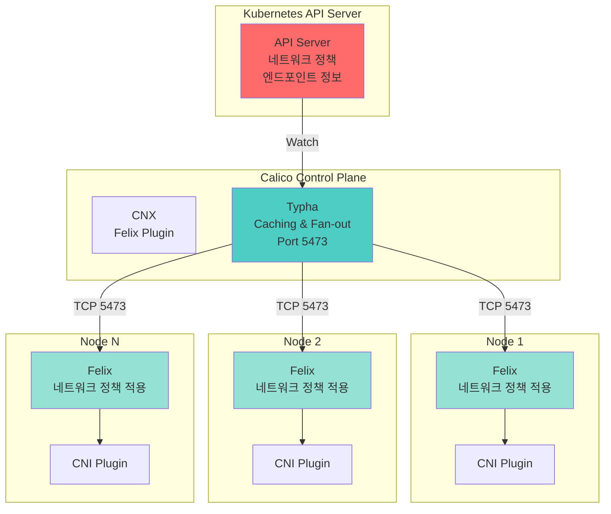
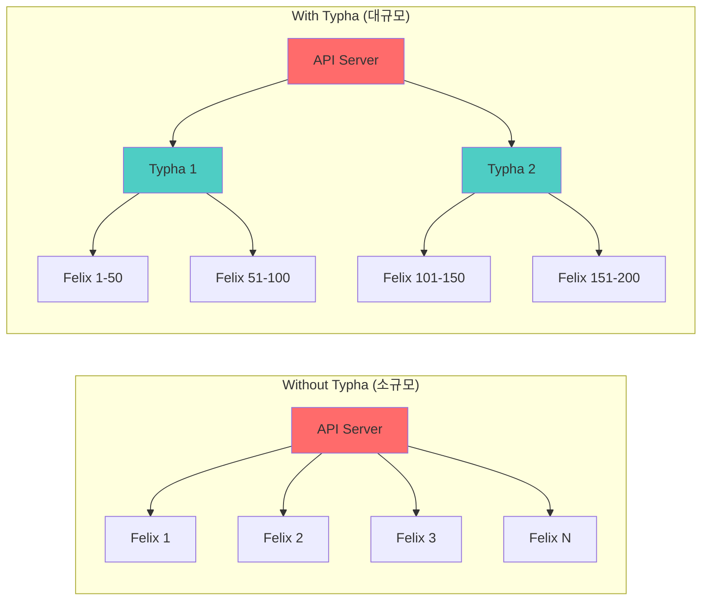
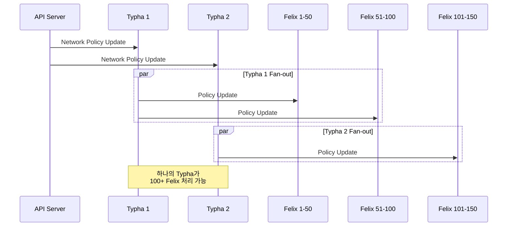
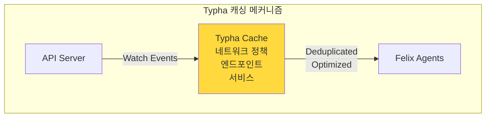
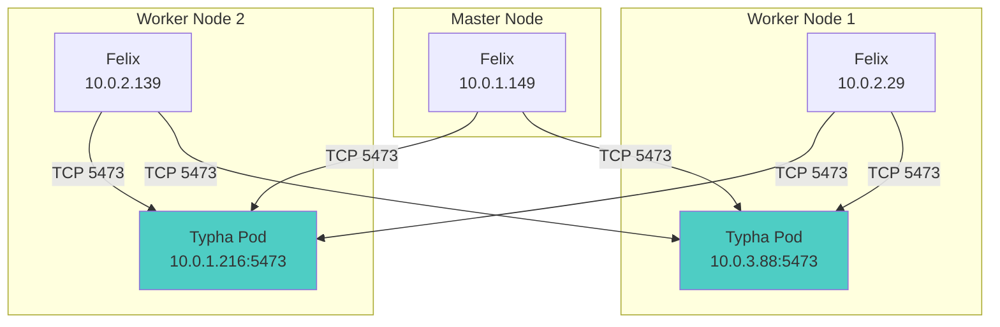
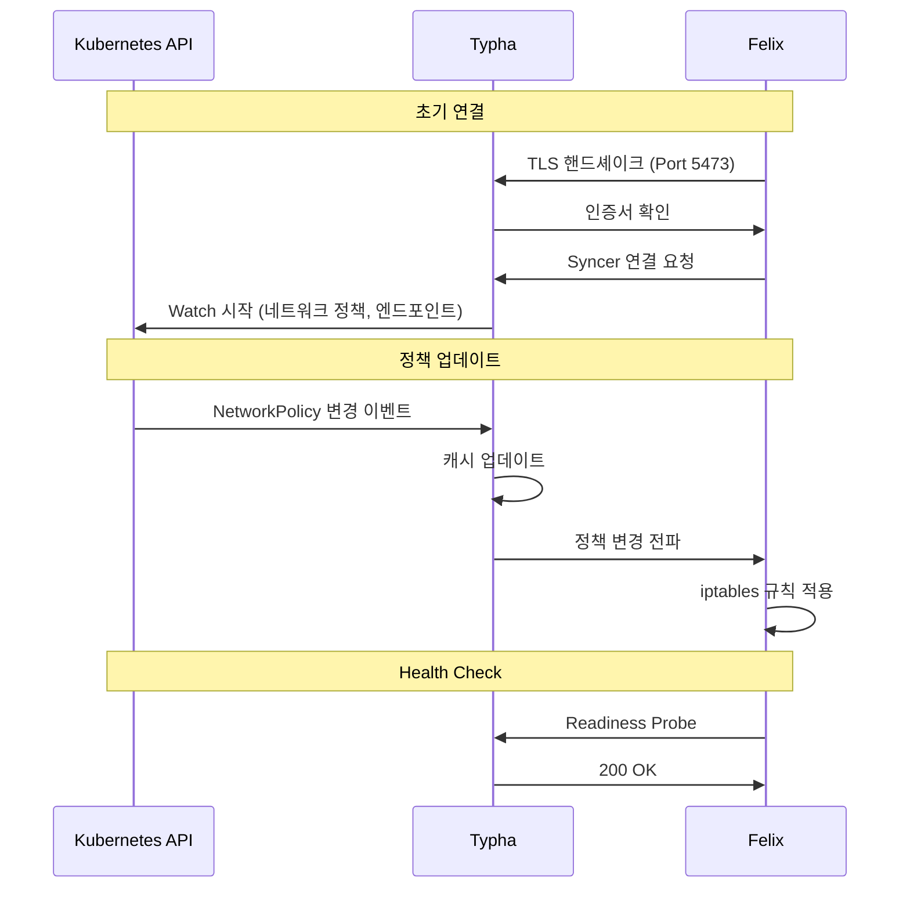
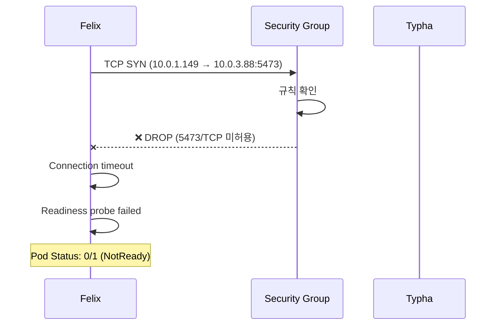
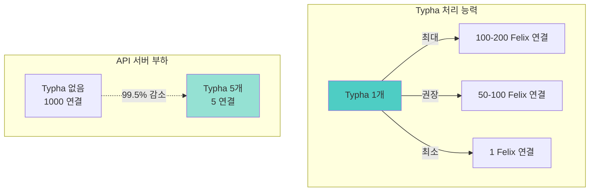
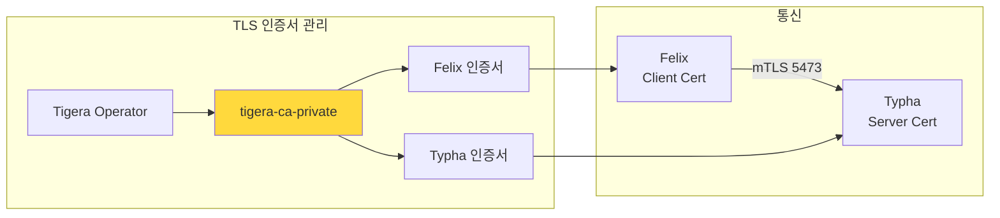

# Calico Typha 아키텍처 및 네트워킹

## 📖 개요

Calico Typha는 대규모 Kubernetes 클러스터에서 확장성과 안정성을 향상시키기 위한 **선택적(Optional) 컴포넌트**입니다. Felix 에이전트와 Kubernetes API 서버(또는 etcd) 사이에서 **중간 캐싱 계층**으로 작동하여 API 서버의 부하를 크게 줄여줍니다.

## 🏗️ Calico 아키텍처

### 전체 구조



### Typha 없는 구조 vs Typha 있는 구조



## 🎯 Typha의 역할

### 1. API 서버 부하 감소

**문제점:**
- 각 노드의 Felix가 API 서버에 직접 Watch 연결
- 노드 100개 = API 서버에 100개의 Watch 연결
- 노드 1000개 = API 서버에 1000개의 Watch 연결
- **결과**: API 서버 과부하 → 클러스터 불안정

**해결책 (Typha):**
- Typha 3개 = API 서버에 3개의 Watch 연결만 필요
- 노드 1000개도 Typha 3개로 처리 가능
- **결과**: API 서버 부하 **99.7% 감소**

### 2. Fan-out 아키텍처



### 3. 캐싱 및 최적화



**캐싱 효과:**
- 중복 이벤트 제거 (Deduplication)
- 배치 업데이트 (Batching)
- 네트워크 트래픽 최적화

## 📊 Typha 활성화 기준

### 노드 수에 따른 권장사항

| 노드 수 | Typha 사용 | Typha 복제본 수 | 이유 |
|---------|-----------|----------------|------|
| 1-2 | ❌ 불필요 | 0 | 오버헤드만 증가 |
| **3-50** | ✅ **권장** | **1-2** | **API 서버 부하 감소 시작** |
| 51-100 | ✅ 필수 | 2-3 | 확장성 확보 |
| 101-500 | ✅ 필수 | 3-5 | 고가용성 |
| 500+ | ✅ 필수 | 5-10 | 대규모 운영 |

### Calico Operator 자동 스케일링

Calico Operator는 클러스터 규모에 따라 Typha 복제본 수를 **자동 조정**합니다:

```yaml
apiVersion: operator.tigera.io/v1
kind: Installation
metadata:
  name: default
spec:
  typhaDeployment:
    spec:
      # 자동 스케일링 (기본값)
      # 노드 수에 따라 Typha 복제본 자동 조정
      strategy:
        rollingUpdate:
          maxUnavailable: 1
```

**자동 계산 로직:**
```
Typha 복제본 수 = max(1, ⌈노드 수 / 200⌉)
최대 20개까지 자동 증가
```

## 🔌 네트워크 요구사항

### 필수 포트 및 프로토콜



### AWS 보안 그룹 구성

**필수 규칙:**

| 방향 | 소스 | 대상 | 포트 | 프로토콜 | 설명 |
|------|------|------|------|----------|------|
| Ingress | Master SG | Worker SG | 5473 | TCP | Master Felix → Worker Typha |
| Ingress | Worker SG | Master SG | 5473 | TCP | Worker Felix → Master Typha |
| Ingress | Worker SG | Worker SG (self) | 5473 | TCP | Worker 간 Typha 통신 |

**Terraform 예시:**

```hcl
# Master → Worker Typha
resource "aws_security_group_rule" "master_to_worker_typha" {
  type                     = "ingress"
  from_port                = 5473
  to_port                  = 5473
  protocol                 = "tcp"
  security_group_id        = aws_security_group.worker.id
  source_security_group_id = aws_security_group.master.id
  description              = "Calico Typha from master"
}

# Worker → Master Typha
resource "aws_security_group_rule" "worker_to_master_typha" {
  type                     = "ingress"
  from_port                = 5473
  to_port                  = 5473
  protocol                 = "tcp"
  security_group_id        = aws_security_group.master.id
  source_security_group_id = aws_security_group.worker.id
  description              = "Calico Typha from worker"
}

# Worker ↔ Worker Typha
resource "aws_security_group_rule" "worker_to_worker_typha" {
  type              = "ingress"
  from_port         = 5473
  to_port           = 5473
  protocol          = "tcp"
  security_group_id = aws_security_group.worker.id
  self              = true
  description       = "Calico Typha between workers"
}
```

## 🔄 Typha 통신 흐름

### 정상 통신 시퀀스



### 연결 실패 시퀀스 (보안 그룹 문제)



## 🛠️ Typha 설정 및 관리

### 1. Typha 상태 확인

```bash
# Typha Pod 확인
kubectl get pods -n calico-system -l k8s-app=calico-typha -o wide

# Typha 서비스 확인
kubectl get svc -n calico-system calico-typha

# Typha 로그 확인
kubectl logs -n calico-system -l k8s-app=calico-typha --tail=100
```

### 2. Felix → Typha 연결 확인

```bash
# Felix 로그에서 Typha 연결 상태 확인
kubectl logs -n calico-system -l k8s-app=calico-node --tail=50 | grep -i typha

# 정상 출력 예시:
# [INFO] Connecting to Typha. address=10.0.2.193:5473
# [INFO] Typha connection established
```

### 3. Typha 복제본 수 조정

```bash
# 수동으로 복제본 수 조정 (필요 시)
kubectl patch installation default --type=merge -p '
{
  "spec": {
    "typhaDeployment": {
      "spec": {
        "replicas": 3
      }
    }
  }
}'
```

### 4. Typha 메트릭 확인

```bash
# Typha 메트릭 엔드포인트
kubectl port-forward -n calico-system \
  svc/calico-typha-metrics 9093:9093

# 브라우저에서 확인
curl http://localhost:9093/metrics
```

## 📈 성능 및 확장성

### Typha 성능 지표



### 리소스 요구사항

| Typha 복제본 수 | CPU 요청 | 메모리 요청 | CPU 제한 | 메모리 제한 |
|----------------|----------|-------------|----------|------------|
| 1 | 100m | 128Mi | 200m | 256Mi |
| 3 | 100m | 128Mi | 200m | 256Mi |
| 5+ | 100m | 128Mi | 200m | 256Mi |

**특징:**
- Typha는 stateless하므로 수평 확장 용이
- 각 인스턴스의 리소스 요구량은 일정
- 노드 수가 아닌 복제본 수로 확장

## 🔒 보안 고려사항

### TLS 통신

Typha와 Felix 간 통신은 **mTLS(mutual TLS)**로 암호화됩니다:



### 인증서 검증

```bash
# Typha 인증서 확인
kubectl get secret -n calico-system node-certs -o yaml

# Felix에서 Typha 인증 로그
kubectl logs -n calico-system calico-node-XXX | grep -i "certificate"
```

## 🚨 트러블슈팅

### 일반적인 문제

#### 1. Felix가 Typha에 연결하지 못함

**증상:**
```
[WARNING] Failed to connect to typha endpoint IP:5473
error=dial tcp IP:5473: i/o timeout
```

**원인:**
- 보안 그룹에서 5473/TCP 미허용
- 네트워크 정책으로 차단
- Typha Pod이 실행 중이 아님

**해결:**
```bash
# 1. 보안 그룹 확인
aws ec2 describe-security-groups --group-ids sg-XXXXX

# 2. Typha Pod 상태 확인
kubectl get pods -n calico-system -l k8s-app=calico-typha

# 3. 네트워크 연결 테스트
nc -zv TYPHA_IP 5473
```

#### 2. Typha Pod이 시작되지 않음

**증상:**
```
calico-typha-XXX   0/1   CrashLoopBackOff
```

**원인:**
- API 서버 연결 실패
- 인증서 문제
- 리소스 부족

**해결:**
```bash
# 로그 확인
kubectl logs -n calico-system calico-typha-XXX

# 이벤트 확인
kubectl describe pod -n calico-system calico-typha-XXX
```

#### 3. Typha 복제본 수가 너무 적음

**증상:**
- Felix 연결 지연
- Typha CPU 사용률 높음

**해결:**
```bash
# Typha 복제본 증가
kubectl patch installation default --type=merge -p '
{
  "spec": {
    "typhaDeployment": {
      "spec": {
        "replicas": 5
      }
    }
  }
}'
```

## 📚 참고 자료

### 공식 문서
1. **Calico Typha Reference**
   - https://projectcalico.docs.tigera.io/reference/typha
   - Typha의 공식 레퍼런스 문서

2. **Calico Architecture Overview**
   - https://docs.tigera.io/calico/latest/reference/architecture/overview
   - Calico 전체 아키텍처 설명

3. **Calico Network Requirements**
   - https://docs.tigera.io/calico/latest/getting-started/kubernetes/requirements#network-requirements
   - 네트워크 포트 및 프로토콜 요구사항

4. **Calico on AWS**
   - https://docs.tigera.io/calico/latest/reference/public-cloud/aws
   - AWS 환경에서의 Calico 구성

5. **Typha Performance Tuning**
   - https://docs.tigera.io/calico/latest/operations/typha
   - Typha 성능 최적화 가이드

### 관련 문서
- [Calico Typha 포트 5473 트러블슈팅](./CALICO_TYPHA_PORT_5473_ISSUE.md)
- [Calico CNI 설치 가이드](../deployment/platform/CALICO_CNI_INSTALLATION.md)

## 🏷️ 태그
`calico` `typha` `networking` `architecture` `cni` `kubernetes` `scalability` `aws`

