# Calico Typha 포트(5473) 연결 실패 트러블슈팅

## 📋 문제 개요

**발생 일시:** 2025-11-18  
**환경:** AWS EKS-like 클러스터 (14 노드, self-managed K8s + ALB Controller)  
**증상:** `calico-node-nv4qn` (Master 노드) Pod이 Ready 상태가 되지 않음

```bash
NAME                READY   STATUS    RESTARTS   AGE
calico-node-nv4qn   0/1     Running   0          13m
```

## 🔍 문제 진단

### 1. Pod 상태 확인

```bash
kubectl describe pod -n calico-system calico-node-nv4qn
```

**주요 발견 사항:**
```
Events:
  Warning  Unhealthy  13m (x3 over 13m)     kubelet            
    Readiness probe failed: calico/node is not ready: felix is not ready: 
    Get "http://localhost:9099/readiness": dial tcp 127.0.0.1:9099: connect: connection refused
  Warning  Unhealthy  3m12s (x26 over 12m)  kubelet            
    Readiness probe failed: calico/node is not ready: felix is not ready: 
    readiness probe reporting 503
```

### 2. Pod 로그 분석

```bash
kubectl logs -n calico-system calico-node-nv4qn --tail=100
```

**핵심 에러 메시지:**
```
[WARNING] Failed to connect to typha endpoint 10.0.3.88:5473.  
  Will try another if available... 
  error=dial tcp 10.0.3.88:5473: i/o timeout myID=0x1 type="node-status"

[WARNING] Failed to connect to typha endpoint 10.0.1.216:5473.  
  Will try another if available... 
  error=dial tcp 10.0.1.216:5473: i/o timeout myID=0x1 type="tunnel-ip-allocation"
```

### 3. Typha Pod 상태 확인

```bash
kubectl get pods -n calico-system -l k8s-app=calico-typha -o wide
```

**결과:**
```
NAME                            READY   STATUS    RESTARTS   AGE   IP
calico-typha-59df5c67d8-k99wq   1/1     Running   0          12m   10.0.3.88    k8s-worker-storage
calico-typha-59df5c67d8-mmjwk   1/1     Running   0          13m   10.0.1.216   k8s-postgresql
calico-typha-59df5c67d8-svdvg   1/1     Running   0          13m   10.0.2.193   k8s-monitoring
```

✅ Typha Pod들은 모두 정상 실행 중

### 4. 네트워크 연결 테스트

```bash
# Master 노드에서 Typha Pod으로 연결 테스트
nc -zv 10.0.2.193 5473
```

**결과:**
```
Connection failed
```

❌ **Master 노드에서 Worker 노드의 Typha Pod(5473/TCP)으로 연결 불가**

## 🎯 근본 원인 (Root Cause)

**AWS 보안 그룹에 Calico Typha 포트(5473/TCP)가 열려있지 않음**

### Calico Typha란?

Calico Typha는 대규모 Kubernetes 클러스터에서 확장성과 안정성을 향상시키기 위한 컴포넌트입니다.

**공식 문서:**
- [Calico Typha Reference](https://projectcalico.docs.tigera.io/reference/typha)
- [Calico Architecture](https://docs.tigera.io/calico/latest/reference/architecture/overview)

**주요 역할:**
1. **Felix와 데이터스토어 간 중개**: 모든 Felix 에이전트가 Kubernetes API 서버에 직접 연결하는 대신, Typha가 중간에서 캐싱 및 프록시 역할 수행
2. **API 서버 부하 감소**: 수백, 수천 개의 노드 환경에서 API 서버 과부하 방지
3. **Fan-out 아키텍처**: 하나의 Typha 인스턴스가 100개 이상의 Felix 클라이언트 처리 가능

**활성화 기준:**
- 일반적으로 **워커 노드 3개 이상**일 때 자동 활성화
- Calico Operator는 클러스터 규모에 따라 Typha 인스턴스 수 자동 조정

**네트워크 요구사항:**
- **포트**: TCP 5473 (기본값)
- **통신 방향**: 
  - Master → Worker (Typha Pod)
  - Worker → Worker (Typha Pod)
  - Felix (모든 노드) → Typha

## 🔧 해결 방법

### 1. 보안 그룹 규칙 확인

```bash
# Master 보안 그룹 ID 확인
aws ec2 describe-instances \
  --filters "Name=tag:Name,Values=k8s-master" \
  --query "Reservations[].Instances[].SecurityGroups[].GroupId" \
  --region ap-northeast-2

# 결과: sg-0afdc5528d5cf7d1c (Master SG)
#       sg-06d0aec7f41806b51 (Worker SG)
```

### 2. AWS CLI로 보안 그룹 규칙 추가

```bash
# Worker SG ← Master SG (Master가 Worker의 Typha에 접근)
aws ec2 authorize-security-group-ingress \
  --group-id sg-06d0aec7f41806b51 \
  --source-group sg-0afdc5528d5cf7d1c \
  --protocol tcp \
  --port 5473 \
  --region ap-northeast-2

# Master SG ← Worker SG (Worker가 Master의 Typha에 접근)
aws ec2 authorize-security-group-ingress \
  --group-id sg-0afdc5528d5cf7d1c \
  --source-group sg-06d0aec7f41806b51 \
  --protocol tcp \
  --port 5473 \
  --region ap-northeast-2

# Worker SG ← Worker SG (Worker 간 Typha 통신)
aws ec2 authorize-security-group-ingress \
  --group-id sg-06d0aec7f41806b51 \
  --source-group sg-06d0aec7f41806b51 \
  --protocol tcp \
  --port 5473 \
  --region ap-northeast-2
```

**결과:**
```json
{
    "Return": true,
    "SecurityGroupRules": [
        {
            "SecurityGroupRuleId": "sgr-0e34803f065234d8b",
            "FromPort": 5473,
            "ToPort": 5473,
            "IpProtocol": "tcp"
        }
    ]
}
```

### 3. Terraform 코드 업데이트 (영구 적용)

`terraform/modules/security-groups/main.tf`에 규칙 추가:

```hcl
# Calico Typha (Master ↔ Worker)
resource "aws_security_group_rule" "master_to_worker_typha" {
  type                     = "ingress"
  from_port                = 5473
  to_port                  = 5473
  protocol                 = "tcp"
  security_group_id        = aws_security_group.worker.id
  source_security_group_id = aws_security_group.master.id
  description              = "Calico Typha from master"
}

resource "aws_security_group_rule" "worker_to_master_typha" {
  type                     = "ingress"
  from_port                = 5473
  to_port                  = 5473
  protocol                 = "tcp"
  security_group_id        = aws_security_group.master.id
  source_security_group_id = aws_security_group.worker.id
  description              = "Calico Typha from worker"
}

# Calico Typha within workers
resource "aws_security_group_rule" "worker_to_worker_typha" {
  type              = "ingress"
  from_port         = 5473
  to_port           = 5473
  protocol          = "tcp"
  security_group_id = aws_security_group.worker.id
  self              = true
  description       = "Calico Typha between workers"
}
```

### 4. 연결 확인

```bash
# Master 노드에서 Typha 연결 테스트
nc -zv 10.0.2.193 5473
```

**결과:**
```
Connection to 10.0.2.193 5473 port [tcp/*] succeeded!
```

✅ 연결 성공!

### 5. Pod 상태 재확인

약 10초 대기 후:

```bash
kubectl get pods -n calico-system -l k8s-app=calico-node -o wide
```

**결과:**
```
NAME                READY   STATUS    RESTARTS   AGE
calico-node-nv4qn   1/1     Running   0          15m   (k8s-master)  ← Ready!
```

✅ **문제 해결 완료!**

## 📊 해결 전후 비교

| 항목 | 해결 전 | 해결 후 |
|------|---------|---------|
| Master → Typha 연결 | ❌ Timeout | ✅ 성공 |
| calico-node-nv4qn 상태 | 0/1 (NotReady) | 1/1 (Ready) |
| Felix Readiness Probe | 503 에러 | 정상 |
| 전체 Calico Node Pod | 13/14 Ready | 14/14 Ready |

## 📝 교훈 및 베스트 프랙티스

### 1. Calico 필수 포트 목록

| 포트 | 프로토콜 | 용도 | 필수 통신 |
|------|----------|------|-----------|
| 179 | TCP | BGP (BGP 모드 사용 시) | All ↔ All |
| 4789 | UDP | VXLAN (Overlay 모드) | All ↔ All |
| **5473** | **TCP** | **Typha** | **Felix → Typha** |
| 9091 | TCP | Felix Prometheus 메트릭 | 모니터링 시스템 |
| 9099 | TCP | Felix Health Check | Kubelet |

**참고:** [Calico Network Requirements](https://docs.tigera.io/calico/latest/getting-started/kubernetes/requirements#network-requirements)

### 2. AWS 보안 그룹 설계 시 고려사항

```mermaid
graph LR
    A[Master SG] -->|모든 Calico 포트| B[Worker SG]
    B -->|API Server 6443| A
    B -->|자체 통신| B
    
    style A fill:#ff9999
    style B fill:#99ccff
```



**체크리스트:**
- [ ] Kubernetes API (6443/TCP)
- [ ] Kubelet (10250/TCP)
- [ ] VXLAN (4789/UDP)
- [ ] **Typha (5473/TCP)** ← 이번 이슈
- [ ] NodePort (30000-32767/TCP)

### 3. 문제 진단 순서

1. **Pod 상태 확인** → `kubectl describe pod`
2. **로그 분석** → `kubectl logs`
3. **네트워크 연결 테스트** → `nc -zv IP PORT`
4. **보안 그룹 규칙 확인** → AWS Console 또는 AWS CLI
5. **Typha/Felix 구성 확인** → Calico 설정 리뷰

### 4. Calico 배포 시 사전 준비

**공식 문서:**
- [Calico on AWS](https://docs.tigera.io/calico/latest/reference/public-cloud/aws)

**필수 확인 사항:**
```bash
# 1. CNI 플러그인 디렉토리
ls -la /opt/cni/bin/

# 2. Calico 설정
kubectl get installation default -o yaml

# 3. Typha 복제본 수 (노드 수에 따라 자동 조정)
kubectl get deployment -n calico-system calico-typha -o wide

# 4. Felix - Typha 연결 상태
kubectl logs -n calico-system -l k8s-app=calico-node --tail=50 | grep -i typha
```

## 🔗 참고 자료

### 공식 문서
1. **Calico Typha**
   - https://projectcalico.docs.tigera.io/reference/typha
   - https://docs.tigera.io/calico/latest/reference/architecture/overview

2. **Calico 네트워크 요구사항**
   - https://docs.tigera.io/calico/latest/getting-started/kubernetes/requirements#network-requirements

3. **Calico on AWS**
   - https://docs.tigera.io/calico/latest/reference/public-cloud/aws

4. **Calico Troubleshooting**
   - https://docs.tigera.io/calico/latest/operations/troubleshoot/troubleshooting

### 관련 이슈
- GitHub: projectcalico/calico - [Typha connection timeout issues](https://github.com/projectcalico/calico/issues)

## 🏷️ 태그
`calico` `typha` `networking` `aws` `security-group` `troubleshooting` `kubernetes` `port-5473`

